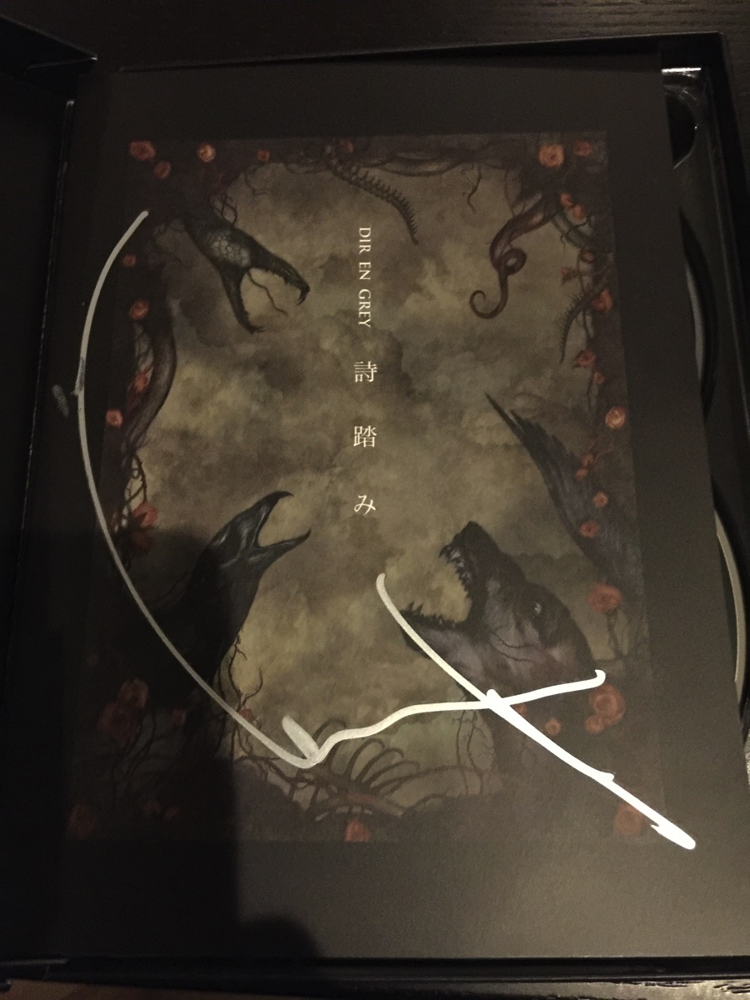
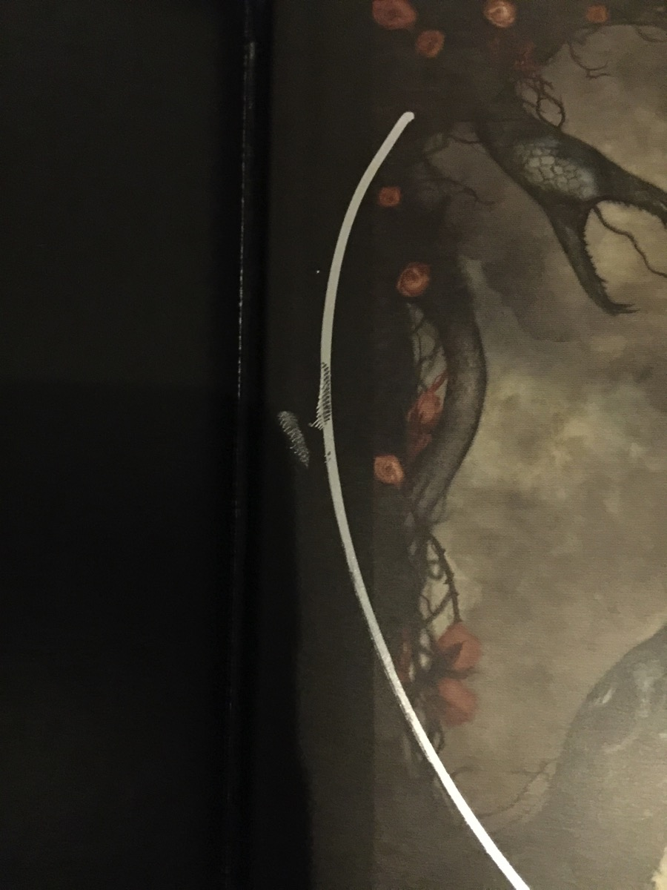

---
categories:
- DIR EN GREYのイベント
date: Wed, 27 Jul 2016 14:47:00 +0000
slug: post-9235
tags:
- DIR EN GREY
- イベントレポ
title: 【インストレポ】DIR EN GREY詩踏みサイン会＠タワーレコード渋谷店
---

本日発売のDIR EN GREY新曲「詩踏み」のインストアイベントに参加すべくタワーレコード渋谷店に行ってまいりました。本日はそこで行われたサイン会のレポートです。<!--more-->今回のインストアイベントは6月5日の名古屋からスタートしていました。リリース日前までは、予約会ということで先着で予約した人は握手会に参加できるというものでした。

そして、いよいよ今日からはサイン会として8月7日の兵庫まで開催される運びとなっております。

<h2>高鳴る緊張。タワレコ渋谷に現れたのはToshiya</h2>

ぼくはスタート前まで緊張で体に異常をきたしておりました。

<blockquote class="twitter-tweet" data-lang="ja">
汗を全くかかない
&mdash; しんぺー@ (@s_s_p_y) <a href="https://twitter.com/s_s_p_y/status/758236545534918656">2016年7月27日</a></blockquote>

今回初めて地下のイベントスペースに入ったのですが、結構広めでした。

前の方は整列用の柵が設けられており、誘導された順に並びました。注意事項によると本日のイベントはサインのみ・トークNG・プレゼントは手紙のみとのことでした。また、サインできる箇所は指定されていたのですが、、、、ブックレットの表１って、、、わからない人はわからないと思う言い方で何度も何度も、、、、あとはスリーブにも可。そのどっちかとのことです。

そして、ついにメンバーご登場。サイン会初日の本日現れたメンバーはToshiyaでした。

服装は以下の通り。
<blockquote class="twitter-tweet" data-lang="ja">
暑い中、拙いトークとサイン会に来てくれてありがとうございました！  Toshiya<a href="https://twitter.com/hashtag/%E8%A9%A9%E8%B8%8F%E3%81%BF?src=hash">#詩踏み</a><a href="https://twitter.com/hashtag/%E3%82%A4%E3%83%B3%E3%82%B9%E3%83%88%E3%82%A2?src=hash">#インストア</a><a href="https://twitter.com/hashtag/%E3%82%BF%E3%83%AF%E3%83%AC%E3%82%B3%E6%B8%8B%E8%B0%B7?src=hash">#タワレコ渋谷</a><a href="https://twitter.com/hashtag/DIRENGREY?src=hash">#DIRENGREY</a> <a href="https://t.co/HzLmZxbAhT">pic.twitter.com/HzLmZxbAhT</a>
&mdash; DIR EN GREY (@DIRENGREY_JP) <a href="https://twitter.com/DIRENGREY_JP/status/758266735367589888">2016年7月27日</a></blockquote>

見えにくいので補足ですが、帽子の縁にはリング？みたいなものがついておりました。また、シューズはベージュ色で先が尖っているようなものでした。ちなみにシャツはDIRT

<h2>少しだけトークがありました。</h2>

マネージャーの井上さんを司会にほんの少しだけトークの時間がありました。

井上氏「すわる？」

Toshiya「た・・・てた方がいいでしょ」とこちらの方に問いかけ

井上氏「じゃぼくは後ろの方に」

井上氏「詩踏みはCDとLIVEで違う？」

Toshiya「違うね。LIVEは前へ前へという感じで」

井上氏「気持ちは前へ前へですけど、体は皆さんそのままで」←注意事項w来い！は気合ですか？www

Toshiya「今はまだ詩踏みというよりも足踏みになってる」

井上氏「はい、ここ本日のツイートネタです！」

井上氏「9月のLIVEはどんな感じ？」

Toshiya「DUMは世界観を作りこむようにしてきたけど、おれはどちらかというと今をぶつけていきたい。」

井上氏「アレンジはするの？」

Toshiya「しなくても変わると思う。たぶんね。」

井上氏「なくなっちゃうサンプラザがありますが」

Toshiya「むかし、サンプラザの近くに住んでて中野サンプラザでやった時、チャリでいくわって言ったらやめてって止められた。」

井上氏「当時は事務所の車がGMCというすごい大きい車で。で時間が早いといるから、もっと早い時間に家まで迎えに行って。でも道が狭くて車が入れないから、途中で止めて。回り道して。」

Toshiya「歩いて5分なのに10分で。」「当時めちゃくちゃでっかい車に乗ってて〜」←なぜか井上氏が言ったことをそのまま繰返しはじめるToshiya。。。「当時のマネージャーと中が悪くて、じゃあここから自分でいけって言われて俺が運転した。でエンストした」

井上氏「あったね！エンストしてよかった。トミーさんがでかい車に乗れっていうからね。もう擦りまくりだったけど」その後はツイートしちゃだめってネタが。

GMCはこんな車

Toshiya「本日はお日柄もよく、皆さん集まっていただいてありがとうございます。流れ作業になってしまいますがどうぞ宜しくお願いします。」

ここで一旦Toshiyaはける。会場設営。その間に井上さんから再度の注意事項

「とてもたくさんの方がいるので、ここにいる（ステージ上にいる)時間をなるべく短くするためにトークは禁止でお願いします。話しかけられても、聞こえないという設定にしてありますので」いつもよりテンション高い気がする井上氏。三連休以降の井上さんは大丈夫なんだろうか・・・ちゃんと休んでます？テンションが異常ですぜ！

<h2>Toshiyaの爽やかすぎるご尊顔</h2>

で、その後サインを書いていただいたわけなんですが、、、、、なんていうか、、、、こちら生きているのが恥ずかしくなるくらいの爽やかな笑顔で一人一人の眼を見てご挨拶されておりました。

もう音楽がでかすぎてなんて言ってたか思い出せもしません。たぶん「ありがとうございます」かな。

ほんとうに爽やかでした。

<h2>しんぺーはこう思った。</h2>

いやー

終わった瞬間から汗がでました。。。。。

どっと疲れが。。。。

と思ったらインク乾いてなくて触っちゃった。。。。

と言ったところで本日は以上になります。  おやすみなさい。