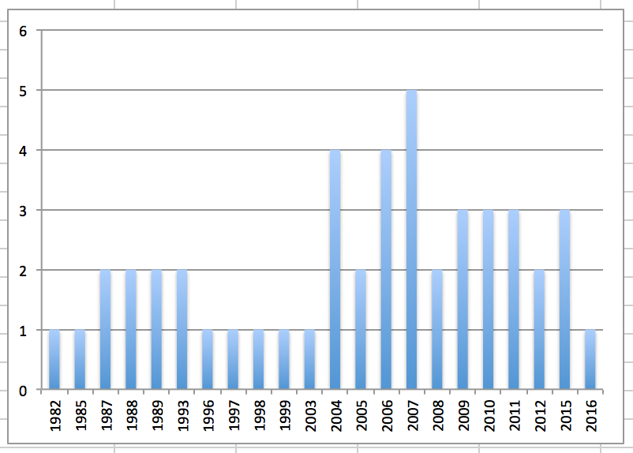

---
categories:
- ヴィジュアルジャパンサミット
date: Sun, 04 Sep 2016 16:03:28 +0000
slug: post-9265
tags:
- ヴィジュアルジャパンサミット
title: ヴィジュアルジャパンサミット参戦バンドのファンの年齢層を調べてみた
---

ぼくが編み出したざっくりとしたファンの年齢層の計算方法についてご紹介します。もちろんバンドが長く続けば続くほど様々な年齢層に支持される場合もありますし、一概には言えません。ただ、コアファンの年齢層についてはこれでだいたい計算できるのではと思います。<!--more--><h2>ファンの年齢層計算方法</h2>

音楽を聴き出すのってだいたい12歳前後だと思います。思春期が始まるあたりで、自分の好みや他人に影響で好きなバンドができたりするものです。

もうちょい補足すると、バンドマンがメジャーデビューとかするのがだいたい20代前半くらいだとします。それに強い憧れを抱き、ファンになるのが中高生です。つまりこれが12歳以上というわけ。

ということで<strong>12という数字</strong>が重要になってきます。

次にそのバンドの活動している年数です。例えばDIR EN GREYは1999年にメジャーデビューをしました。今年で17年目になります。そこに先ほどの12という数字を足します。すると29になります。

つまり、これがファンの年齢ということになるわけですが、バッファをとってだいたい±５くらいがファン層ということにするとだいたい算出されてきます。

どうでしょうか？DIR EN GREYのファンの方々、20代中盤〜30代中盤なんじゃないですか？

ただし、バンドを長く続けていて、ファンの新陳代謝をしていたり幅広い層に支持を受けていたりすると全く通用はしないと思いますが、だいたいはあってるのではないかと思います。

<h2>ヴィジュアルジャパンサミット参戦バンドのファンの年齢層を調べてみた</h2>

まず、第5弾までのラインナップにて算出しましたこちらのグラフをごらんください。半数以上が2004年以降のバンドです。

また上記のファンの中心年齢層を表す数式に当てはめますと平均年齢が24歳、最大値で29歳、最小値で19歳という感じです。

これあくまで平均値ですので、実際は最大51歳から下は10代前半という感じなります。

もうこれ、ジェネレーションギャップ云々じゃないでしょう。もうカオスですカオス。親と子ほど違っております。大丈夫でしょうか！

<h2>でもそんなことないと思う。</h2>

ま、いうてもそんなことはないと思います。多分20代中心のフェスになるんじゃないでしょうか。ただ昨年のルナフェスよりかは、もっと年齢層が低くなる気がします。でも、若い人はそんなにこないんじゃないかなと思います。なぜなら、チケット代が高いから。しかもほとんどが３バンドで押さえられてるだろうから。

<h2>しんぺーはこう思った。</h2>

まぁぶっちゃけ、今のところぼくの温度感はかなり低くなっております。

全ラインアップ発表前にチケット売り切れましたとか（そんなことは決してないと思う）

参戦バンドが応募式なの？とか（そんなこと決してないと思う。オンエアーバトル？）

名前すら聞いたことない若手バンドばっかりとか。

しまいには、１バンドの公演時間がどう考えてもすくなさそうなところとか。

もう、なんていうか去年のルナフェスの神聖な感じが全くないわけで、闇鍋という感じです。

ルナフェスは、一般の方でも行ってみようかな？って思わせるような感じでしたけど、VJSに関しては本当にバンギャ向けという感じで敷居が高いし、しかもバンギャ自体もちょっと引き気味みたいな感じで。。。なんというか全体的にお粗末すぎる。。。

んーなやましい。。。

と言ったところで本日は以上になります。  おやすみなさい。