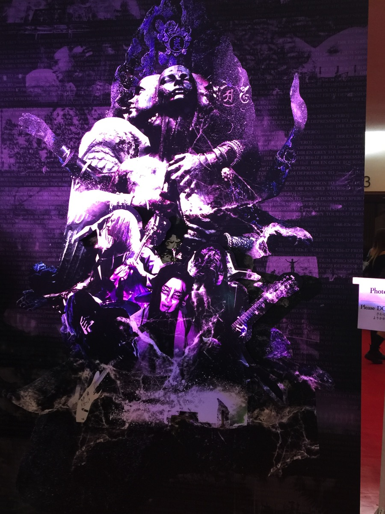
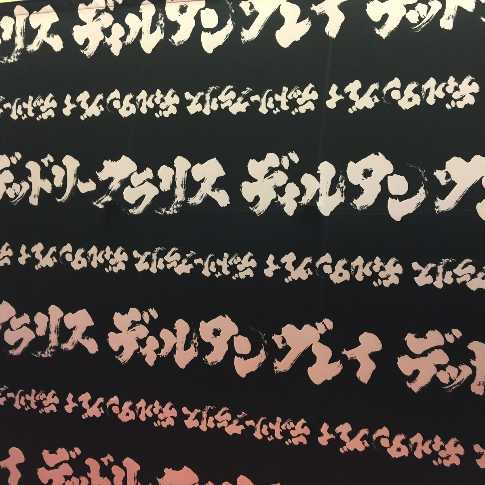
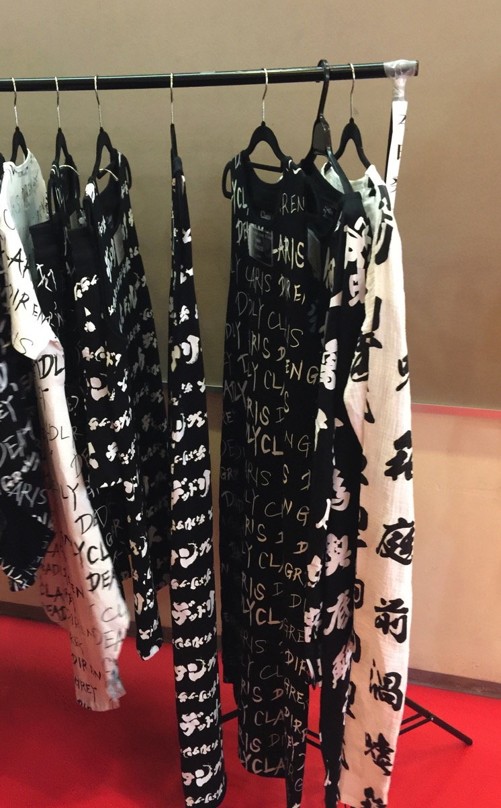
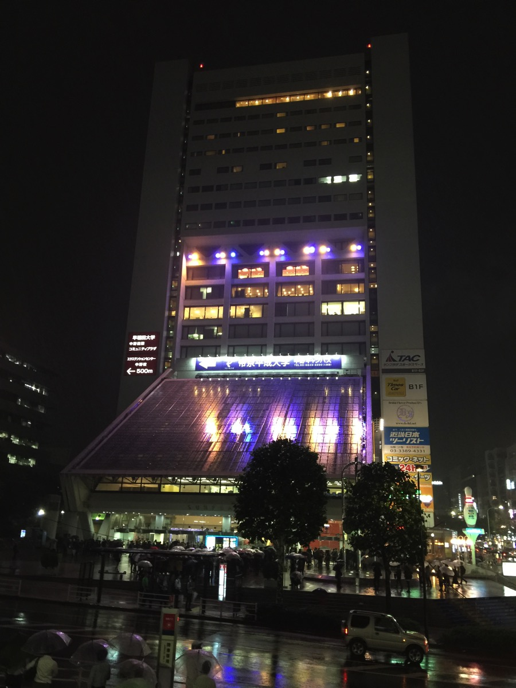

---
categories:
- DIR EN GREYのLIVEレポ
- TOUR16-17 [mode of DUM SPIRO SPERO]
date: Tue, 20 Sep 2016 23:06:24 +0000
slug: post-9290
tags:
- DIR EN GREY
- LIVEレポ
title: 【ライブレポ】DIR EN GREY TOUR16-17 FROM DEPRESSION TO ________ [mode of DUM SPIRO
  SPERO]2016_9_20@中野サンプラザ
---

いい加減に映像に歌詩表示すんのやめろぉお！！クソダサいブランド立ち上げて冗談みたいなデザインのＴシャツ出すのはまだしも、LIVEの演出までださくするのはいい加減やめてほしい。<!--more-->

すいません、愚痴っぽくて。でも本当にいい加減カラオケ演出やめてほしいです。歌わせたいとしても、歌詩の表示させるエフェクトもフォントもダサい。DIR EN GREYのLIVEの演出って記号化だと思うんですよ。わかりやすく言うと、グリーンを基調としたPVの「かすみ」ってあるじゃないですか。だから我々は「かすみ」に対して緑色という認識をするわけですけど、そうなるとLIVEでは、緑色の照明を使うだけで「かすみ」の演出として成立するわけです。「DRAIN AWAY」なら桜＝ピンクや朱色というか夕焼け色みたいな。

こういった簡素化、記号化で成立しているのがDIR EN GREYのLIVE演出だと思うんですよ。その証拠に今では「obscure」のPVなんか流さずに六芒星を浮かび上がらせるだけでしょ。もちろん逆もある。「lotus」は舞ってる(泳いでる)女性がいないとと思うし、「輪郭」はPV流してほしい。それが記号だと思うのです。

そんな中で感覚的な記号化の過程に、文字表現ているのかなぁと感じた。それはくだんのダサいデザインＴシャツすなわち「ディルタングレイ」にもあてはまる。

世界観ぶっ壊してね？そう感じるのです。

といくとで長くなりましたがLIVEレポです。

<h2>セトリ</h2>

狂骨の鳴り
THE BLOSSOMING BEELZEBUB
DIFFERENT SENSE
Lotus
咀嚼
Midwife
蜜と唾
DIABOLOS
流転の塔
「欲巣にDreambox」或いは成熟の理念と冷たい雨
Unraveling
獣慾
詩踏み

EN.
VANITAS
DECAYED CROW
新曲
Un deux
激しさとこの胸の中で絡みついた灼熱の闇

なんだがとても短く感じました。体感で本編は10曲もやってないかなくらい。でもきっちりといつも通りでした。

全体的に演奏がまとまってない印象でした。とくに詩踏み。まだ完成形と言う感じではないなぁと
むしろ新曲の方が乗りやすい感じで、最初から最後まで頭触れる曲でした。次回のアルバムはノリがいい曲が多そうな予感。

ラストの激闇では、最後上手方面から定位置に戻ろうとする薫が、忘れていたみたいでノロノロと歩いているところでToshiyaが荒ぶりはじめました。すんでのところで避けつつ、警戒しながら下手に移動して安全を確認すると同時に前の方にでてきておりました。

あと最後はける時、Dieが襟首を大きくカットしたツアーＴシャツを着ていたせいか左肩からずり落ちてはだけておりました。一説によるとティクビが見えていたとか。

<h2>ステージセット</h2>

会場入口のドアを抜けると博物館特有の香りが歴史を感じさせました。小さい頃に来たっきりなのでどんなところか覚えていませんでしたが、全体的にsukekiyoを彷彿とさせる様な感じでした。

ステージ周りは垂れ幕が下がっていて、SEはオルゴールでDUMの曲が流れてました。ステージ上部には5枚の薄い幕が垂れ下がっていて、ステージ後方に移される映像とは別のものが投影されていて小さいモニターとして機能していました。
また途中でこの幕が降りて来て短冊状となり、いつもの紗幕の様に全面に文字を映すようになっていました。(蜜と唾)

<h2>しんぺーはこう思った。</h2>

(台風で雨がすごかった）

当時はかなりの緊張感があったように思いますが、いい意味でこっちもメンバーも緊張感が抜けた感じでした。ただ一部息を吸うことすら許されないくらいの場面もありました。

あとはやはり冒頭に述べた通り、unduexの歌詩表示カラオケ演出。。本当にクソでした。それ以外はステージから遠かったので細かいメンバーの様子はわからず！