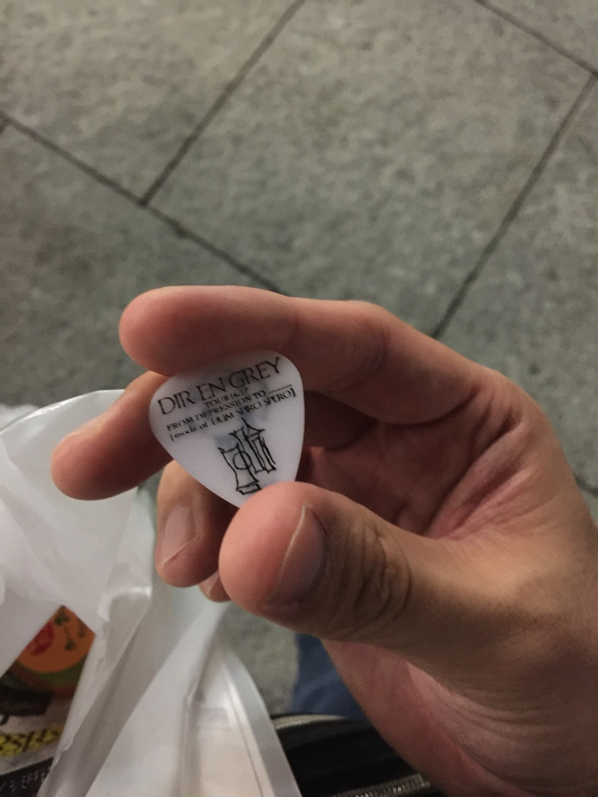
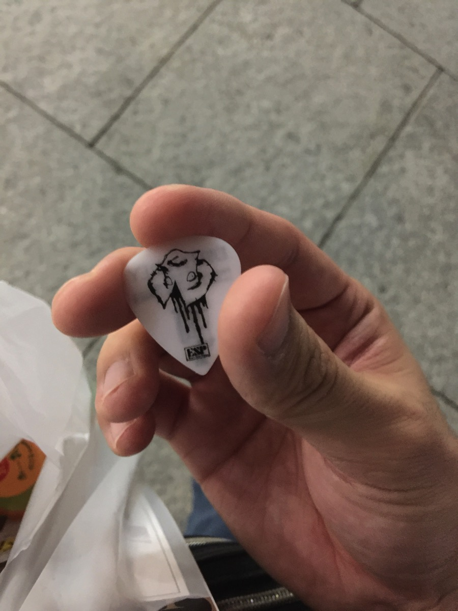

---
categories:
- DIR EN GREYのLIVEレポ
- TOUR16-17 [mode of DUM SPIRO SPERO]
date: Thu, 22 Sep 2016 02:53:27 +0000
slug: post-9305
tags:
- DIR EN GREY
- LIVEレポ
title: 【ライブレポ】DIR EN GREY TOUR16-17 FROM DEPRESSION TO ________ [mode of DUM SPIRO
  SPERO]2016_9_21@中野サンプラザ
---

夏はいつ終わると思う？海に入れなくなったら？8月が終わったら？いや違う！ツアーが終わったらだ！ということで今回の「TOUR16-17 FROM DEPRESSION TO ________ [mode of DUM SPIRO SPERO]」の参戦日が終了しました！ぼくの夏は終わりました！！！<!--more-->

<h2>セトリ</h2>
まずはセトリです。今回のツアー「mode of DUM SPIRO SPERO」はほとんどの会場が2daysです。セトリも２種類用意されており「LOTUS」はじまりか、「狂骨の鳴り」はじまりかで分かれているようです。9月21日の中野サンプラザはLOTUS始まりでした。

LOTUS
Different sense
詩踏み
Cause of fickleness
Phenomenon
滴る朦朧
蜜と唾
DIABOLOS
THE BLOSSOMING BEELZEBUB
Unraveling
AMON
流転の塔

VANITAS
Sustain the untruth
#新曲
暁
激しさとこの胸の中で絡みついた灼熱の闇

<h2>メンバー衣装</h2>

昨日より断然ステージに近い位置だったので、割とよく見えました。
端的に印象だけをお伝えしますと、上手から

<ul>
	<li>大黒摩季</li>
	<li>宝塚</li>
	<li>園児</li>
	<li>女子高生</li>
	<li>気の早いハロウィンおじさん</li>
</ul>

Dieはウェーブのかかった髪形でした。Toshiyaはスカートとジャケットとネクタイ、それとおそらくですがおでこから目にかけて黒く塗っていました。ただ目以外は黒というよりもシルバーっぽかったです。そのToshiyaは途中からジャケットを脱ぎ、アンコでは黒いシャツ？を着ていました。京は長いコート？にハット、白いロングのシャツと黒いスカーフをしていました。アンコではコートを脱いで現れました。ちなみに薫はアンコでは自分のカスタマイズ浴衣を羽織っていました。

<h2>感想</h2>

昨日よりも長く感じました。さらにホールにも関わらず終わったらフラフラになるくらいで、DUM SPIEO SPEROの世界観を堪能できました。いかにもDIR EN GREYという感じでとても楽しいライブでした。個人的には「輪郭」もききたかったー！

あと、ホールだからかアンコに入るとスマホいじる方が結構目立ちますね。持論ですけど、アンコールってアンコを願った人のためのものだと思うんですよね。そうじゃないなら、本編終了時点で帰った方がいいと思います。

<h2>しんぺーはこう思った。</h2>

最後の餌まきの時に、ヒラヒラと舞い降りてきて目の前の席に落ちて、気がつかれてなかったので身を乗り出してゲットしました。

薫のピックです。

裏

さて、次の参戦ライブは「mode of 鬼葬」の大宮！！大宮初めて行く会場！
そしてそん次はたぶん12月のハロウィン殺し！何気に今年あと2回しかLIVEの予定が入ってないw

ただ年明けから「TOUR16-17 FROM DEPRESSION TO ________ [mode of UROBOROS]」始まりそうだし、でんぱ組の幕張メッセのLIVEも行きたいし、なんならsukekiyoもツアー及びニューアルバムとか出しかねないし！ということで追加のLIVE等がなければ今年はこんなもんになりそうです。。

それとたぶんVJSはいかないと思います。あそこまでグダグダだと、行っても高確率で微妙そうだし、、、

と言ったところで本日は以上になります。  おやすみなさい。