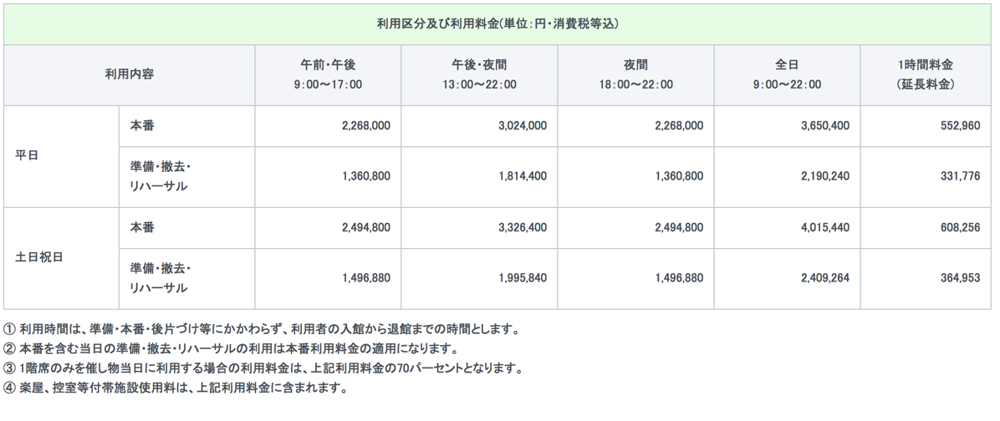
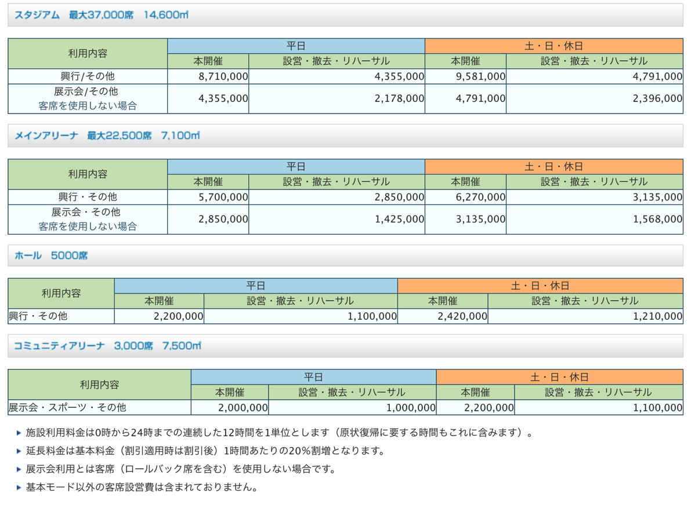

---
categories:
- LIVEのお作法
date: Mon, 26 Sep 2016 12:31:18 +0000
slug: post-9313
tags:
- LIVEのお作法
title: LIVEのアンコールについてぼくが思うこと
---

ぼくがLIVEの時に絶対にこれはやるぞということの１つにアンコールを全力でするというポリシーがあります。先日のDIR EN GREYの中野サンプラザ公演にて改めてアンコールと行為について改めて考えて見たのでまとめてみました。<!--more-->先日のDIR EN GREYの中野サンプラザ公演は、いつものスタンディングと違いホール公演ということもあり本編が終了するとだいたいの人が着席していました。ぼくも着席しました。ただそこからスマホをずっといじっている方が結構目立ちました。アンコールなんていうのは、織り込み済みでセトリも決まってるし、どうせ演るんだからどう待機していようが同じだろうという意見もあるかもしれません。

でもぼくはそうは思いません。

<h2>アンコールはアンコールを望んだ者のためのもの</h2>

ぼくがアンコールを叫ぶ理由は2つあります。

１つはその昔Gacktが復活してから初めての横浜アリーナ公演での出来事です。本編が終了しGacktがはけると同時に立ちっぱなしで手を叩くおねえさんが数メートル先にいました。目につく場所にいたので、本編中もめちゃくちゃ動いてらっしゃったのを見ていました。ぼくはというと、本編で疲れ切ってしまったのですがその方はずーっとずーっと動きっぱなし。

その姿を見て凄いカッコいいなと思ったのを今でもよく覚えています。その方の後ろ姿、髪型や服装まで鮮明に覚えています。

だからぼくもアンコールも全力でと決めています。

もう１つの理由が、ぼくがピエラーということに起因します。若い方は知らないと思いますが、PIERROTというバンドはあるツアーで「今後アンコールを求められなければやらないこともある」と宣言し、実際アンコールの声援がメンバーが求める基準に達しなかったとしてアンコールをしなかったことがありました。

その逆にアンコールを求める声援が鳴り止まず、ほぼ本編と同じ曲数を行なったこともあります。

つまりピエラーにとっては、アンコールとはない可能性があるものなのです。だからアンコールを心の底から求めて叫ぶのです。

<h2>バンド側にはアンコールできない場合もある</h2>

そうは言っても、バンド側にはアンコールできない場合もあります。本編終了後のアンコールは演ったとしても、ダブルアンコール•トリプルアンコールなんてのはとくに演れない場合がほとんどです。その理由は<strong>コストがかかるからです。</strong>

よく言われるのが、施設利用料の延長料金です。少し調べてみました。

国際フォーラムホールAの場合、規定の時間から1時間延長されると平日で552,960円、休日で608,256円かかるようです。

（引用元:<a href="https://www.t-i-forum.co.jp/organizer/facilities/a/">https://www.t-i-forum.co.jp/organizer/facilities/a/</a>）

また、さいたまスーパーアリーナですと1時間当たりの20%がかかります。

（引用元:<a href="http://www.saitama-arena.co.jp/business/usage_fee_basic_facilities/">http://www.saitama-arena.co.jp/business/usage_fee_basic_facilities/</a>）

施設の利用時間の単位が12時間なので休日で延長したとすると9,581,000円÷12時間×120％でおよそ958,100円です。

また、本編が延長すれば、撤去時間も伸びることになります。計算が別かはわかりませんが、仮に同じで20%増しだとするとおよそ150万円の延長料金になるはずです。

さらに、それに付随する人件費や延長のための残業費用等も深夜料金でかかることが予想されます。

この費用をペイするにはチケットをどれくらい売ればいいのでしょうか。例えば8100円のチケットだとすると、185枚うらないといけません。チケットにはプレイガイドの手数料や集客コストもかかります。チケットではなく物販だったとしても、Ｔシャツ4100円だとすると365枚売らないといけません。

ということで、ここまで計算してやっとバンドに延長させる＝予定にないアンコールをさせることが非現実的だということがなんとなくわかってきました。

<h2>しんぺーはこう思った</h2>

<strong>それでもアンコールしてほしい。</strong>

まぁ上の計算が仮にあってたとして、それでもアンコールしてほしいならグッズをたくさん買えってことなのかもしれない。バンド側も買ってもらうために良い物を作らなくちゃいけないわけですが。

そう考えるとつくづくLIVEというものは演者と観客の共同作品なんだなーと。

とはいえ、逆に懐事情を気にしてトリプルアンコール求めなくて、後で言われちゃうこともあるし、突然の召集でLIVE行ってトリプルアンコールあるだろ！！と思って叫んでも帰れ言われることもあるし

そう思うと、やはり共同作品なので、お互いの気持ちがぴったり合致しないとなぁ(2回目)

まぁでも予定されてるにしろされてないにしろ、ぼくは今後も叫び続けます。というか叫ばずとも思いが伝われば拍手でもなんでも良いと思うので、今後もアンコールを願っていこうと思います。

といったところで、本日は以上になります。
おやすみなさい。