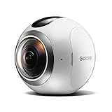
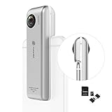
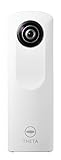

---
categories:
- レビュー
date: Tue, 27 Sep 2016 11:30:30 +0000
slug: post-9318
tags:
- ガジェット
title: 今流行りの全天球カメラ「RICOH THETA」が欲しいので軽く調べてみた
---

今ほしいなーと思っているものがあります。それはRICOHから出ているthetaという全天球カメラです。ただ最近はVRの注目とともに、こういったガジェットがたくさん出てきているので、他にいいのがないか含めて調べてみました。本日はそのご紹介です。<!--more--><h2>全天球カメラとは？</h2>

簡単にいうとカメラを中心としたほぼ360°を撮影できるカメラのことです。

<blockquote data-width="500" data-height="375" class="ricoh-THETA-spherical-image" >Nordic Aurora in Norway - Spherical Image - RICOH THETA</blockquote>

動画だとこんな感じ

<blockquote data-width="500" data-height="375" class="ricoh-THETA-spherical-image" >Color Run Live in United Kingdom - Spherical Image - RICOH THETA</blockquote>

どうですか？面白いでしょう？

<h2>なんでほしいのか</h2>

なんでこんなものがほしいのかというと、理由は２つありす。１つは、<strong>その空間そのものを撮影したいと思うこと</strong>が多いからです。例えば、ぼくはよくLIVE終わりにパノラマ写真でLIVE会場周辺を撮影します。なんでかというと、LIVEが終わって感動の中日常に戻っていく様をなんとなくとっておきたいと思うからです。

あともう１つは<strong>写真を撮るのが苦手だから</strong>。全天球ならどんな風に撮ろうが関係なさそうなきがするし。ということでほしいのです。

<h2>同じような機能を持った他社製品</h2>

で、THETAについて調べているとAmazonの関連商品から色々と似たようなガジェットを発見。
色々な会社からこういった全天球カメラがでているみたいです。

<h3>SAMSUNG　GAER 360</h3>
こちらはSAMSUNG製の全天球カメラです。

<a href="http://www.amazon.co.jp/exec/obidos/ASIN/B01ID2Q72Q/warawareotoko-22/ref=nosim/" target="_blank" >【Galaxy純正 国内正規品】 Galaxy 全天球カメラ Gear 360 Galaxy S7 edge / S6 / S6 edge対応 ホワイト SM-C200NZWAXJP</a>
posted with <a href="http://kaereba.com" rel="nofollow" target="_blank">カエレバ</a>

 by Galaxy 2016-07-15    

<a href="http://www.amazon.co.jp/gp/search?keywords=gear%20360&__mk_ja_JP=%83J%83%5E%83J%83i&tag=warawareotoko-22" target="_blank" >Amazon</a>

<a href="http://hb.afl.rakuten.co.jp/hgc/0f6e221b.2eb9748a.0f6e221c.35cc1e84/?pc=http%3A%2F%2Fsearch.rakuten.co.jp%2Fsearch%2Fmall%2Fgear%2520360%2F-%2Ff.1-p.1-s.1-sf.0-st.A-v.2%3Fx%3D0%26scid%3Daf_ich_link_urltxt%26m%3Dhttp%3A%2F%2Fm.rakuten.co.jp%2F" target="_blank" >楽天市場</a>

<a href="http://ck.jp.ap.valuecommerce.com/servlet/referral?sid=3041033&pid=882528283&vc_url=http%3A%2F%2Fsearch.shopping.yahoo.co.jp%2Fsearch%3Fp%3Dgear%2520360&vcptn=kaereba" target="_blank" >Yahooショッピング</a>

ぼくの好きなアメリカのユーチューバーの<a href="https://www.youtube.com/user/caseyneistat/videos">Casey Neistat</a>もSAMSUNGに提供を受けて使用してます。
<iframe width="560" height="315" src="https://www.youtube.com/embed/_PMb8bfAXtE" frameborder="0" allowfullscreen></iframe>

ただし、値段が5万円近くするのと、Amazonの口コミが悪い点、端末依存が強そう、というあたりが気になります。
端末依存が強そうというのは、SAMSUNGの商品ですので、当然Androidに特化しています。<a href="http://www.samsung.com/jp/product/gearvr/#gear-vr">Gear VR</a>を使ってAndroidで利用することを前提としている節があります。実機で確かめていないので不確かですが、iphoneで利用できるのかも不明です。Youtubeにアップして、同じようなVRガジェットを使えばiPhoneでも同じように楽しむことはできそうですが…

あとは動画の画質が悪そうな点がダメです。

<h3>Insta360 Nano</h3>

これ、アイデア商品です。すごくいいと思います。
単体でも利用できますが、iPhoneのライトニングコネクタに接続して利用することでiPhoneの画面でどこを撮影しているのかを見ながら撮影ができるようになっています。

<a href="http://www.amazon.co.jp/exec/obidos/ASIN/B01HNM4UTE/warawareotoko-22/ref=nosim/" target="_blank" >INSTA360 Nano 360°全天球パノラマ式カメラ 超HD3K 3040x1520高解像度 デジタルカメラ 二つの超広角魚眼レンズ 210°+ 210° VR体験 iPhone 6 /iphone 6 plus /iphone 6s / iphone 6s plusに対応</a>
posted with <a href="http://kaereba.com" rel="nofollow" target="_blank">カエレバ</a>

 Insta360     

<a href="http://www.amazon.co.jp/gp/search?keywords=INSTA360%20Nano%20360%81%8B&__mk_ja_JP=%83J%83%5E%83J%83i&tag=warawareotoko-22" target="_blank" >Amazon</a>

<a href="http://hb.afl.rakuten.co.jp/hgc/0f6e221b.2eb9748a.0f6e221c.35cc1e84/?pc=http%3A%2F%2Fsearch.rakuten.co.jp%2Fsearch%2Fmall%2FINSTA360%2520Nano%2520360%25C2%25B0%2F-%2Ff.1-p.1-s.1-sf.0-st.A-v.2%3Fx%3D0%26scid%3Daf_ich_link_urltxt%26m%3Dhttp%3A%2F%2Fm.rakuten.co.jp%2F" target="_blank" >楽天市場</a>

<a href="http://ck.jp.ap.valuecommerce.com/servlet/referral?sid=3041033&pid=882528283&vc_url=http%3A%2F%2Fsearch.shopping.yahoo.co.jp%2Fsearch%3Fp%3DINSTA360%2520Nano%2520360%25C2%25B0&vcptn=kaereba" target="_blank" >Yahooショッピング</a>

価格も2万円半ば。ポケットに入るサイズですし、導入モデルとしてはとてもいいように思います！ただ、こちらもきになる点があります。

それは<strong>中華製</strong>ということと、<strong>iPhoneのライトニングコネクタ専用</strong>という点です。iPhoneの次期モデルがライトニングコネクタを搭載しない可能性も十分あります。また、OSのアップデートで給電ができなくなったり、使用ができなくなる可能性は十分にあります。

ということで、こちらの商品も端末依存が強いように思えます。

<h2>全天球カメラはTHETA一択</h2>

ということで一長一短な感じはしますが、値段や環境面で見ていくとやはりTHETA一択な気がします。

ただし、THETAにはモデルが2つ存在します。
それが上位モデルのTHETA SとエントリーモデルのTHETA m15です。

上位モデルの THETA SはTHETA　m15に比べて高画質、ライブストリーミングにも対応、HDでの動画撮影もできます。値段は3万円代後半。

<a href="http://www.amazon.co.jp/exec/obidos/ASIN/B014US3FQI/warawareotoko-22/ref=nosim/" target="_blank" >RICOH デジタルカメラ RICOH THETA S 360°全天球カメラ 910720</a>
posted with <a href="http://kaereba.com" rel="nofollow" target="_blank">カエレバ</a>

 リコー 2015-10-23    

<a href="http://www.amazon.co.jp/gp/search?keywords=ricoh&__mk_ja_JP=%83J%83%5E%83J%83i&tag=warawareotoko-22" target="_blank" >Amazon</a>

<a href="http://hb.afl.rakuten.co.jp/hgc/0f6e221b.2eb9748a.0f6e221c.35cc1e84/?pc=http%3A%2F%2Fsearch.rakuten.co.jp%2Fsearch%2Fmall%2Fricoh%2F-%2Ff.1-p.1-s.1-sf.0-st.A-v.2%3Fx%3D0%26scid%3Daf_ich_link_urltxt%26m%3Dhttp%3A%2F%2Fm.rakuten.co.jp%2F" target="_blank" >楽天市場</a>

<a href="http://ck.jp.ap.valuecommerce.com/servlet/referral?sid=3041033&pid=882528283&vc_url=http%3A%2F%2Fsearch.shopping.yahoo.co.jp%2Fsearch%3Fp%3Dricoh&vcptn=kaereba" target="_blank" >Yahooショッピング</a>

ただし、THETA m15にもいいところがあります。それは<strong>値段が安いこと</strong>。2万円代で購入できます。また、<strong>色が複数ありカワイイ</strong>です。THETA Sに比べると動画、静止画ともに画質が落ちますが、全天球という遊びの撮影に画質をどこまで求めるのかーという点で、こちらでもいいかなという選択肢もありだと思います。

<a href="http://www.amazon.co.jp/exec/obidos/ASIN/B00OZCM70K/warawareotoko-22/ref=nosim/" target="_blank" >RICOH デジタルカメラ RICOH THETA m15 ホワイト 360°全天球イメージ撮影デバイス 0910700</a>
posted with <a href="http://kaereba.com" rel="nofollow" target="_blank">カエレバ</a>

 リコー     

<a href="http://www.amazon.co.jp/gp/search?keywords=theta%20m15&__mk_ja_JP=%83J%83%5E%83J%83i&tag=warawareotoko-22" target="_blank" >Amazon</a>

<a href="http://hb.afl.rakuten.co.jp/hgc/0f6e221b.2eb9748a.0f6e221c.35cc1e84/?pc=http%3A%2F%2Fsearch.rakuten.co.jp%2Fsearch%2Fmall%2Ftheta%2520m15%2F-%2Ff.1-p.1-s.1-sf.0-st.A-v.2%3Fx%3D0%26scid%3Daf_ich_link_urltxt%26m%3Dhttp%3A%2F%2Fm.rakuten.co.jp%2F" target="_blank" >楽天市場</a>

<a href="http://ck.jp.ap.valuecommerce.com/servlet/referral?sid=3041033&pid=882528283&vc_url=http%3A%2F%2Fsearch.shopping.yahoo.co.jp%2Fsearch%3Fp%3Dtheta%2520m15&vcptn=kaereba" target="_blank" >Yahooショッピング</a>

<h2>しんぺーはこう思った。</h2>

さて、どちらのモデルを購入しようかな〜と悩んでおります。ちなみに、そろそろニューモデルがでるのでは思い、RICOHに問い合わせましたが新製品の発表はどうもなさそうな回答をもらいまいした。

ということで来月あたり、どちらかのモデルを購入して、いろんなところで撮影したいな〜と思っております。。

と言ったところで本日は以上になります。  おやすみなさい。