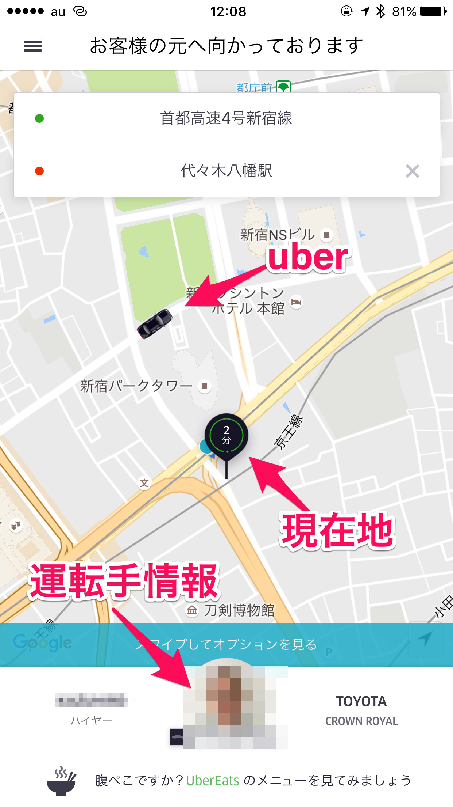
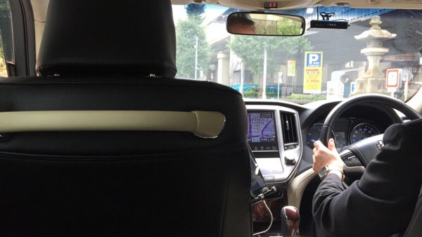
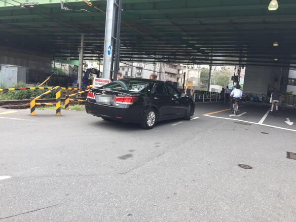
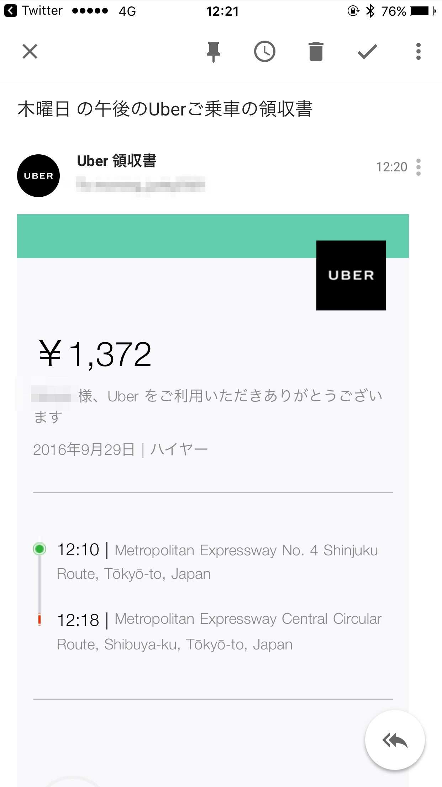
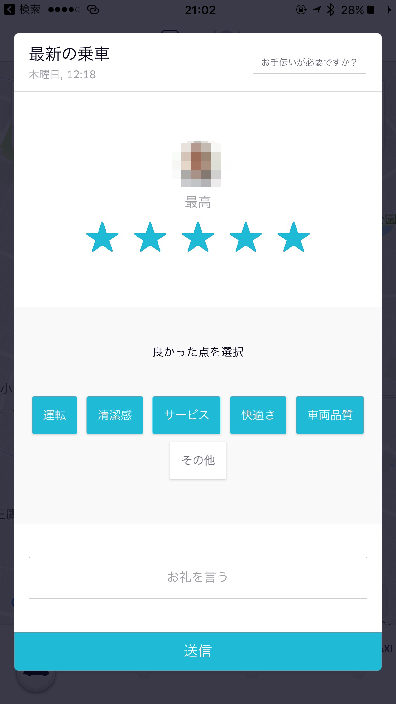
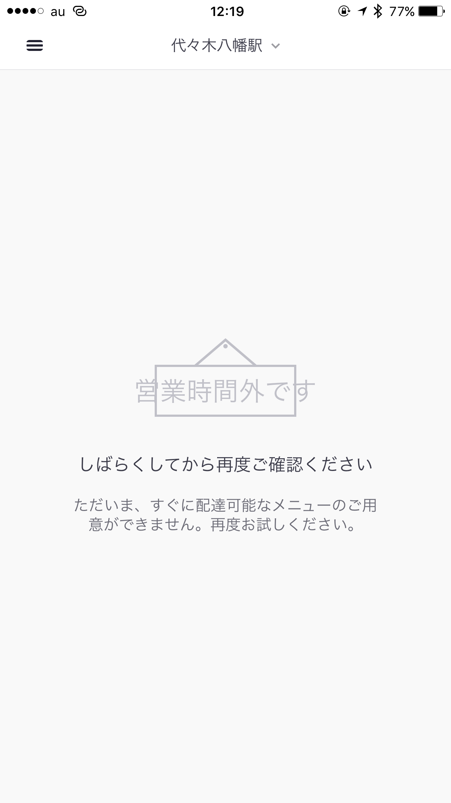
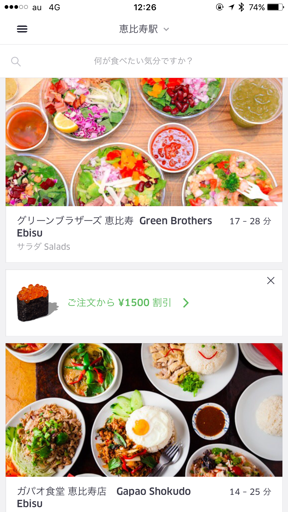

---
categories:
- Uber Eats
date: Thu, 29 Sep 2016 12:24:00 +0000
slug: post-9335
tags:
- Uber Eats
title: Uber Eatsの対象エリア外なので対象エリアまでUnerで行って注文してみようとした話
---

ついにUber Eatsが日本でも本日よりスタートしました！！ぼくはこの日を待ちわびていました！早速ですが使ってやろうと思った話です！<!--more--><h2>Uberとは？</h2>

タクシーに代わるサービスとして世界的に流行している配車サービスです。

運転手は一般人。仕事の合間や空いている時間と自分の車を利用してタクシーの様に人を運ぶサービスです。

運転手は自分の空いている時間を利用してお小遣いが稼げ、乗客は予め設定した目的地に対しての経路の料金が提示されるため会計が分かりやすく明朗となります。また料金の支払いはクレジットカードを通してUberに支払うため、現金のやりとりといった手間や不正などが起きません。

この圧倒的な利便性で世界中の旧来のタクシーを押しのけて流行中です。

<h2>Uber Eatsとは？</h2>

そんなUberが始めたのが弁当宅配サービスの「Uber Eats」です。本国アメリカでは既にスタートしておりましたが、日本でも本日やっとスタートです！

スタート時点では、150店舗以上と提携しておりUberと契約した配達員がスクーターや自転車で届けてくれます。

料金は今の所料理代のみのようです。
なお、対象エリアはいまのところ渋谷・恵比寿、青山・赤坂、六本木・麻布エリアとなっております。

<h2>早速使ってみた！</h2>

と言いたいところですが、なんとぼくは今西新宿あたりに勤務しており、見事に対象エリアの範囲外！！！ふぁうくーー！！

以前LINEもLINE WOWというワンコインで何でも買ってきてくれるサービスをやっていて、おそらく日本一使いまくってたであろうぼくとしては、何としてでもこの類似サービスをスタート日である今日体験したい！！と思っていました。

それが、ギリギリの範囲外！！

使えないなんて絶対に嫌だ！！！

ということで、Uberを使って、Uber Eatsの対象エリア内に移動してそこで注文して食べてやることにしました。

<h3>Uberの使い方</h3>

Uberを自分で使うのは初めてですが、その手軽さが素晴らしかったです。

まずはアプリをDL、必要情報を登録します。クレジットカードは必須です。

アプリを立ち上げて、現在地にピンを刺せば近くを走っているUberがリアルタイムで地図に表示されます。なお、日本ではアメリカの様に一般人が運転手をしていることは今の所ありません。Uberに登録したちゃんとした運転手がきます。

現在地と目的地を設定して配車依頼をするとすぐにきます。たまたま近くにいたからというのもありますが、本当にすぐきました。地図上で自分の指定した地点に近づいてくる様子もわかるので、ストレスもありません。

来たのはトヨタのクラウンで車内はめちゃくちゃ綺麗。普通のタクシーならタバコ臭かったりすることもありますが、そんなことはありませんでした。ラジオも流れてないし、無線でのやりとりとなんかもなくてひたすら静寂の中目的地へと運ばれました。

ちなみに車体にデカデカと「ウーバー」とな書いてないので、使い慣れてないと乗車時きょどります。

さて、対象エリア内に着きました。車を降りると数分後に登録したメールアドレス宛に領収書が届きました。

料金は普通のタクシーに比べて、若干高い感じもしますが、品質がすごいよいので今後普及すれば安くなるかもしれません。ちなみに運転手の評価もできる様になっています。

さて、ではさっそくUber Eatsで注文です！
まずは専用のアプリを立ち上げ、現在地を指定します。この辺の使い勝手はUnerアプリと同じような感じです。

で、

なんだってええええ！？？会社で確認した時は大戸屋とか大戸屋とか大戸屋とかあったのにぃぃい！！！

どうやら、スタート日ということとエリア内とはいえ隅っこすぎたため近くに配達員がいなかったようです。

他に恵比寿駅や渋谷駅を指定してみましたが2、3店舗しか配達可能店舗がなくなってて、さらに結構時間がかかるみたいな表示になっていました。

まぁ、そらそうだよね。スタート日だもん。

ということで、注文できなかったので、Uberで来た道をトボトボ歩いて帰りましたとさ

<h2>しんぺーはこう思った。</h2>

ぼくの勤めている場所は、周りに飲食店がなくあったとしてもビルのテナントで高い上にいつも同じような店で飽き飽きしています。

そんな中に一筋の光を照らしてくれてたのがLINE WOWでした。ワンコインでなんでも買って来てくれました。ハンバーガーを毎週20個近く注文したり、ピザ屋にデリバリーさせずにLINE WOWに持って来てもらうことで半額特典を利用したり、オープンしたての店に3時間近く並んでもらったりしました。そんなLINE WOWがサービス終了をしてから数ヶ月、やっと再び照らされた光、それがUber Eatsなのです。

はやく！はやく新宿全域を対象エリアにしておくれ！！使い倒すから！！

といったところで本日は以上です。
おやすみなさい。

それと近々リベンジしますんで