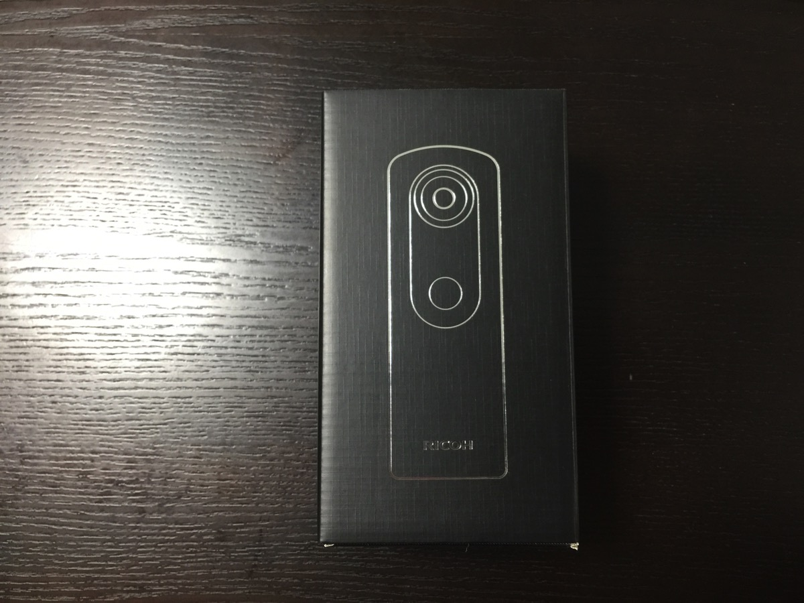
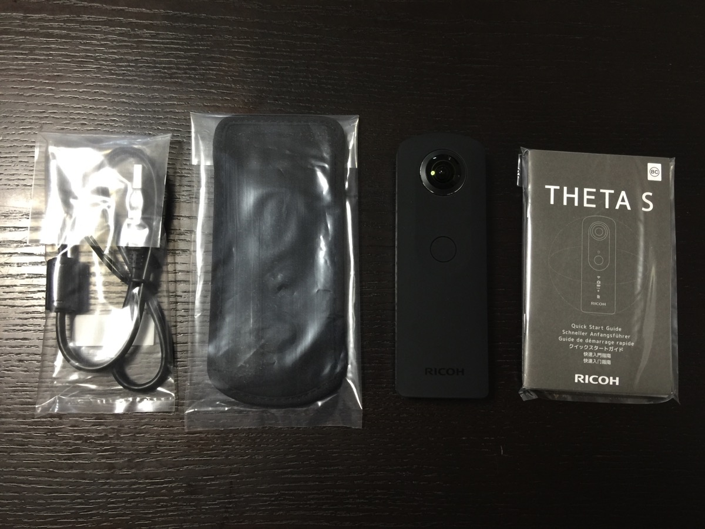
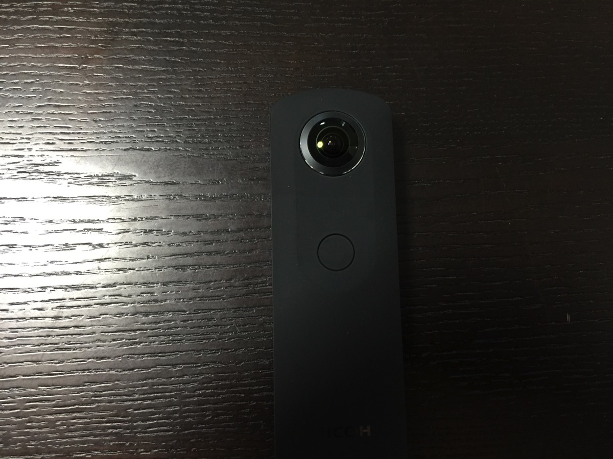
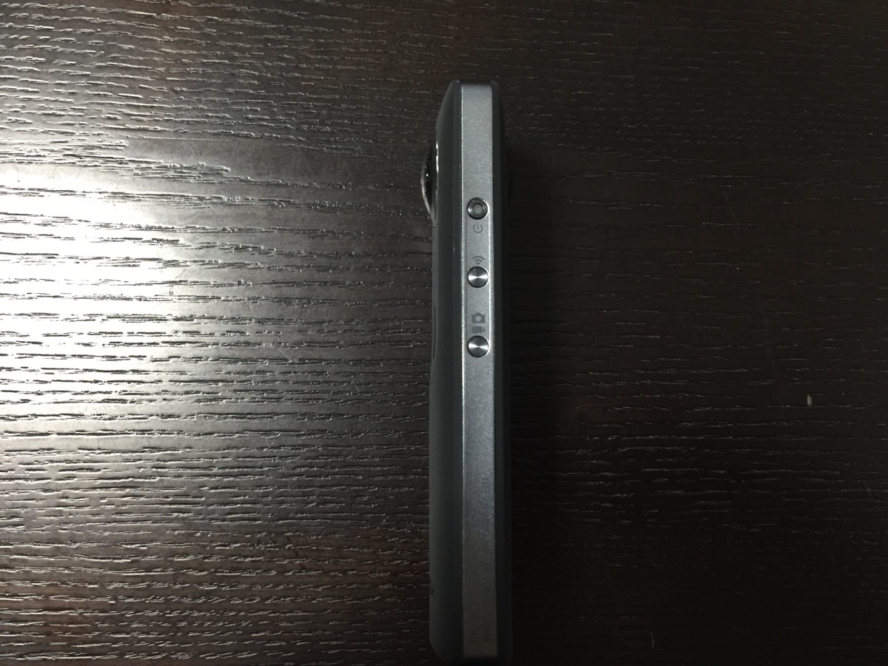
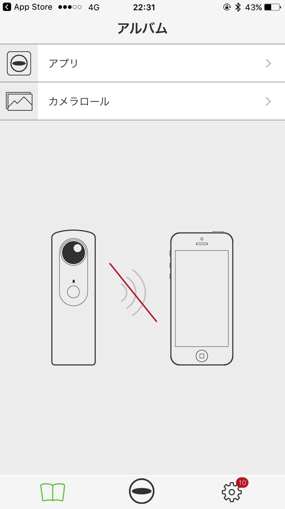

---
categories:
- レビュー
date: Thu, 06 Oct 2016 13:07:02 +0000
slug: post-9407
tags:
- THETA
title: RICOHのTHETA S 360を購入してしまった！そして返品します！
---

いやー買ってしまってました全天球カメラ「RICOH THETA S 360」
欲しいな〜欲しいな〜と思ってたらね。<!--more--><h2>事の顛末</h2>

楽天ポイントが15000円分あったんですわ。でTHETAの購入にポイントを充てると現金はいくらになるのかなと思ってたわけです。

で、楽天にて購入画面でポイントを使用、確定画面の手前まで行って合計金額を確認。現金は23,000円くらい、なるほど〜思ったよりも負担額大きいなと感想を抱く

そこで、ぼくの記憶は途切れました。寝ながらやってたので、寝落ち・・・

何かの気配に目をさますと、飛び込んできたのは「ご注文ありがとうございました」の文字

はっ！！！やってもうた！！！まじかよ！！！

まぁいっか。欲しいと思ってたし←

<h2>そして早速届いた！！</h2>

いやー！わくわくするぜ！

ということで早速iPhoneとの接続を開始！！

と、ここで問題発生。

なんどやってもアプリと接続ができない。。。

どゆこと！？Twitterで検索してみても、つながりにくいとはでてきても全くつながらないという声はほとんどない。こりゃ、初期不良か？？

ということで返品決定

でも、まだできるかは不明。とりあえずTHETAのサポートにメールしました。明日電話もしてみよう。

それと楽天のカメラのキタムラにも問い合わせておこう。

4万円近くしたんだから、なんとしてもどうにかしてもらわなければ！！！

<h2>しんぺーはこう思った。</h2>

どうやら一部情報によるとロシアかどっかの外国にてTHETA  SCという新たな商品の登録履歴があったとのことです。ということで近々新商品がでることはほぼ間違いありません。

そちらは4K動画撮影可能ということなので本体価格いくらいになるんでしょうか。。。据え置きだったら、買い替えも検討します！

でも、とにかく今の段階では全く使えないぼくのTHETAなので早々に返品いたします！！

と言ったところで本日は以上になります。  おやすみなさい。

<a href="http://www.amazon.co.jp/exec/obidos/ASIN/B014US3FQI/warawareotoko-22/ref=nosim/" target="_blank" >RICOH デジタルカメラ RICOH THETA S 360°全天球カメラ 910720</a>
posted with <a href="http://kaereba.com" rel="nofollow" target="_blank">カエレバ</a>

 リコー 2015-10-23    

<a href="http://www.amazon.co.jp/gp/search?keywords=THETA&__mk_ja_JP=%E3%82%AB%E3%82%BF%E3%82%AB%E3%83%8A&tag=warawareotoko-22" target="_blank" >Amazon</a>

<a href="http://hb.afl.rakuten.co.jp/hgc/0f6e221b.2eb9748a.0f6e221c.35cc1e84/?pc=http%3A%2F%2Fsearch.rakuten.co.jp%2Fsearch%2Fmall%2FTHETA%2F-%2Ff.1-p.1-s.1-sf.0-st.A-v.2%3Fx%3D0%26scid%3Daf_ich_link_urltxt%26m%3Dhttp%3A%2F%2Fm.rakuten.co.jp%2F" target="_blank" >楽天市場</a>

<a href="http://ck.jp.ap.valuecommerce.com/servlet/referral?sid=3041033&pid=882528283&vc_url=http%3A%2F%2Fsearch.shopping.yahoo.co.jp%2Fsearch%3Fp%3DTHETA&vcptn=kaereba" target="_blank" >Yahooショッピング</a>

