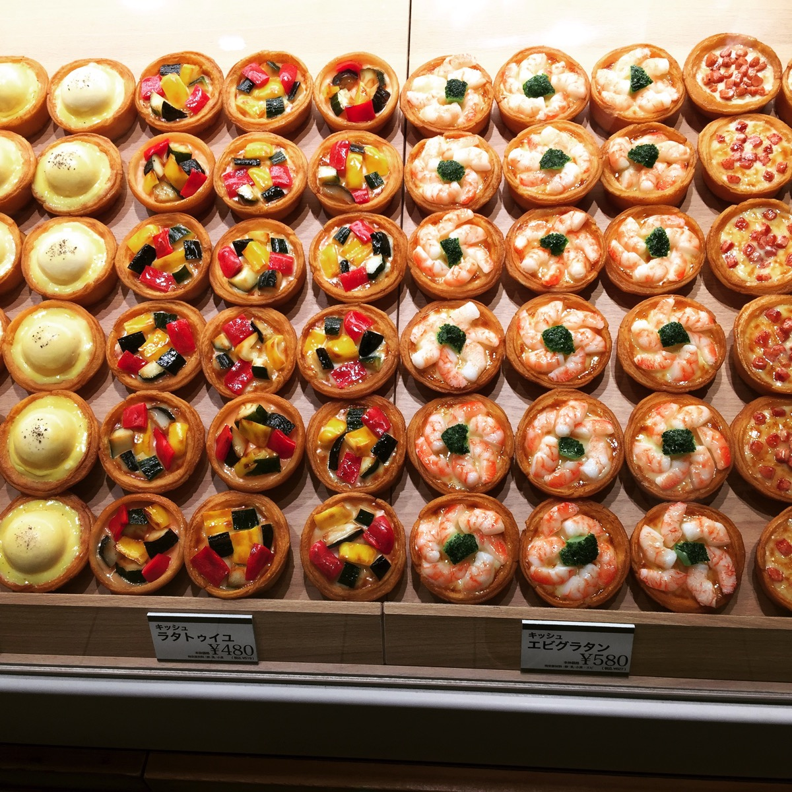
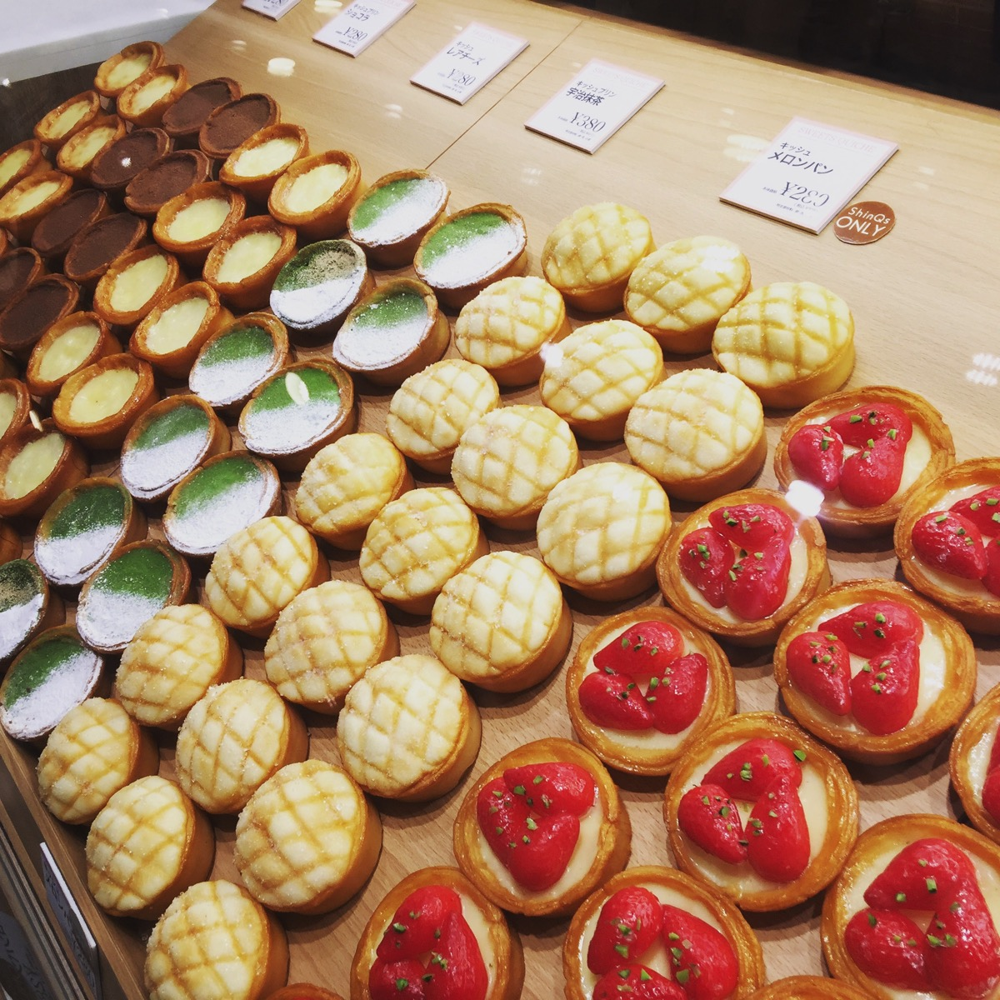

---
categories:
- グルメ
date: Sun, 09 Oct 2016 13:23:12 +0000
slug: post-9428
tags:
- スイーツ
title: ヒカリエの地下2階にある「キッシュヨロイヅカ」で買ったスイーツを翌日食べた感想
---

先日ヒカリエに久しぶりに行ったら、お店が色々変わってました。そんな中一際目立つお店があったので思わず買ってしまいました。そして食べる前の写真撮り忘れましたw　でも見た目かなりインパクトあって、そして美味しかったのでご紹介します！！！<!--more-->
<h2>見た目のインパクトがすごい！キッシュヨロイヅカ</h2>
故川島なお美のご主人で、パティシエとして有名な鎧塚俊彦のお店です。
というか、そんな予備情報は一切知らずにもう目に飛び込んできた瞬間に並んで買っちゃいました。

ということで、早速こちらをごらんください！

どうですか！？

これ絶対おいしそうでしょう！？？？

買ったのは、カルボナーラ・ロレーヌ・キッシュメロンパン（渋谷ヒカリエ限定）・キッシュプリンショコラ・ストロベリーの5つ。

５点で1,900円！！！1つ280円！！！高い！！

そう高かった！！にもかかわらず買って帰ってきて一晩寝かせて翌日の朝に食べました。お腹がいっぱいだったんです。

しかし、しかし！！ちょっとトーストして食べたキッシュたちは美味しかったんですね〜

これ絶対すぐに食べたらもっと美味しかったと思う。。今度はそうしたい。。

これ、絶対おすすめです。

参考：<a href="http://www.1016.co.jp/quicheyoroizuka/">キッシュヨロイヅカ</a>
<h2>しんぺーはこう思った。</h2>
万が一、翌日食べた美味しさが実は最高値という可能性は否定できませんが、それでも美味しかったです。1人で5個ははっきりいって食べすぎなので、1人で食べるなら多くて3つくらいかなと思います。それなら1,000円くらいだし。

まぁとにかく、美味しかったのでおすすめです！！！

と言ったところで本日は以上になります。

おやすみなさい。