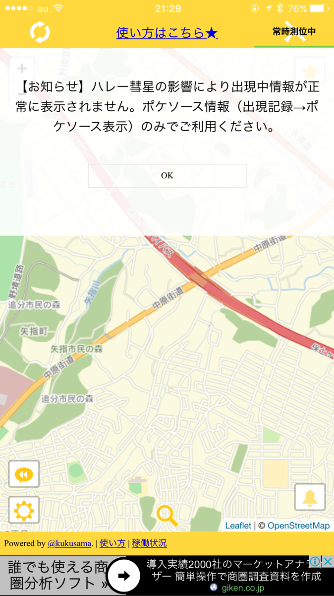

---
categories:
- ポケモン
date: Mon, 10 Oct 2016 13:06:34 +0000
slug: post-9432
tags:
- ポケモンGO
title: そういうのじゃねーんだよ！ポケモンGOの追加予定新機能がどれもクソ
---

ぼくのポケモンGOの最新の進捗です！130匹！はい！先週と変わってません！しかし来週中にカブトを進化させる予定です！さて、そんな中ナイアンティック社より新機能の追加が発表されました！実装は近日中とのこと！ただその新機能がどれもクソすぎて話にならないので、それについての愚痴でございます！！<!--more--><h2>新機能：メダルのランクアップで狙ったタイプのポケモンが捕まえやすくなります！</h2>

<blockquote>
 捕まえたポケモン毎のタイプのメダル（キャンプファイヤー、にわし、サイキッカーなど）がランクアップすると、そのタイプのポケモンを捕まえやすくなるボーナス効果が得られるようになりました。例えば、キャンプファイヤーのメダルがランクアップするとボーナス効果を得られ、ヒトカゲやロコン、ポニータなどの、ほのおタイプのポケモンの捕まえやすさがアップします。

引用：<a href="http://pokemongo.nianticlabs.com/ja/">http://pokemongo.nianticlabs.com/ja/</a>
</blockquote>

は？

そんな数値に現れない捕まえやすさなんかどうでもええわあああああああ！！！！！そんなことよりも先にやることがあるだろ！！！

ポケモンの出現位置の補正やら、出現率の細かな修正やら、色々やることあるだろ！！

<h2>トレーニングバトルがさらに楽しく！</h2>

<blockquote>今まで仲間チームのジムに対して、手持ちのポケモン 1 匹でしかチャレンジできなかったトレーニングですが、このアップデートによって手持ちから 6 匹のポケモンを選んでチャレンジできるようになりました。また、自分のトレーナーレベルにあわせて、相手のポケモンのCPが調整されることで、よりバトルを楽しめるようになりました。

引用：<a href="http://pokemongo.nianticlabs.com/ja/">http://pokemongo.nianticlabs.com/ja/</a>
</blockquote>

いやージムバトルやってねーわーあんなつまんないことやらいでしょ。せっかく自分が落としたジムなのに配置で横入りされたり、バトルスタートする瞬間にエラーになるし、もっとやるべきことがあるでしょう。

<h2>今本当に必要とされるアップデート</h2>

それは、ポケモンの位置情報のヒントではないでしょうか？

<blockquote class="twitter-tweet" data-lang="ja">
Some more screencaps of the new <a href="https://twitter.com/PokemonGoApp">@PokemonGoApp</a> tracker <a href="https://twitter.com/hashtag/PokemonGo?src=hash">#PokemonGo</a> <a href="https://t.co/Lsizu9DoKi">pic.twitter.com/Lsizu9DoKi</a>
&mdash; Jackson Palmer (@ummjackson) 2016年8月9日</blockquote>

ポケモンの居場所を探してくれるアプリが軒並み使い物にならなくなっています。ぼくはP-GOサーチを使っていました。しかし最近警告を受けたようで、ポケモンの名前と画像が使用できなくなったりしていました。そしてついに利用すらできなくなりました。

ハレー彗星の影響とか言ってますが、これはポケモンGO側の仕様変更によるもののようです。

ポケモンの本当の楽しさ、それは集めることです。そしてその次が育て戦わせることです。

ぼくはまだポケモンGO自体はゲームの初期段階だと思います。だから集めるための機能を充実させるべきです。集めるための機能とは具体的にポケモンと出会う機能です。

捕まえやすいかどうかなんてはっきりいって二の次三の次です。まずは出会えたこと自体が楽しいのです。珍しいポケモン、出会ったことのないポケモンに出会った時、ポケモン自体をプレイしたことがあろうがなかろうが、そのテンションは同じです。その楽しさこそがポケモンGOの楽しさにつながっているのです。でなければこんなゲーム性がないゲームが流行るわけがありません。

<h2>しんぺーはこう思った。</h2>

いらない機能の実装よりもバグを治すのと、交換・バトル機能の実装を一刻も早くしてほしいものです。

今後のポケモンは交換やユーザー間でのバトルが実装されない以上、いくら他の機能を追加しようとポケモンGOに未来はありません。

と言ったところで本日は以上になります。  おやすみなさい。