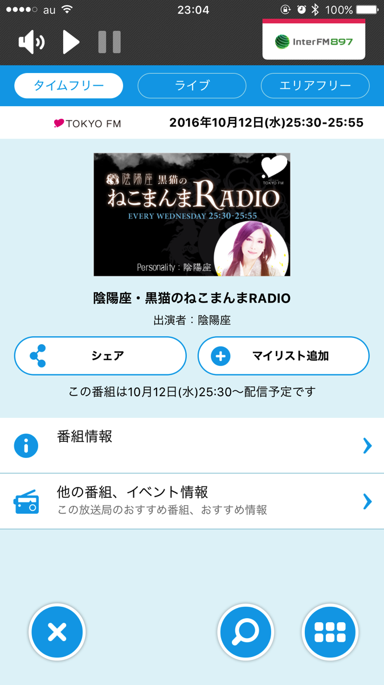
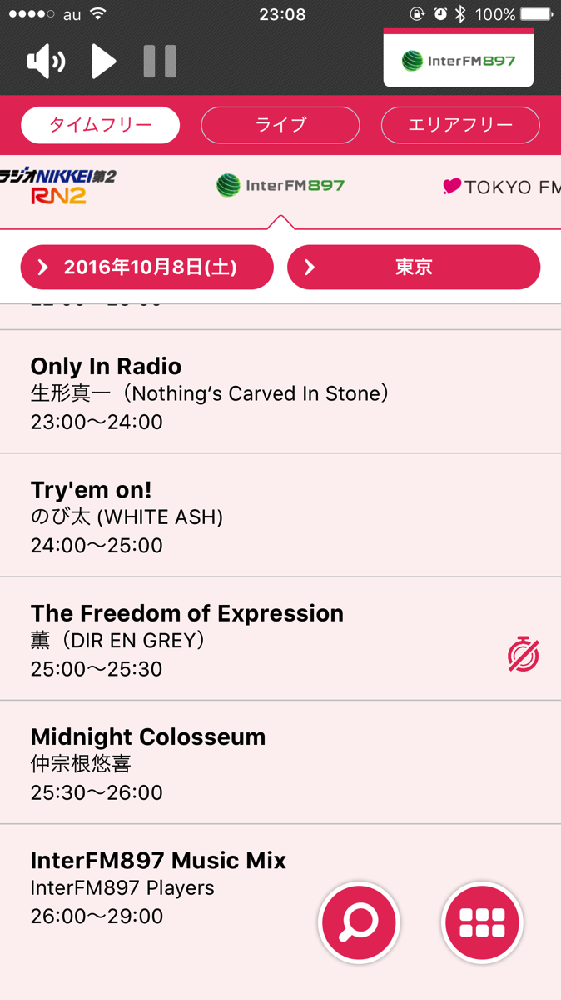

---
categories:
- アプリ
date: Wed, 12 Oct 2016 14:19:16 +0000
slug: post-9443
tags:
- アプリ
title: radikoの新機能が中途半端で使いにくい件
---

radikoがフルリニューアルしましたー！早速新機能を使ってみましたので感想をご紹介いたします。<!--more--><h2>radiko新機能「シェアラジオ」</h2>

今聴いてる番組をSNSでシェアできる機能です。リンクを載せてシェアできるので、シェアされた方はリンクからアプリを立ち上げた上で番組を聴くことができます。

シェアするとこんな感じ↓

<blockquote class="twitter-tweet" data-lang="ja">
[radiko.jp]GOLDEN 4 EGGS(水) | NACK5 | 2016/10/12/水 | 23:00-23:30 <a href="https://twitter.com/hashtag/nack5?src=hash">#nack5</a> <a href="https://t.co/YUhc5iAwvo">https://t.co/YUhc5iAwvo</a>  テスト <a href="https://t.co/CQQio7Ip4h">pic.twitter.com/CQQio7Ip4h</a>
&mdash; しんぺー@ (@s_s_p_y) <a href="https://twitter.com/s_s_p_y/status/786208182976720897">2016年10月12日</a></blockquote>

正直使いにくいです。AbemaTVみたいに番組の一部が切り出されるわけでもありませんし、それをそのまま再生できるわけでもありません。

中途半端

<h2>radiko新機能「タイムフリー」</h2>

これは便利！過去1週間分の全番組を聴くことができます。ただし条件があります。

再生ボタンを押してから3時間以内にかぎり、再生•戻し•飛ばしができるのです。通勤時に2時間番組を聴いていて、帰宅時に続きを聞こうと思ったらもう聴けなくなっていました。

時間切れになって再生不可になるとこんな風に時計マークが表示されます↓

正直全く使えるレベルではありません。これならyoutubeに上がってるものを聴いた方が全然いいです。

一週間だけならせめて何回でも聞けるようにしてほしいです。

<h2>しんぺーはこう思った。</h2>

何やら、まだまだシガラミやら決まりやらがごっりごりに作用してこうなっちゃいました〜って感じがしますが、それでも相当進んだんじゃないかと思います。

今後の革新に期待！

と言ったところで本日は以上になります。  おやすみなさい。

<a href="https://itunes.apple.com/jp/app/radiko.jp/id370515585?mt=8&uo=4&at=11ld5P" target="_blank" >radiko.jp</a>

無料

(2016.10.12時点)

<a href="https://itunes.apple.com/jp/developer/radiko-co.-ltd./id427755241?uo=4&at=11ld5P" target="_blank" >radiko Co.,Ltd.</a>

posted with <a href="http://pochireba.com" rel="nofollow" target="_blank">ポチレバ</a>

