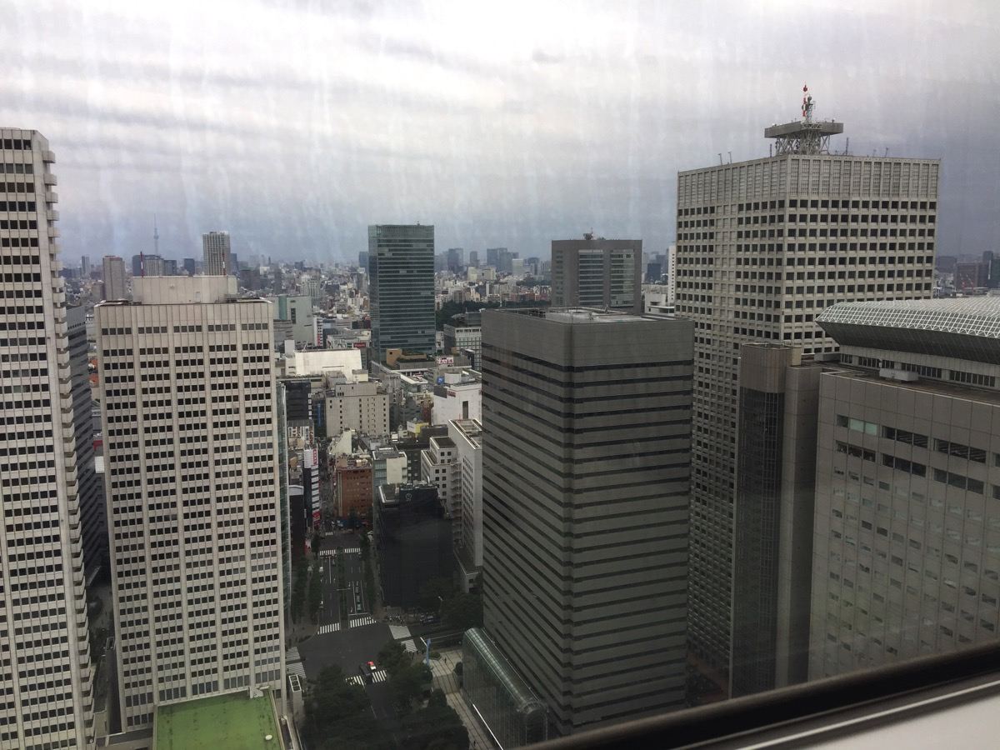
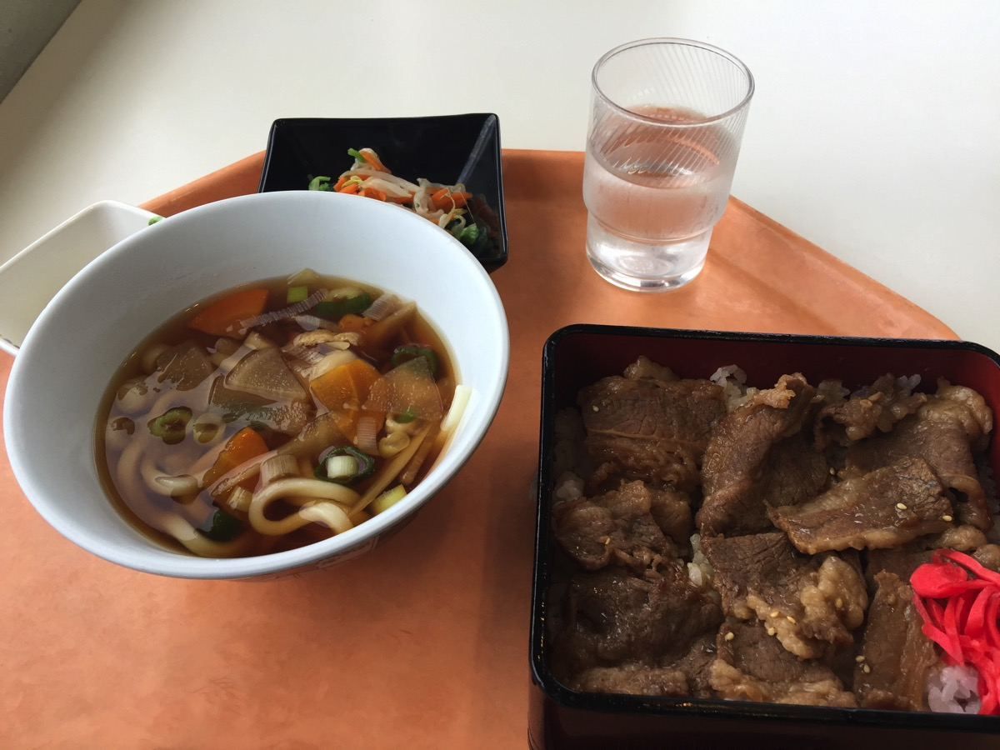

---
categories:
- グルメ
date: Thu, 13 Oct 2016 14:14:41 +0000
slug: post-9449
tags:
- グルメ
title: 都庁の職員食堂行ってきた！まぁまぁ安くて食べられるレベル！
---

会社が西新宿方面にあるんですが、いやー本当にいい店がない！あったら誰か教えて。前は会社が渋谷にあって、その時は美味しいお店ばっかりだったんですが、オフィス街の外れなので店もまばらで、あるとしたらオフィスビルの地下レストランくらい。値段も高いし飽きるし、面白くもない！そんな中、都庁の職員食堂には一般の人も入れるらしくて、安いしソコソコの味という噂を耳にしたので行ってきました！本日はそのご紹介です。

都庁のビルは新宿駅に背を向けて、向かって右側が第一庁舎で左側が第二庁舎。職員食堂は第一庁舎の32階と第二庁舎の4階にあります。第二庁舎4階は現在工事中のため閉鎖してましたので、本日は第一庁舎32階にいってきましたー！

いやーお役所ていつも慣れないわー、しかも都庁なだけあって警備員も沢山いて、妙にキンチョーしました。<!--more--><h2>職員食堂への行き方</h2>

職員食堂は一般の人でも普通に入って食事できます。

ただし、用紙に氏名と電話番号を記入して入館書を受け取ってからでないとエレベーターに乗れません。これわかりにくいので、迷ったら受付で聞いてみるといいです。教えてくれます。

エレベーターで32階まで上がると食堂らしい食堂が広がっていました。ぼくが行った時間がお昼休みを過ぎていたからでしょうか、一般の人が沢山いました。おじいさん、おばあさん、外国人観光客などなど。東京観光スポット的な感じになってる雰囲気でした。

ただ、説明書きや英語表記などはなく、もうあからさまに職員用です。迷ってる外国人夫婦に食券の買い方を教えてあげたりしました。

<h2>職員食堂の内観とご飯</h2>

えーっと、古いです。暗いです。いかにも食堂って感じです。ちょっと古めの大学の食堂ですね。

<blockquote data-width="500" data-height="375" class="ricoh-theta-spherical-image" >Post from RICOH THETA. - Spherical Image - RICOH THETA</blockquote>

ただし、32階なので見晴らしはいいです。でも窓際じゃないと見れません。

ご飯は、こんな感じです。

これで690円、量はまぁ普通。多くもなくお腹いっぱいくらいです。味は•••普通。普通に美味しいわけでもなく、まずいわけでもなく、食堂って感じです。

<blockquote data-width="500" data-height="375" class="ricoh-theta-spherical-image" >Post from RICOH THETA. - Spherical Image - RICOH THETA</blockquote>

西新宿のオフィスビルのレストラン相場でいうと5〜7割くらいの値段ですかね。味もそれ相応。

<h2>しんぺーはこう思った。</h2>

んー、正直好き好んでまた行くことはないかなぁ。これならコンビニの弁当とか牛丼食べた方がいい。

体験としては行って見てもいいかも！

といったところで、本日は以上になります。
おやすみなさい。