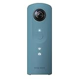
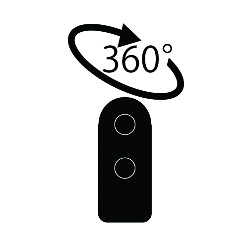

---
categories:
- レビュー
date: Fri, 14 Oct 2016 12:54:00 +0000
slug: post-9452
tags:
- THETA
title: ニューモデル「theta SC」と「theta S」のスペック比較
---

噂されてたRICOH thetaのニューモデルが遂に発売されました〜！数日前にRICOHのtheta S 360°を購入したぼく涙目〜！ということで本日はtheta sとニューモデルのtheta scの比較です。<!--more-->
<h2>RICOH theta scは高性能で安いらしい</h2>
そうらしいですよ！ぼくが数日前に購入したtheta sとほぼ同等の性能があるにも関わらず、値段が1万円近く安いらしいです。

<a href="http://www.amazon.co.jp/exec/obidos/ASIN/B01M3O1FTK/warawareotoko-22/ref=nosim/" target="_blank">RICOH デジタルカメラ RICOH THETA SC (ブルー) 360°全天球イメージ撮影デバイス 910743</a>

posted with <a href="http://kaereba.com" target="_blank" rel="nofollow">カエレバ</a>

リコー 2016-10-28

<a href="http://www.amazon.co.jp/gp/search?keywords=theta%20sc&amp;__mk_ja_JP=%E3%82%AB%E3%82%BF%E3%82%AB%E3%83%8A&amp;tag=warawareotoko-22" target="_blank">Amazon</a>

<a href="http://hb.afl.rakuten.co.jp/hgc/0f6e221b.2eb9748a.0f6e221c.35cc1e84/?pc=http%3A%2F%2Fsearch.rakuten.co.jp%2Fsearch%2Fmall%2Ftheta%2520sc%2F-%2Ff.1-p.1-s.1-sf.0-st.A-v.2%3Fx%3D0%26scid%3Daf_ich_link_urltxt%26m%3Dhttp%3A%2F%2Fm.rakuten.co.jp%2F" target="_blank">楽天市場</a>

<a href="http://ck.jp.ap.valuecommerce.com/servlet/referral?sid=3041033&amp;pid=882528283&amp;vc_url=http%3A%2F%2Fsearch.shopping.yahoo.co.jp%2Fsearch%3Fp%3Dtheta%2520sc&amp;vcptn=kaereba" target="_blank">Yahooショッピング</a>

比較表は<a href="https://theta360.com/ja/about/theta/">こちら</a>

見た限り変わってるのはカラーバリエーションと重さ（Sは125g、SCは102g）くらい。それと変わった点はシャッタースピードが速くなったらしい。つまり、動いている被写体に対してブレが少なくなったり、手ブレも少なくなったみたいです。

ただしtheta scはあくまで下位モデル！

正確には数年前に発売されたtheta m15とtheta sの中間と言えます。

<a href="http://www.amazon.co.jp/exec/obidos/ASIN/B00OZCM70K/warawareotoko-22/ref=nosim/" target="_blank">RICOH デジタルカメラ RICOH THETA m15 ホワイト 360°全天球イメージ撮影デバイス 0910700</a>

posted with <a href="http://kaereba.com" target="_blank" rel="nofollow">カエレバ</a>

リコー

<a href="http://www.amazon.co.jp/gp/search?keywords=theta%E3%80%80m15&amp;__mk_ja_JP=%E3%82%AB%E3%82%BF%E3%82%AB%E3%83%8A&amp;tag=warawareotoko-22" target="_blank">Amazon</a>

<a href="http://hb.afl.rakuten.co.jp/hgc/0f6e221b.2eb9748a.0f6e221c.35cc1e84/?pc=http%3A%2F%2Fsearch.rakuten.co.jp%2Fsearch%2Fmall%2Ftheta%25E3%2580%2580m15%2F-%2Ff.1-p.1-s.1-sf.0-st.A-v.2%3Fx%3D0%26scid%3Daf_ich_link_urltxt%26m%3Dhttp%3A%2F%2Fm.rakuten.co.jp%2F" target="_blank">楽天市場</a>

<a href="http://ck.jp.ap.valuecommerce.com/servlet/referral?sid=3041033&amp;pid=882528283&amp;vc_url=http%3A%2F%2Fsearch.shopping.yahoo.co.jp%2Fsearch%3Fp%3Dtheta%25E3%2580%2580m15&amp;vcptn=kaereba" target="_blank">Yahooショッピング</a>

その証拠にtheta sにかなわない部分がいくつかあります。

<strong>動画撮影時間</strong>

Sは一度に25分の動画が撮影可能です。対してSCは5分です。また、SCはストリーミングでの動画放送には対応していません。そのためかSCには出力用のミニHDMIがありません。

あくまでエントリーモデル。

ただし、動画が5分しか撮影できないからといって、買うのを躊躇うのは間違いです。なぜなら全天球動画の容量が膨大だからです。

thetaは本体で撮影したデータをスマホ側に転送することで加工や閲覧、共有をすることができます。ただし、その際データの大きさに比例して転送時間がかかります。

図で説明するとこんな感じ

①thetaで撮影する。

②撮影したデータをスマホに転送する。静止画ならスマホで直接加工して、共有ができます。この転送にけっこう時間がかかります。

③転送した動画データをPCに転送。動画の場合は共有する場合PCで一旦編集しないといけません。そのためPCに転送します。この時は優先で行いますのでスピーディーです。

④PCで全天球動画用アプリでメタデータを編集。ここからが少し面倒。thetaから編集用のアプリケーションでていますので、それを使って少し動画をいじる必要があります。

こんな感じで全天球動画を作成するのですが、theta本体からスマホに動画を転送する時、容量が大きければ大きいほど転送に時間がかかります。転送中はアプリを閉じることはできません。閉じると最初からやり直しです。目安として試しに撮影した動画の容量ですが、5分動画で約580MB、10分動画で約1.3GBでした。ちなみに5分動画だと転送に10分以上かかりました。

つまり何が言いたいかというと<strong>5分以上の全天球データはあまり現実的ではない</strong>ということです。転送や加工、さらに保存しておくのにもあまり適していません。ちなみに編集なしで動画を単純に人に送ったりSNSに投稿しても全天球動画が平面に展開された歪んだ動画にしかなりません。

<a href="http://www.amazon.co.jp/exec/obidos/ASIN/B01M3O1FTK/warawareotoko-22/ref=nosim/" target="_blank">RICOH デジタルカメラ RICOH THETA SC (ブルー) 360°全天球イメージ撮影デバイス 910743</a>

posted with <a href="http://kaereba.com" target="_blank" rel="nofollow">カエレバ</a>

リコー 2016-10-28

<a href="http://www.amazon.co.jp/gp/search?keywords=theta%E3%80%80sc&amp;__mk_ja_JP=%E3%82%AB%E3%82%BF%E3%82%AB%E3%83%8A&amp;tag=warawareotoko-22" target="_blank">Amazon</a>

<a href="http://hb.afl.rakuten.co.jp/hgc/0f6e221b.2eb9748a.0f6e221c.35cc1e84/?pc=http%3A%2F%2Fsearch.rakuten.co.jp%2Fsearch%2Fmall%2Ftheta%25E3%2580%2580sc%2F-%2Ff.1-p.1-s.1-sf.0-st.A-v.2%3Fx%3D0%26scid%3Daf_ich_link_urltxt%26m%3Dhttp%3A%2F%2Fm.rakuten.co.jp%2F" target="_blank">楽天市場</a>

<a href="http://ck.jp.ap.valuecommerce.com/servlet/referral?sid=3041033&amp;pid=882528283&amp;vc_url=http%3A%2F%2Fsearch.shopping.yahoo.co.jp%2Fsearch%3Fp%3Dtheta%25E3%2580%2580sc&amp;vcptn=kaereba" target="_blank">Yahooショッピング</a>

まとめると<strong>手軽に全天球を楽しみたい人向けなのがtheta sc</strong>です。

theta sは夜空の星の動きをタイムラプス撮影したい！みたいなわりと全天球を自己表現として使いたい人向けです。

<a href="http://www.amazon.co.jp/exec/obidos/ASIN/B014US3FQI/warawareotoko-22/ref=nosim/" target="_blank">RICOH デジタルカメラ RICOH THETA S 360°全天球カメラ 910720</a>

posted with <a href="http://kaereba.com" target="_blank" rel="nofollow">カエレバ</a>

リコー 2015-10-23

<a href="http://www.amazon.co.jp/gp/search?keywords=theta&amp;__mk_ja_JP=%E3%82%AB%E3%82%BF%E3%82%AB%E3%83%8A&amp;tag=warawareotoko-22" target="_blank">Amazon</a>

<a href="http://hb.afl.rakuten.co.jp/hgc/0f6e221b.2eb9748a.0f6e221c.35cc1e84/?pc=http%3A%2F%2Fsearch.rakuten.co.jp%2Fsearch%2Fmall%2Ftheta%2F-%2Ff.1-p.1-s.1-sf.0-st.A-v.2%3Fx%3D0%26scid%3Daf_ich_link_urltxt%26m%3Dhttp%3A%2F%2Fm.rakuten.co.jp%2F" target="_blank">楽天市場</a>

<a href="http://ck.jp.ap.valuecommerce.com/servlet/referral?sid=3041033&amp;pid=882528283&amp;vc_url=http%3A%2F%2Fsearch.shopping.yahoo.co.jp%2Fsearch%3Fp%3Dtheta&amp;vcptn=kaereba" target="_blank">Yahooショッピング</a>

どちらを選ぶかは、何に使いたいかによります！
<h2>しんぺーはこう思った。</h2>
正直発表を知った時は動揺しました。
この前買ったばっかだよ•••と。でも、まぁこれくらいのスペック差なら許容範囲•••強がりではありません！

どちらにしろ、全天球の画像はイジイジして眺めてるだけでも楽しいです。

また、すでに記事でもいくつか画像をあげてますが、表現の幅が広がる感じがします。

本当に買ってよかったと思います。なんとなく飲み会の時に全員で写れる様のリア充カメラな印象でしたが、子どもご生まれた人ばかりの人や小さい子どもがいる人、もしくは1人で出かけるのが好きな人、旅行に行くのが好きな人などに勧められるカメラだと思います。

もちろんハロウィン時期なのでリア充のハロウィン飲みにもうってつけです。

あとはぼくみたいに普通のカメラの撮影が苦手な人とかにもオススメです。買って損はありません！飽きて売っても高いままだし！

といったところで本日は以上になります。
おやすみなさい。