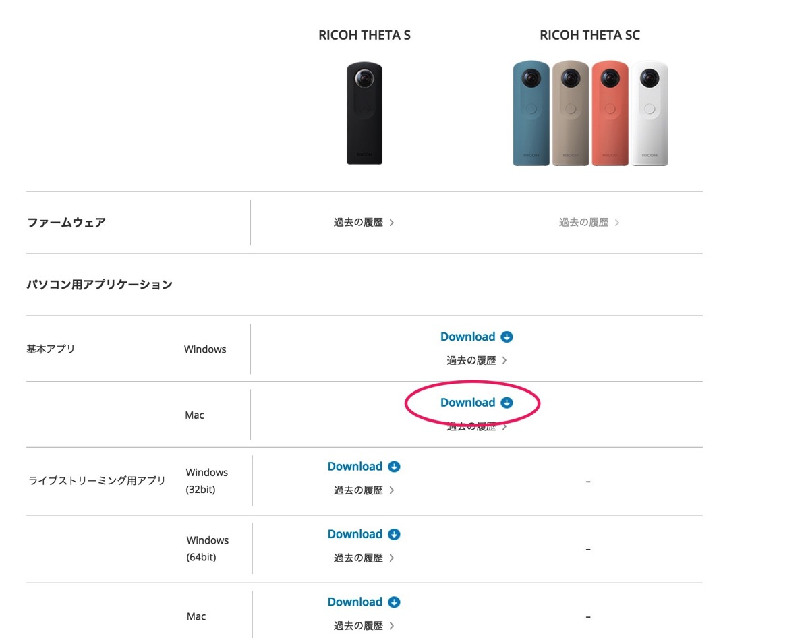
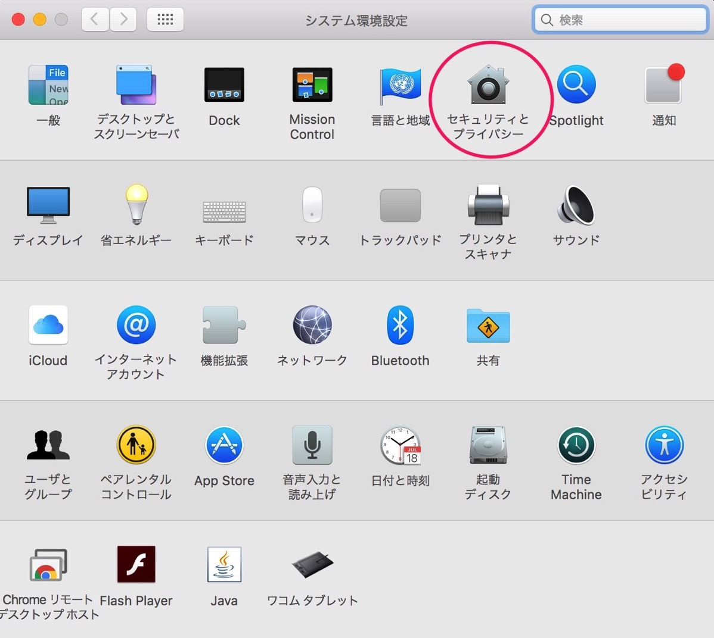
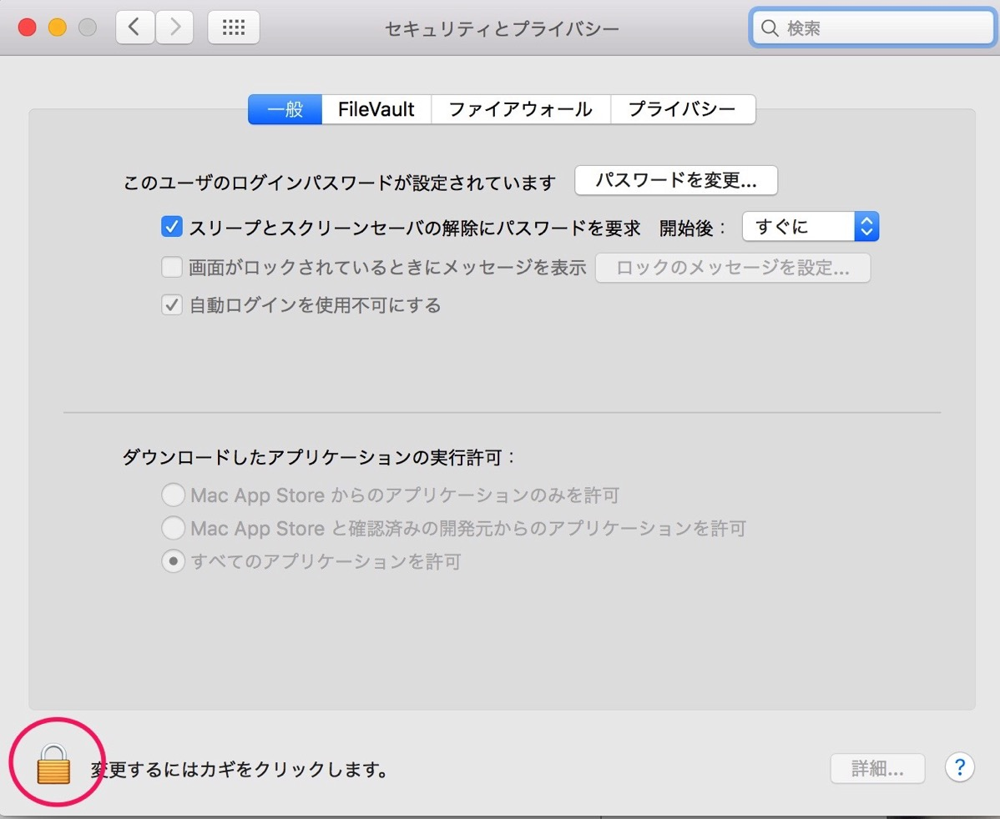
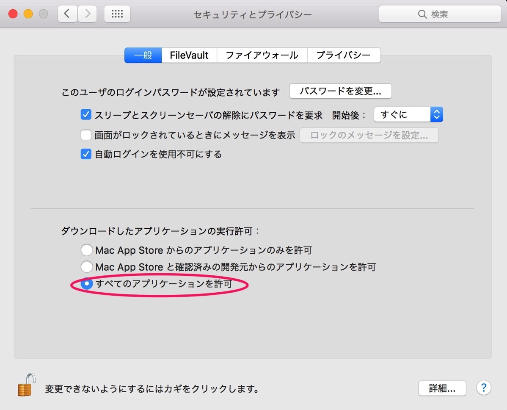
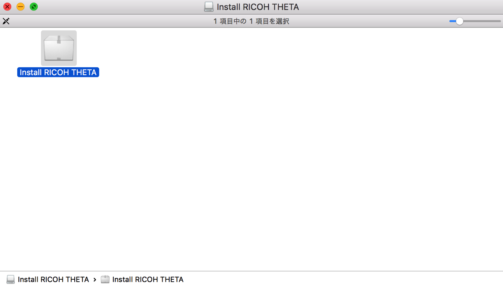
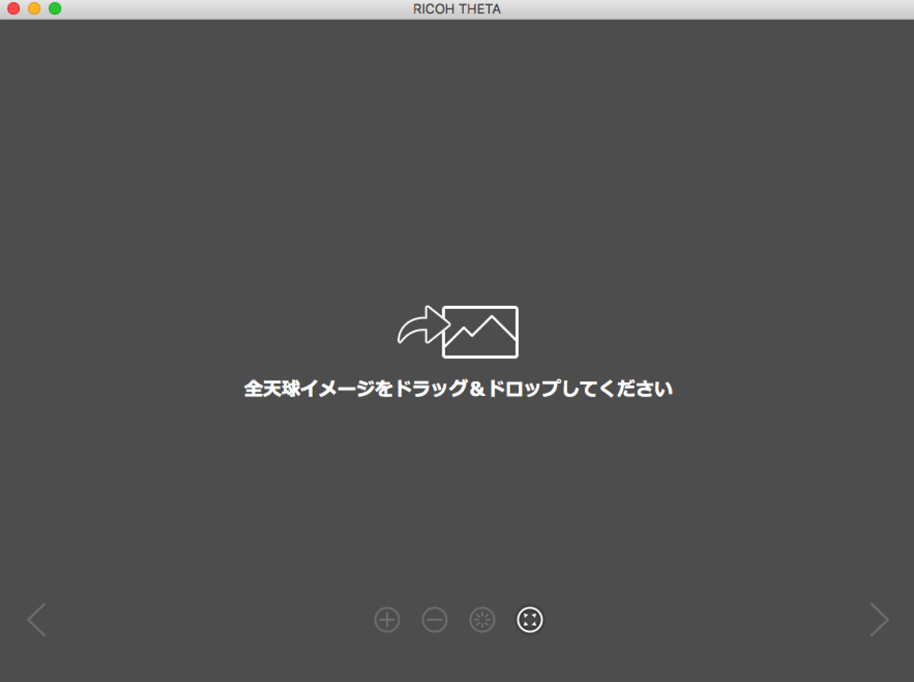
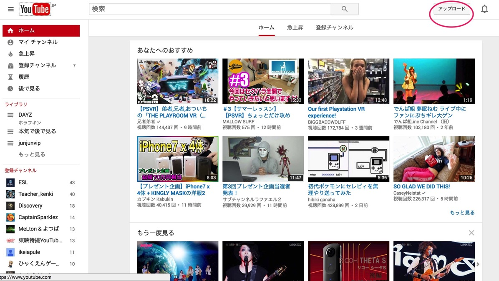
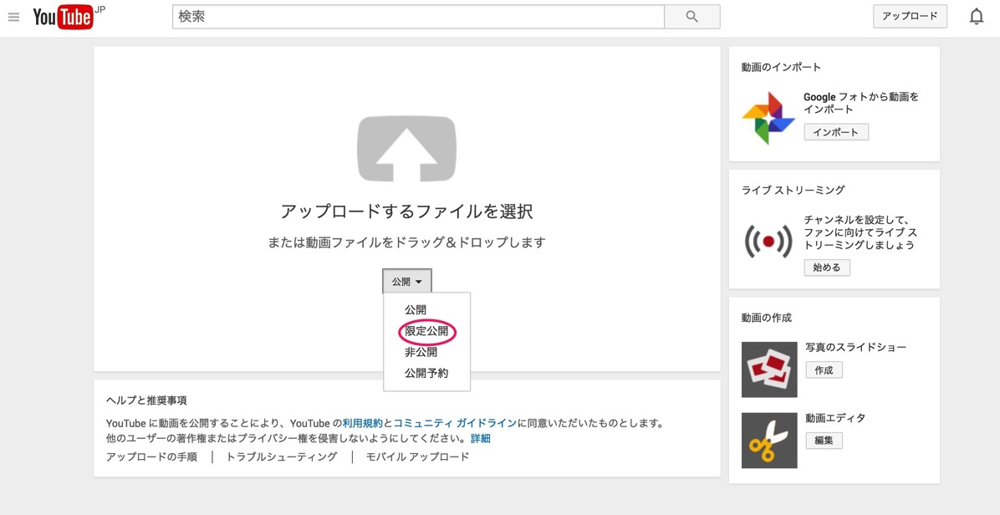
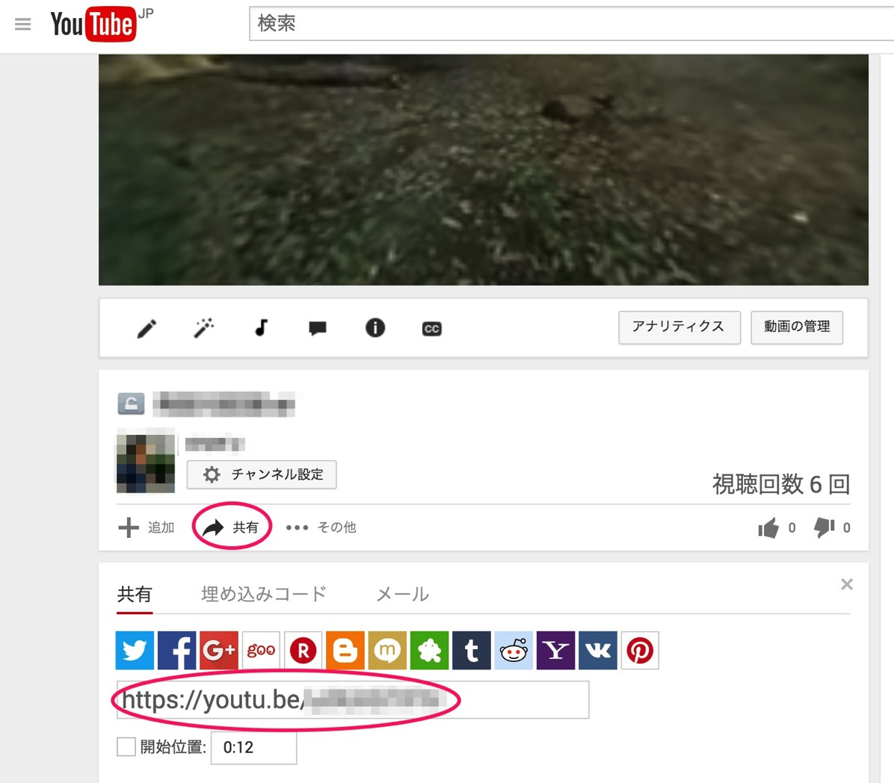
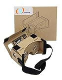

---
categories:
- レビュー
date: Tue, 18 Oct 2016 13:28:41 +0000
slug: post-9472
tags:
- THETA
title: macでthetaの全天球動画を共有する方法
---

thetaで撮影した全天球動画を他人に全天球のまま共有したい〜！ということでやり方がずっとわからなかったんですが、ようやく原因が判明しました！ということで本日はそのご紹介。ちなみにmac限定のお話です。<!--more--><h2>macのiphotoに同期しちゃうと動画ファイルの形式が強制的に書き変わっちゃうからダメ</h2>

そうなんです。<strong>macにもともと入っている写真管理ソフトのiphotoだと取り込んだ際に強制的に形式が変換されてしまい、m4vという形式になってしまいます。</strong>これだとthetaの全天球変換ソフトで取り込むことができません。

ここでぼくはつまずいてしまいました。

そこで、<strong>macのイメージキャプチャというこれまた内蔵されているアプリを使ってthetaから直接動画をダウロードしてしまいます。そうするとMP4形式でダウンロードされます</strong>ので、全天球変換アプリにそのまま突っ込むことができます。

それでは具体的な変換方法の説明に移ります！でもこの前提を忘れない様にしましょう！

<h2>youtubeに全天球動画をアップするまで</h2>

１、まずはRICOHのthetaページからアプリをダウンロードします。

<a href="https://theta360.com/ja/support/download/">https://theta360.com/ja/support/download/</a>

２、ただこのままだとアプリをインストールすることができませんので、macの設定を少し変えます。

macはMac App Store経由でしかアプリをインストールできない状態になっている方がほとんどだと思います。そこで、その制限を一時的に解放します。

設定からセキュリティとプライバシーをクリック

一般のタブをクリックして、左下の鍵マークをクリック

すべてのアプリケーションを許可にチェックをいれれば完了。アプリのインストールが終わったら元に戻しておきましょう。

3、インストール

あとは先ほどのサイトからダウンロードしたアプリをインストールするだけです。ダウンロードしたファイルをクリックしていくだけでOK

これで準備万端

4、thetaをmacに接続してイメージキャプチャで動画を取り込む

・イメージキャプチャとthetaが接続された状態のスクショ

5、インストールしたアプリで全天球に変換

取り込んだ動画をインストールしたアプリにドラッグするだけ

ちなみに変換しても動画ファイルのサイズの変化はほとんど見られませんでした。

6、変換されたらyoutubeにアップするだけ！

youtubeのアップロードというボタンをクリック

ここで注意。アップロードする際に公開というところをクリックして限定公開にしましょう。そうすることでリンクを知っている人だけがアクセスできる様になります。プライベートな動画を共有するだけならステータスには注意が必要です。

他人に共有する際には動画の下にある共有をクリックするとリンクがでてきます。これをコピーするなりして他人に知らせましょう。

また、他人に共有してもスマホの場合はyoutubeアプリでないと全天球で見えません。

<h2>しんぺーはこう思った。</h2>

全天球動画を楽しむためにはこんなガジェットもあります。スマホをセットして簡単なVR動画を楽しむことができます。

<a href="http://www.amazon.co.jp/exec/obidos/ASIN/B0196BLLLK/warawareotoko-22/ref=nosim/" target="_blank" >Linkcool Google Cardboard（グーグル・カードボード）3Dメガネ 3d Vrメガネ 組み立て式 NFCタグとベルト付き</a>
posted with <a href="http://kaereba.com" rel="nofollow" target="_blank">カエレバ</a>

 linkcool     

<a href="http://www.amazon.co.jp/gp/search?keywords=Linkcool%20Google%20Cardboard&__mk_ja_JP=%E3%82%AB%E3%82%BF%E3%82%AB%E3%83%8A&tag=warawareotoko-22" target="_blank" >Amazon</a>

<a href="http://hb.afl.rakuten.co.jp/hgc/0f6e221b.2eb9748a.0f6e221c.35cc1e84/?pc=http%3A%2F%2Fsearch.rakuten.co.jp%2Fsearch%2Fmall%2FLinkcool%2520Google%2520Cardboard%2F-%2Ff.1-p.1-s.1-sf.0-st.A-v.2%3Fx%3D0%26scid%3Daf_ich_link_urltxt%26m%3Dhttp%3A%2F%2Fm.rakuten.co.jp%2F" target="_blank" >楽天市場</a>

<a href="http://ck.jp.ap.valuecommerce.com/servlet/referral?sid=3041033&pid=882528283&vc_url=http%3A%2F%2Fsearch.shopping.yahoo.co.jp%2Fsearch%3Fp%3DLinkcool%2520Google%2520Cardboard&vcptn=kaereba" target="_blank" >Yahooショッピング</a>

今度買ってみます。

<a href="http://www.amazon.co.jp/exec/obidos/ASIN/B01MED3A2I/warawareotoko-22/ref=nosim/" target="_blank" >RICOH デジタルカメラ RICOH THETA SC (ピンク) 360°全天球イメージ撮影デバイス 910741</a>
posted with <a href="http://kaereba.com" rel="nofollow" target="_blank">カエレバ</a>

 リコー 2016-10-28    

<a href="http://www.amazon.co.jp/gp/search?keywords=theta%20sc&__mk_ja_JP=%E3%82%AB%E3%82%BF%E3%82%AB%E3%83%8A&tag=warawareotoko-22" target="_blank" >Amazon</a>

<a href="http://hb.afl.rakuten.co.jp/hgc/0f6e221b.2eb9748a.0f6e221c.35cc1e84/?pc=http%3A%2F%2Fsearch.rakuten.co.jp%2Fsearch%2Fmall%2Ftheta%2520sc%2F-%2Ff.1-p.1-s.1-sf.0-st.A-v.2%3Fx%3D0%26scid%3Daf_ich_link_urltxt%26m%3Dhttp%3A%2F%2Fm.rakuten.co.jp%2F" target="_blank" >楽天市場</a>

<a href="http://ck.jp.ap.valuecommerce.com/servlet/referral?sid=3041033&pid=882528283&vc_url=http%3A%2F%2Fsearch.shopping.yahoo.co.jp%2Fsearch%3Fp%3Dtheta%2520sc&vcptn=kaereba" target="_blank" >Yahooショッピング</a>

と言ったところで本日は以上になります。  おやすみなさい。