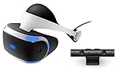

---
categories:
- ライフハック
date: Sun, 23 Oct 2016 11:22:00 +0000
slug: post-9545
tags:
- ブログ
title: iDのカードを作ったのでiDって何かを調べて見た
---

今まで楽天カードをメインに使っていたのですが、Amazonでの買い物が中心なのでAmazonでポイント貯めてそれでKindle本買った方がいいなぁと思い直して、この度Amazonのクレジットカードを作りました。ついでにiDにも申し込んでみました。が、正直iDて何なのかよく知らないので調べて見ました。<!--more--><h2>iDとは</h2>

DoCoMoと三井住友カードが提携し運営している電子マネーです。正直DoCoMoユーザーではない自分にとっては全くどのようなものか知りませんでした。

この電子マネーの一番の特徴は、チャージ制ではなくクレジットカード払いの後払い制という点です。またオートチャージとも違い<strong>完全に後払い制</strong>なので、どちらかというとクレジットカードに近いです。

<h2>iDのメリットは</h2>

ポイントが貯まる、チャージ不要という点ではりません。むしろ一番のメリットは<strong>その利便性</strong>でしょう。

つまり、<strong>クレジットカードが一般的な電子マネーの様に使える</strong>という点です。

サインも入らず、場合によっては<strong>財布から出すことなくタッチするだけで決済ができてしまうのです。</strong>

<h2>他のプリペイドカードとの比較</h2>

ぼくはLINE Payカード、au walletと2つのプリペイドカードを使っています。

この2つは<strong>利便性の違いなどは正直ほぼありません。</strong>
もちろんポイントの還元率などで違いはあります。

LINE payカードは100円で2%貯まりますが、au walletは提携店での買い物時のポイントが多くついたりなどします。

ただ、それもたかがしれています。

それとは別にnanacoも使っていますが、セブンイレブンでnanaco決済すると直接値引きがある商品が多いので正直こちらの方が使い勝手が良いです。

<h2>結論iDいらない</h2>

まもなくApple Payが日本でもスタートします。それによりiPhone7、7plusとapple watchシリーズ2は、端末をかざすことで様々な電子マネーが利用できるようになります。

iDも対象となっています。

ただ、ぼくが使っているのはiPhone6plusです。さらにいうと他のプリカや電子マネーをすでに利用しており、ポイントもそれなりに溜まっています。

そのためよほどのメリットがない限り新たな電子マネーを使おうとは思えません。

よって、iDはぼくのライフスタイルには合わず、全く無用と言わざるおえません。今回なんとなく申し込んでみましたが、このまま利用することは永遠にないと思います。

<iframe src="https://rcm-fe.amazon-adsystem.com/e/cm?t=warawareotoko-22&o=9&p=8&l=as1&asins=B0092VO0LI&ref=tf_til&fc1=000000&IS2=1&lt1=_blank&m=amazon&lc1=0000FF&bc1=FFFFFF&bg1=FFFFFF&f=ifr" style="width:120px;height:240px;" scrolling="no" marginwidth="0" marginheight="0" frameborder="0"></iframe>

<h2>しんぺーはこう思った。</h2>

今月のクレジットカードの請求額が確定になりました。

12万。。。おかしい。。先月の倍くらいになってる。。。

どうしていつもこうなっちゃうんだろう。。。

諸々の支払いを含めても6,7万円くらいに収めたいのに、、もう来月はクレジットカードを封印しようと思います。

ゲームも新作で買う予定のものはないし、kindle本とチケット代以外はお金使う予定もなし！！絶対に来月は7万以内に収める！そして少しはお金を貯めるんだああああ

<a href="http://www.amazon.co.jp/exec/obidos/ASIN/B01H03FQ44/warawareotoko-22/ref=nosim/" target="_blank" >PlayStation VR PlayStation Camera同梱版</a>
posted with <a href="http://kaereba.com" rel="nofollow" target="_blank">カエレバ</a>

 ソニー・インタラクティブエンタテインメント 2016-10-13    

<a href="http://www.amazon.co.jp/gp/search?keywords=PSVR&__mk_ja_JP=%E3%82%AB%E3%82%BF%E3%82%AB%E3%83%8A&tag=warawareotoko-22" target="_blank" >Amazon</a>

<a href="http://hb.afl.rakuten.co.jp/hgc/0f6e221b.2eb9748a.0f6e221c.35cc1e84/?pc=http%3A%2F%2Fsearch.rakuten.co.jp%2Fsearch%2Fmall%2FPSVR%2F-%2Ff.1-p.1-s.1-sf.0-st.A-v.2%3Fx%3D0%26scid%3Daf_ich_link_urltxt%26m%3Dhttp%3A%2F%2Fm.rakuten.co.jp%2F" target="_blank" >楽天市場</a>

<a href="http://ck.jp.ap.valuecommerce.com/servlet/referral?sid=3041033&pid=882528283&vc_url=http%3A%2F%2Fsearch.shopping.yahoo.co.jp%2Fsearch%3Fp%3DPSVR&vcptn=kaereba" target="_blank" >Yahooショッピング</a>

ちなみに今気になってるのはこれです。

と言ったところで本日は以上になります。  おやすみなさい。