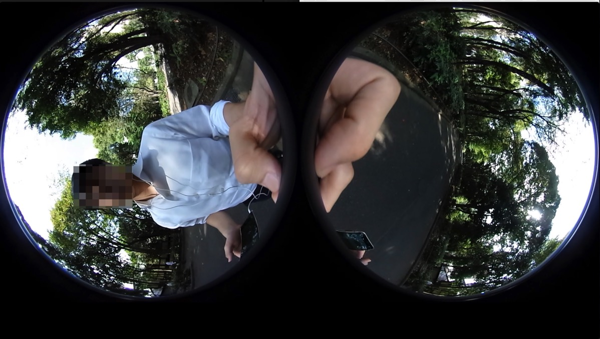
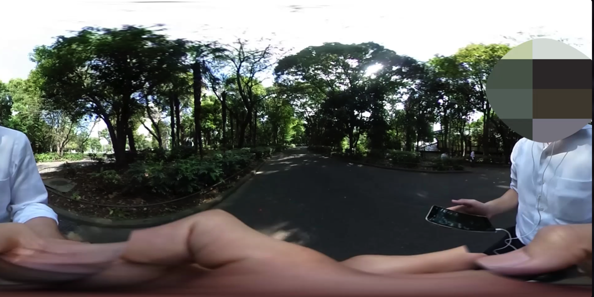
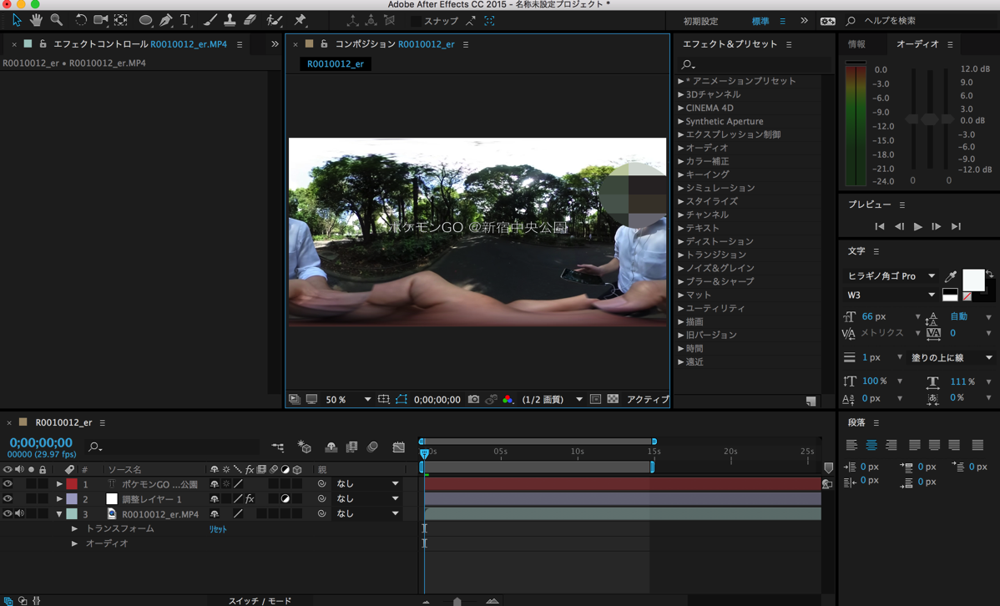
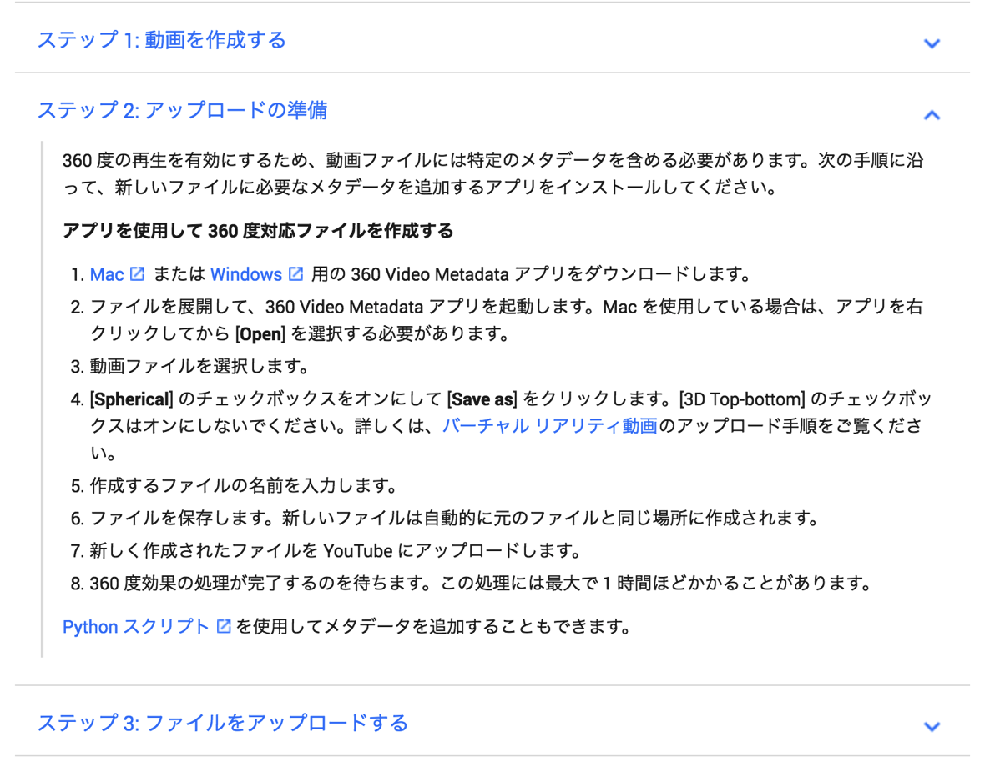
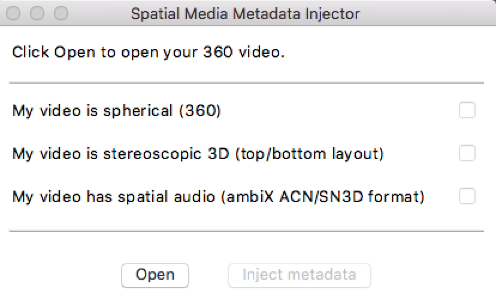
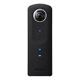

---
categories:
- レビュー
date: Mon, 24 Oct 2016 13:50:32 +0000
slug: post-9553
tags:
- THETA
title: thetaで撮影した全天球動画に文字を入れる方法
---

先日買ったthetaが面白すぎる！動画も静止画も全天球で撮影しております。全く楽しみ方がわからなかったInstagramもようやくいいねもらえたりして、自分の表現の幅も広がったきがするし楽しいです！<!--more--><h2>thetaで撮影した動画にテキストを入れる方法</h2>

どんな感じかというとこんな感じです。

<iframe width="560" height="315" src="https://www.youtube.com/embed/0z4sPZi4VHw" frameborder="0" allowfullscreen></iframe>

<h3>必要なのは動画編集ソフトと全天球変換アプリ</h3>

ぼくはAfter Effectsを利用しました。premiereやitunesでもいけると思います。

単純にthtetaと同期させたばかりのデータではなく、一度全天球のthetaのPC用アプリで平面状態になった動画を編集していきます。

全天球動画の平面変換アプリはこちらからDLしてください。

<a href="https://theta360.com/ja/support/download/">https://theta360.com/ja/support/download/</a>

使い方はこちらの記事を参照

参照：<a href="https://www.warawareotoko.com/2016/10/18/post-9472/">macでthetaの全天球動画を共有する方法</a>

ちなみに変換しないとこんな感じになっちゃいます。

変換するとこれ

作業としては簡単です。動画にすきなテキストを入れるだけ。

一旦ここで書き出します。

このままアップしてもYoutube上ではうまく動きません。Youtube用の全天球変換ソフトでさらにもう一度メタデータを付与する必要があるのです。

ダウンロードはこちら

<a href="https://support.google.com/youtube/answer/6178631?hl=ja">https://support.google.com/youtube/answer/6178631?hl=ja</a>

360 Video Metadataというアプリケーションをダウンロードします。

その後、アプリを開き、お目当ての動画を変換します。チェックは一番上の「My video is sphericial(360)」にのみチェックをいれます。

入れたら「inject metadate」をクリック

これでアップロードすれば完了！！

<h2>しんぺーはこう思った。</h2>

全天球だと顔出ししてないSNSなどにはアップしずらいんですよね。絶対自分が写っちゃうから。一応これモザイク処理してますw

文字の入れ方とかもう少し工夫すれば、おしゃれな動画とかも作れるんじゃないかと思います。

thetaを使って何かしらの動画作品とか作りたいと思うので、編集も撮影もこれから勉強したいと思います。

それにしても本当にtheta楽しいです。買ってよかった〜紅葉とか満開の桜とか雪景色とか撮ったら絶対楽しいはず！

と言ったところで本日は以上になります。  おやすみなさい。

<a href="http://www.amazon.co.jp/exec/obidos/ASIN/B014US3FQI/warawareotoko-22/ref=nosim/" target="_blank" >RICOH デジタルカメラ RICOH THETA S 360°全天球カメラ 910720</a>
posted with <a href="http://kaereba.com" rel="nofollow" target="_blank">カエレバ</a>

 リコー 2015-10-23    

<a href="http://www.amazon.co.jp/gp/search?keywords=theta&__mk_ja_JP=%E3%82%AB%E3%82%BF%E3%82%AB%E3%83%8A&tag=warawareotoko-22" target="_blank" >Amazon</a>

<a href="http://hb.afl.rakuten.co.jp/hgc/0f6e221b.2eb9748a.0f6e221c.35cc1e84/?pc=http%3A%2F%2Fsearch.rakuten.co.jp%2Fsearch%2Fmall%2Ftheta%2F-%2Ff.1-p.1-s.1-sf.0-st.A-v.2%3Fx%3D0%26scid%3Daf_ich_link_urltxt%26m%3Dhttp%3A%2F%2Fm.rakuten.co.jp%2F" target="_blank" >楽天市場</a>

<a href="http://ck.jp.ap.valuecommerce.com/servlet/referral?sid=3041033&pid=882528283&vc_url=http%3A%2F%2Fsearch.shopping.yahoo.co.jp%2Fsearch%3Fp%3Dtheta&vcptn=kaereba" target="_blank" >Yahooショッピング</a>

