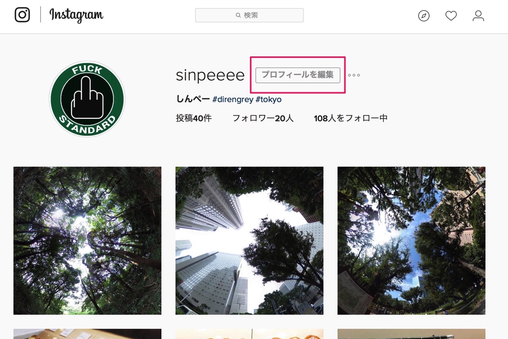
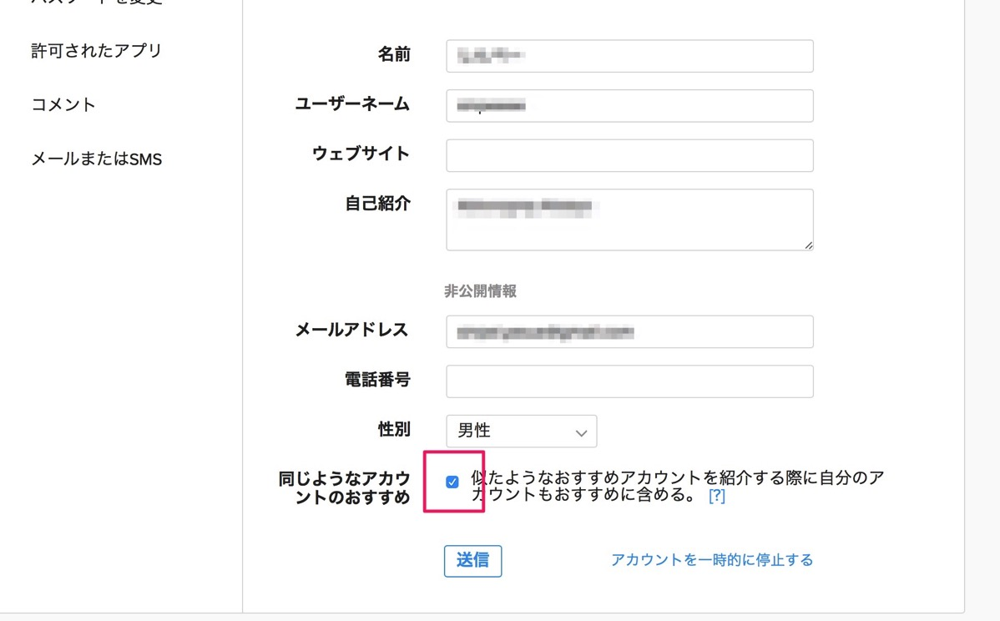

---
categories:
- アプリ
date: Tue, 25 Oct 2016 14:47:26 +0000
slug: post-9561
tags:
- Instagram
title: Instagramで相手のおすすめに自分を表示させない方法
---

最近買ったthetaのおかげでInstagramが捗ってきてるんですけど、どーも気になることがあるんですよねー。それが「おすすめ」に表示されるユーザーです！こいつを非表示にしたくて色々調べて見ました。<!--more-->Instagramと言えど、知り合いとは繋がりたくないんですが、いかんせん<strong>Instagramの運営元はFacebook</strong>です。あらゆるところからデータを取ってきて、なんの遠慮もなく<strong>「この人知り合いだよね？！知ってるよ！！ねぇ！ほらぁほらほら！！」</strong>と出されまくったあげくに、知り合いからフォローされちゃったりして。。。

そうならないために、<strong>相手の「おすすめ」に自分を表示しないやり方です。
</strong>

<h2>相手の「おすすめに自分を表示させないようにするやり方」</h2>

PCサイトからしかこの設定を変えることができないようです。

<a href="https://www.instagram.com">https://www.instagram.com</a>

自分のアカウントのページに行きます。プロフィール編集を選択

プロフィールの編集画面の一番下の「同じようなアカウントのおすすめ」のチェックを外して「送信」

これで相手の「おすすめ」に自分が表示されることがなくなるはずです。

ただ、自分のおすすめには知り合いが表示され続けるかもしれません。それは地道に削除するか、いっそのことブロックしちゃうしかありません。

<a href="https://itunes.apple.com/jp/app/instagram/id389801252?mt=8&uo=4&at=11ld5P" target="_blank" rel="noopener">Instagram</a>

無料

(2016.10.26時点)

<a href="https://itunes.apple.com/jp/developer/instagram-inc./id389801255?uo=4&at=11ld5P" target="_blank" rel="noopener">Instagram, Inc.</a>

posted with <a href="http://pochireba.com" rel="nofollow noopener" target="_blank">ポチレバ</a>

<h2>しんぺーはこう思った。</h2>

フォローされてからだと下手に会社の人とかだとブロックできないし、何よりびびる。。。鍵付きにしてても承認しないと気まずいし・・・

まぁやっぱり自分にはとぅいったーさんが性に合いますわwww

と言ったところで本日は以上になります。  おやすみなさい。