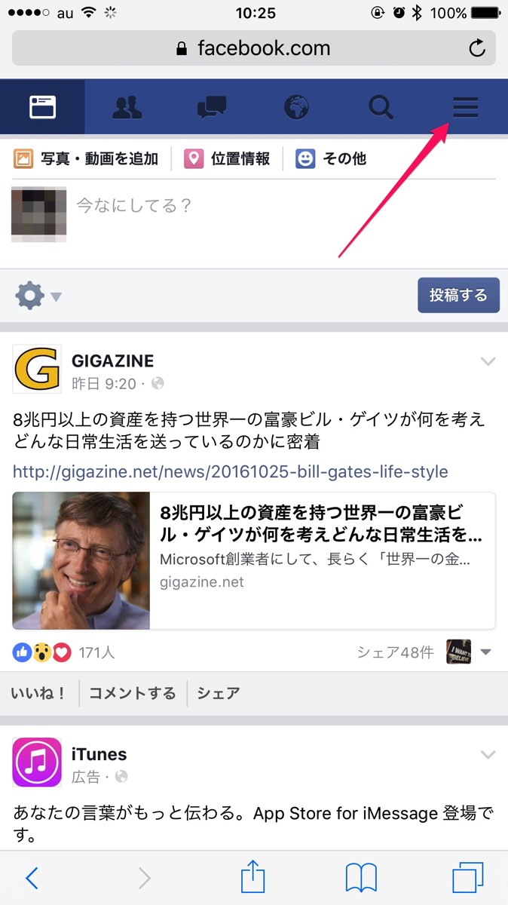
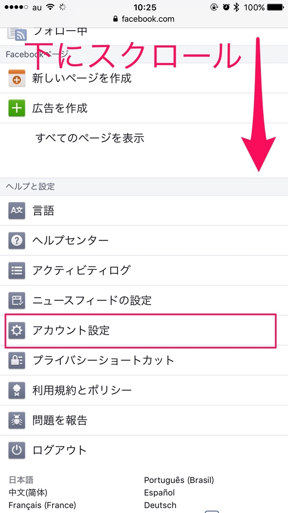
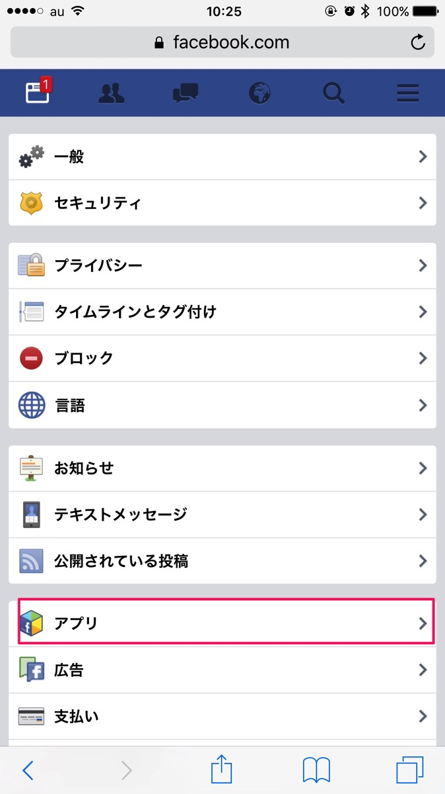
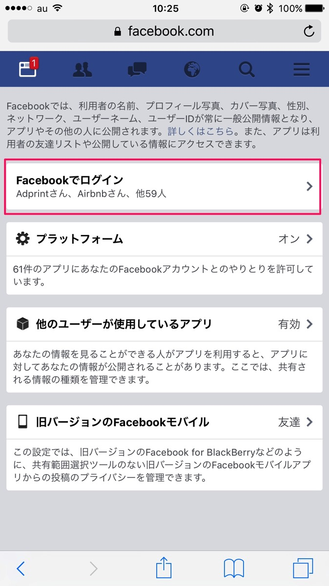
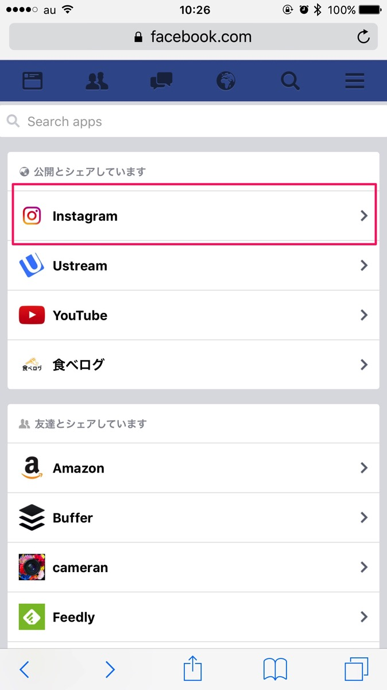
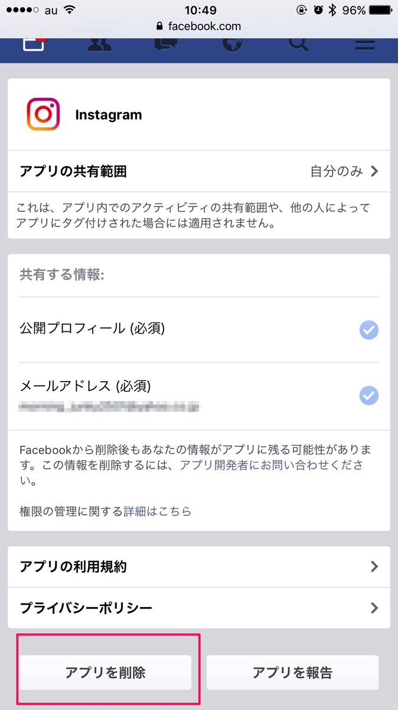
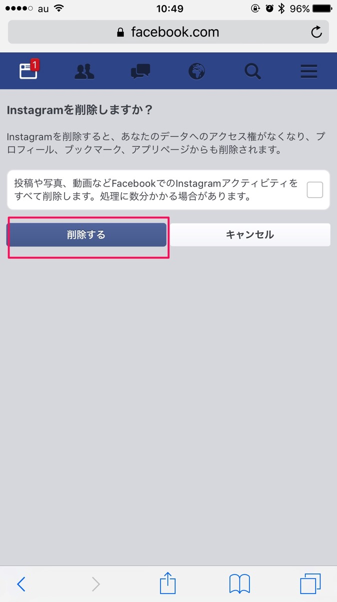
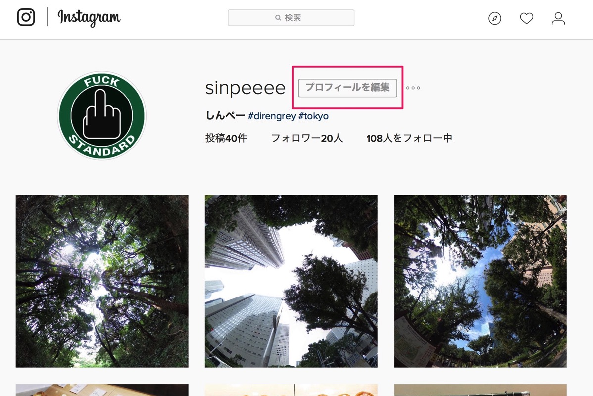
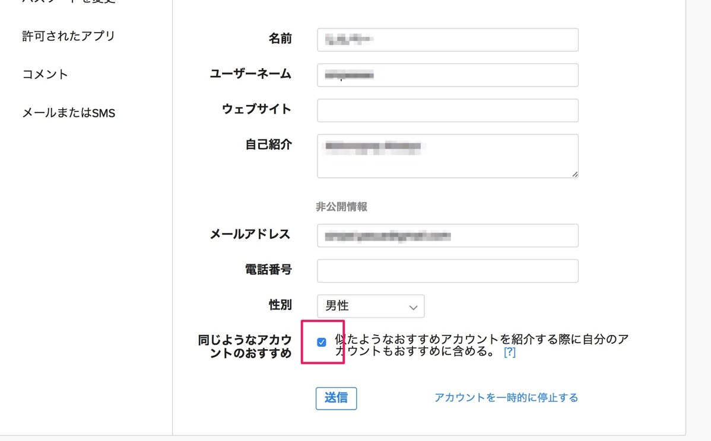

---
categories:
- アプリ
date: Wed, 26 Oct 2016 09:00:21 +0000
slug: post-9576
tags:
- Instagram
title: Instagramとfacebookの連携を解除する方法
---

Instagramを始めてみたものの、Twitterと違ってなぜか知り合いにフォローされたり、「おすすめ」に知り合いが出まくったりしているそこのあなた。これでfacebookとの連携を断ち切ることができます。見落としがちな設定なので、ぜひこれをやってみましょう。<!--more--><h2>facebookとInstagramの連携を解除する方法</h2>

画面はスマホでfacebookを表示させたものになります。

画面を下の方にスワイプします。「アカウント設定」をタップ

「アプリ」をタップ

「Facebookでログイン」をタップ

「公開とシェアしています」をタップします。ここに表示されているアプリはfacebookに何かしらのコメントや反応が表示され、なおかつ他人に公開される設定になっています。人によっては、ここにInstagramがない可能性もありますので、下の方まで見て探してください。

Instagramをタップ。画面一番下の「アプリを削除」をタップ

確認画面です。もし、今までfacebook上にInstagramの何かしらの連携をしてしまっていて、それらを全て削除したいと思ったらチェックボックスにチェックを入れましょう。これで綺麗サッパリ投稿が削除されます。

これで完了です。

<h2>これでfacebookとの連携が終わったと思うな！念には念を入れて</h2>

Instagramのアプリなんかを使ってる人はわかると思いますが、無駄に表示される「おすすめ」ユーザー

あれもfacebookの知り合いなんかが表示される場合があります。

上の操作をすることで連携が切れて表示さなくなるかもしれませんが、念のは念を入れて「おすすめ」設定もいじっておきましょう。

これはどちらかというと相手側に自分が表示されないようにするためのものです。もしどっかからデータ連携されて、向こうに表示されてフォローなんかきちゃったりしたら目も当てられませんので。

PC画面からのみ設定が可能

参考：Instagramで相手のおすすめに自分を表示させない方法

<h2>しんぺーはこう思った。</h2>

女子でもないし、おしゃれな写真もとれないし、会社周りにおいしいお店もないので、なんも載っける写真ないわー

と言ったところで本日は以上になります。  おやすみなさい。