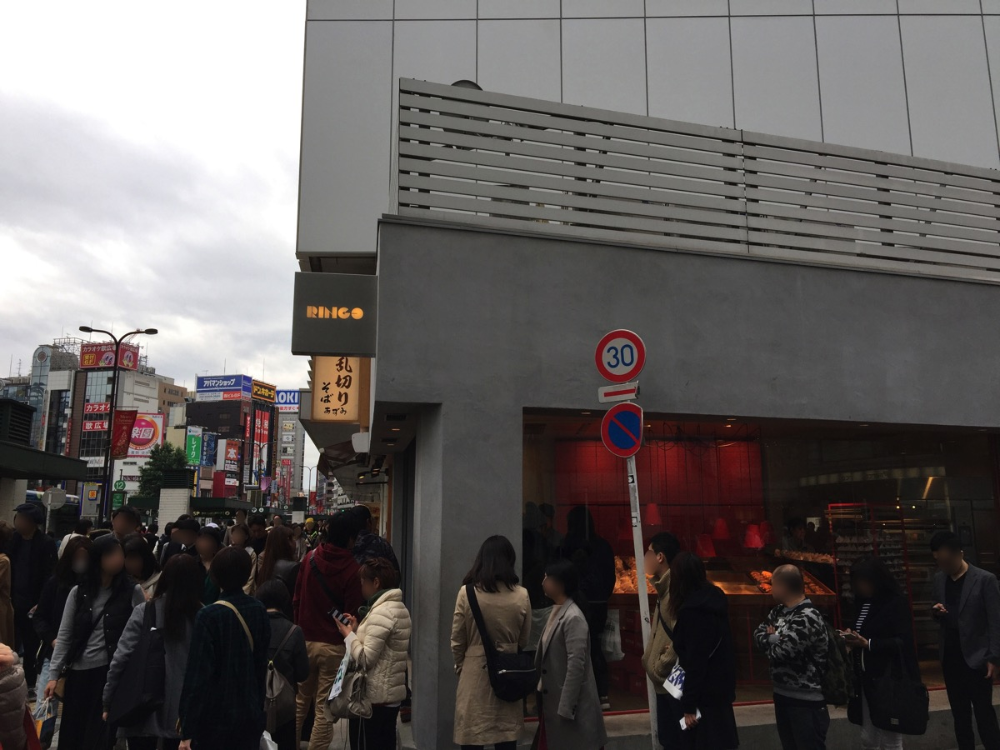
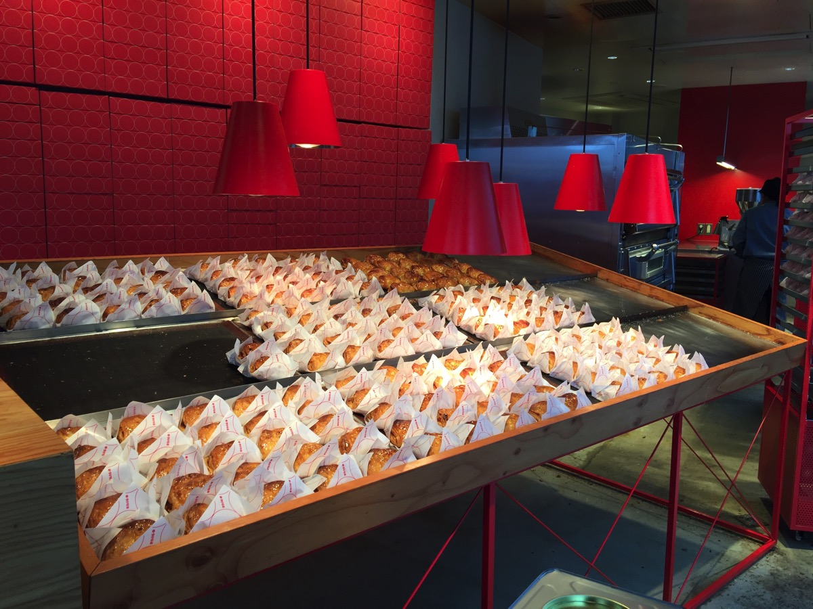
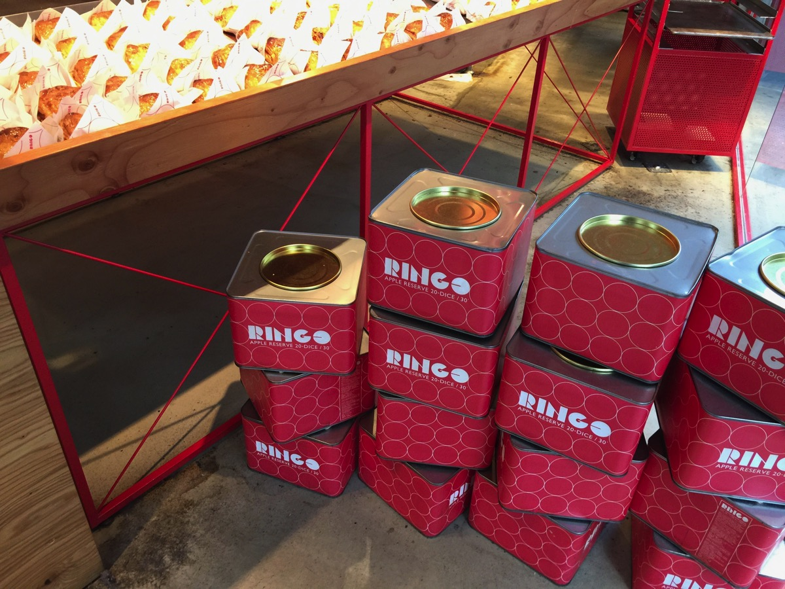
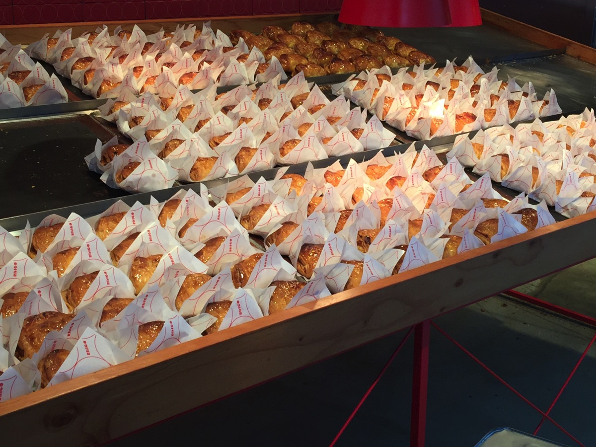
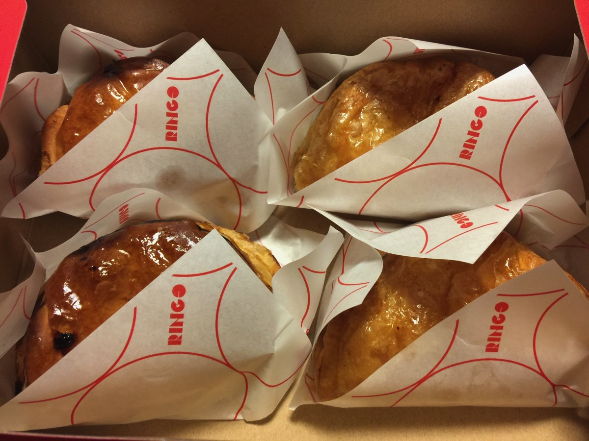
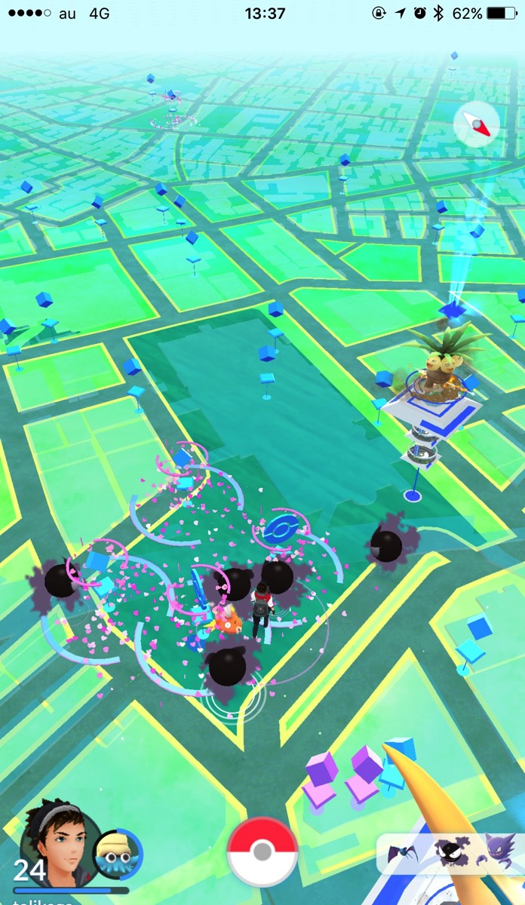

---
categories:
- グルメ
date: Sun, 30 Oct 2016 08:32:00 +0000
slug: post-9595
tags:
- グルメ
title: BAKEが出したアップルパイのお店「RINGO」買った食べた！
---

チーズタルトで有名なBAKEが出したカスタードアップルパイのお店「RINGO」に行ってきました！本日は食べた感想です。<!--more--><h2>アクセス</h2>
お店は今の所池袋と川崎にあります。今回は池袋のお店にいきました。東口の駅を出て左手の路面にあります。

<iframe src="https://www.google.com/maps/embed?pb=!1m18!1m12!1m3!1d3238.7973064691882!2d139.7104192152602!3d35.73120318018268!2m3!1f0!2f0!3f0!3m2!1i1024!2i768!4f13.1!3m3!1m2!1s0x60188d6775b166cb%3A0x5c692f9d7a524976!2z44CSMTcxLTAwMjIg5p2x5Lqs6YO96LGK5bO25Yy65Y2X5rGg6KKL77yR5LiB55uu77yS77yY4oiS77yS!5e0!3m2!1sja!2sjp!4v1477834862802" width="600" height="450" frameborder="0" style="border:0" allowfullscreen></iframe>

<h2>店の内装</h2>

店の外も店の中も真っ赤

ずらーっと並べられた出来立てのアップルパイ

<h2>食べた感想</h2>

しょーじき、そこまで美味しくはなかった。美味しくないというかパンチがない。カスタードの味もあまりしない、リンゴの風味もあまりしない。

正直、ミスドのアップルパイの方が美味しいと思います。個人的な感想ですが。

ちなみに値段は４つで1400円。1個370円と少しおたかめ

参考：<a href="http://ringo-applepie.com/">http://ringo-applepie.com/</a>

<h2>しんぺーはこう思った。</h2>

池袋なんで、用がないと行かない場所なんですが、今日はたまたま用事があったのでいきましたー。

以前はワンリキーの巣だったらしい西口公園にもいきましたが、ハロウィンイベントでゴースばっかり。

でも、ここポケストップが隣接しまくってて普段過ごそう。

といったところで本日は以上です。
おやすみなさい。