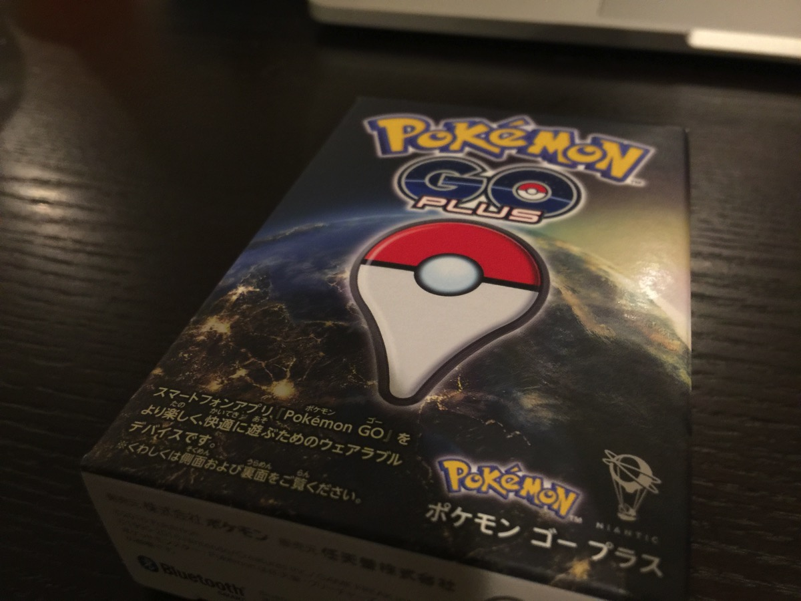
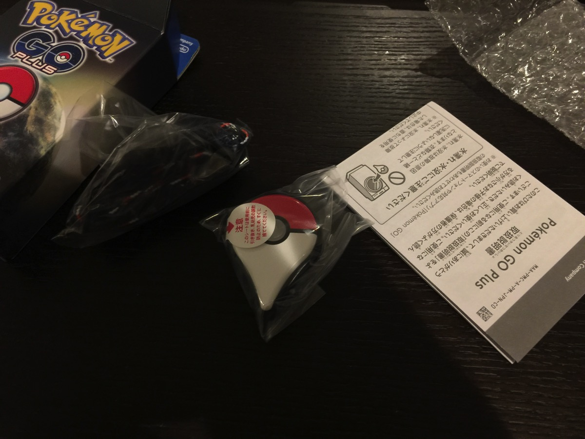
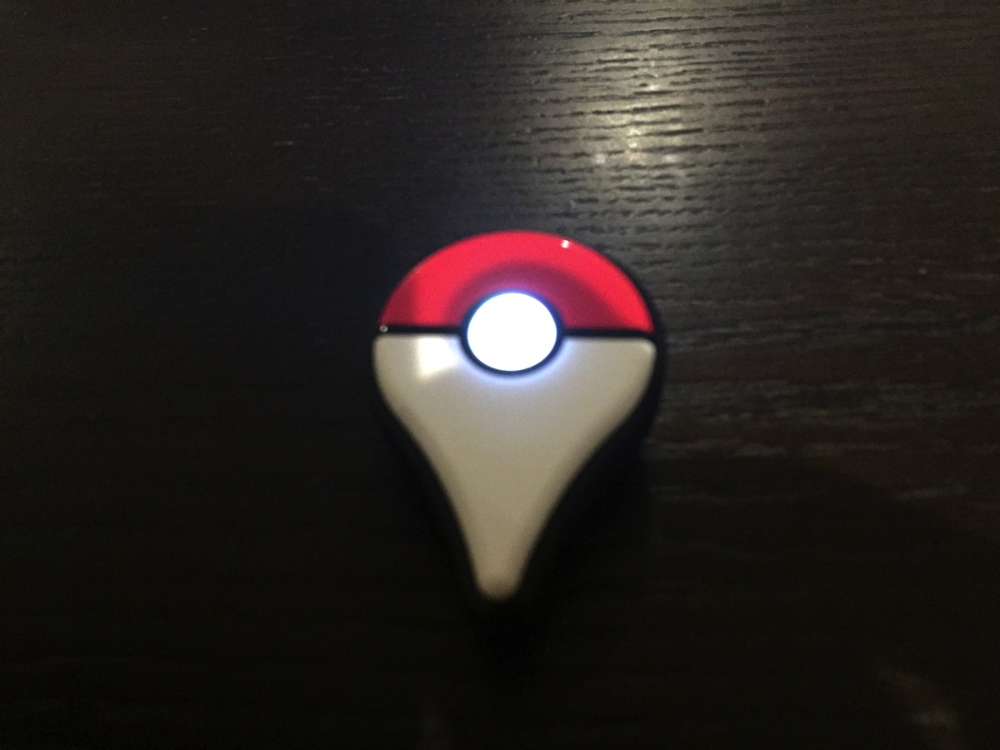
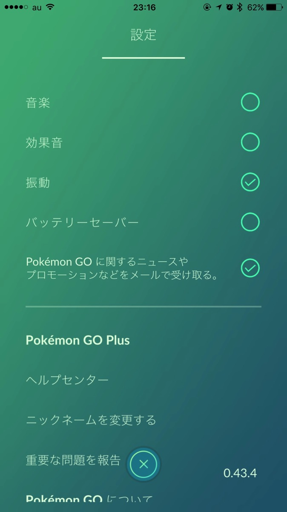
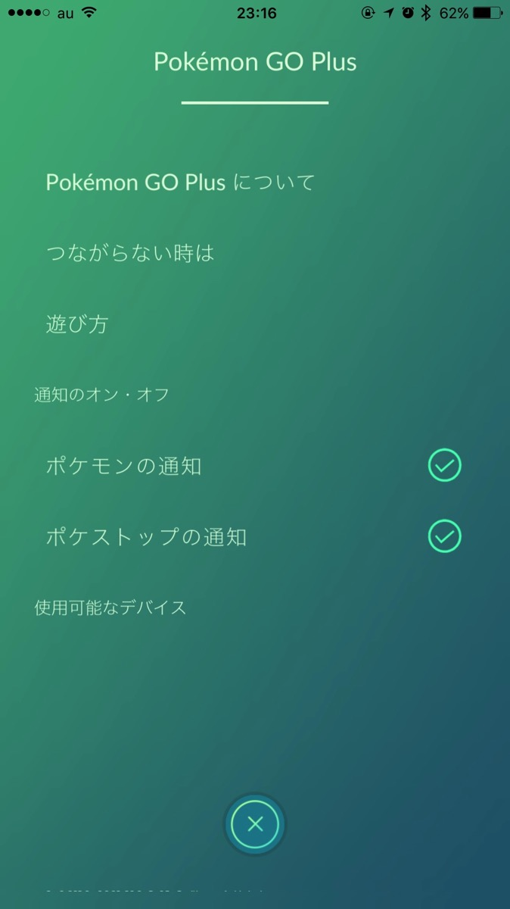
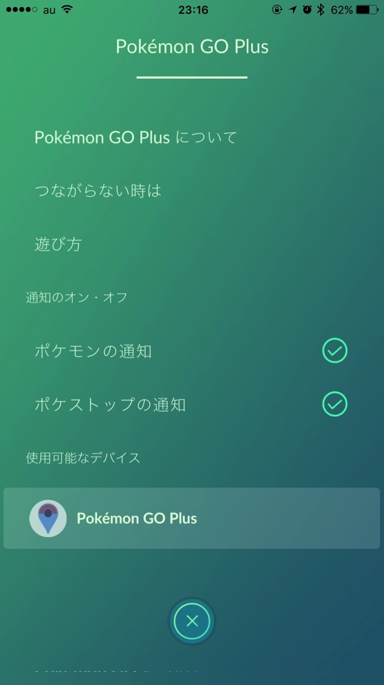

---
categories:
- ポケモン
date: Fri, 04 Nov 2016 14:21:00 +0000
slug: post-9620
tags:
- ポケモンGO
title: ついに手に入れた！ポケモンGOプラス！
---

ついに！本日無事購入できました！ポケモンGOプラス！！朝10時再販スタートだったのですが一向につながらないポケモンのサイトではなく、データ更新されないならAmazonを更新しまくってやっと発見して購入にこぎつけましたー！！<!--more--><h2>こいつがポケモンGOプラスだぁ！！</h2>

見よ！聞きしに勝るちゃっちさよ！思い描いていた以上に小さい！

お菓子のおまけみたい！

触ってみてようやく何となく精巧な機械というのがわかります。

スイッチとか余計なものはなく、真ん中のボタンを押せばOK
ポケモンGOの設定からポケモンGOプラスをタップ

設定画面

この画面を開いている時に本体のボタンを押すと出て来ます。Bluetoothの接続をしたら設定完了

かんたんかんたん

<h2>ポケモンGOプラスで何ができるのか</h2>

<ul>
	<li>バックグラウンドにアプリがあれば1時間は距離をカウントしてくれる！</li>
	<li>近くにポケストップがある時振動し、ボタンを押せばアイテムを回収してくれる</li>
	<li>近くにポケモンがいる時振動し、ボタンを押せば捕まえてくれる</li>
</ul>

最高か！！！最高か！！！

正直ポケモンを捕まえてくれたり、アイテムを回収してくれたりというのはどうでもいい！！！どうでもいい！！

そんなことよりも、ポケモンGOのアプリをバックグラウンドにしまえることの方がメリットがでかいです！つまりポケモンしながらTwitterしたりyoutubeみたりができるのです。

ポケモン中にLINEがきて、読みに言って戻ろうとしたら再起動
よくあります。

そんな煩わしさから解放されるのです！！

ポケモンやりながら音楽聴くと音楽が小さくなるようになりました。で、LINEきたーっと思ってLINE読みに言ったら音楽いきなりでかくなってビビるみたいなw

これさえあえればそんな問題ともおさらな！！

こいつを使って残り7種類卵からかえすぜ

<h2>しんぺーはこう思った。</h2>

いやー前回、買えなかったんで今回は待機して買いました！！

うれしい！！

今回もソッコーで完売して、ソッコーで転売価格になったみたいなのであぶなかった〜

次回は4月30日発売らしいです。。。そんな先かよ
もっと大量生産できないの？？

とりあえず、これで距離稼ぐのがぐーっと楽になるはず！これでコンプ目指します！

と言ったところで本日は以上になります。  おやすみなさい。

<a href="http://www.amazon.co.jp/exec/obidos/ASIN/B01IO57DAM/warawareotoko-22/ref=nosim/" target="_blank" rel="noopener">Pokémon GO Plus (ポケモン GO Plus) & 【Amazon.co.jp限定】オリジナルスマートフォン壁紙&ポケットモンスター サン・ムーンに利用できる300円割引クーポン 配信</a>
posted with <a href="http://kaereba.com" rel="nofollow noopener" target="_blank">カエレバ</a>

 任天堂 2016-09-16    

<a href="http://www.amazon.co.jp/gp/search?keywords=%E3%83%9D%E3%82%B1%E3%83%A2%E3%83%B3GO%E3%83%97%E3%83%A9%E3%82%B9&__mk_ja_JP=%E3%82%AB%E3%82%BF%E3%82%AB%E3%83%8A&tag=warawareotoko-22" target="_blank" rel="noopener">Amazon</a>

<a href="http://hb.afl.rakuten.co.jp/hgc/0f6e221b.2eb9748a.0f6e221c.35cc1e84/?pc=http%3A%2F%2Fsearch.rakuten.co.jp%2Fsearch%2Fmall%2F%25E3%2583%259D%25E3%2582%25B1%25E3%2583%25A2%25E3%2583%25B3GO%25E3%2583%2597%25E3%2583%25A9%25E3%2582%25B9%2F-%2Ff.1-p.1-s.1-sf.0-st.A-v.2%3Fx%3D0%26scid%3Daf_ich_link_urltxt%26m%3Dhttp%3A%2F%2Fm.rakuten.co.jp%2F" target="_blank" rel="noopener">楽天市場</a>

<a href="http://ck.jp.ap.valuecommerce.com/servlet/referral?sid=3041033&pid=882528283&vc_url=http%3A%2F%2Fsearch.shopping.yahoo.co.jp%2Fsearch%3Fp%3D%25E3%2583%259D%25E3%2582%25B1%25E3%2583%25A2%25E3%2583%25B3GO%25E3%2583%2597%25E3%2583%25A9%25E3%2582%25B9&vcptn=kaereba" target="_blank" rel="noopener">Yahooショッピング</a>

