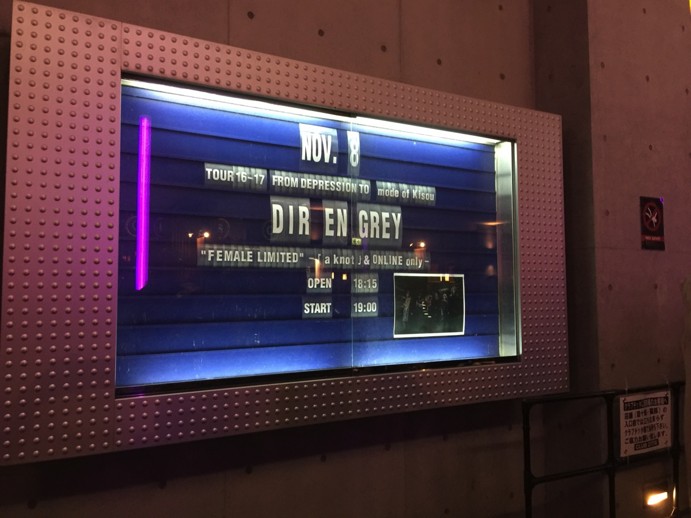

---
categories:
- DIR EN GREYのLIVEレポ
- TOUR16-17 [mode of 鬼葬]
date: Mon, 07 Nov 2016 13:31:00 +0000
slug: post-9653
tags:
- DIR EN GREY
- LIVEレポ
title: 【ライブレポ】DIR EN GREY TOUR16-17 FROM DEPRESSION TO ________ [mode of 鬼葬]a knot
  男限定LIVE2016_11_8＠CLUB CITTA'
---

本日よりスタートしましたDIR EN GREY「TOUR16-17 FROM DEPRESSION TO ________ [mode of 鬼葬]」

そして今日はなんと男限定かつ、ファンクラブのa knot限定LIVEということで不安いっぱいだったのですが、めちゃくちゃ最高に楽しいLIVEでした！！本日はそのLIVEレポでございます！！<!--more--><h2>鬼葬ツアー初日のセトリはめちゃくちゃ熱かった！</h2>

最初の映像は、小さなウィルス？みたなうにょうにょしたものが発生し、立方体の木片みたいなものから円錐に変形したみたいなものでした。。。記憶が曖昧

01.鬼眼
02.ZOMBOID
03.詩踏み
04.undecided
05.新曲
06.24個シリンダー
07.embryo
08.蟲
09.輪郭
10.鴉
11.Chain repulsion
12.FILTH
13.HADES
14.Un deux

EN
01.G.D.S.
02.ピンクキラー
03.The Domestic Fucker Family
04.umbrella
05.SUSTAIN THE UNTRUTH
06.JESSICA

自分的に鬼葬はローテンポな聞かせる系の曲中心と思ってました。ところがどっこい！ジャジーなベースラインや歌謡曲バリに聞かせる曲やらぴょんぴょん飛び跳ねたり、それこそモッシュダイブが発生しそうなヘビーな曲もらあったりで実はかなり振り幅の広いアルバムでした。にも関わらず鬼葬という流れで聞くと一気通貫で筋が通っているというか、同じ世界観なのです。

それとToshiyaがピック弾き、指弾きと入れ替えが激しいので都度ピック投げてた。

新曲は、イントロが今までにないような感じでした。そこからのヘビーな感じへの繋がりがなんとなくムックを連想させます。ただ、曲調はかなり壮大な感じ。PIERROTのCHILDの壮大さとムックの軽快さという印象でした。

あとアンコの「G.D.S.」からの怒涛の流れはかなり熱かった！！！もうほとんど記憶なし。最後の「JESSICA」は自分の昔のこととか思い出して、涙ぐんだわ。それでも、涙が零れなかったのは今が楽しすぎたからだと思う！

<h2>メンバーの衣装とステージセット、そして遂にあの曲の演出が正常に戻った！！</h2>

ぼくは、自分の中では最近恒例となってる下手前方におりました。なので薫中心ですがまずは薫から

ニットぽいワンピースにいつもの遠目からだと素足に見えるパンツ。襟なしの布生地のジャケットを着ていました。ジャケットは二の腕部分にスリットが入っており、絶対領域を演出。そして気になるメイクは、目の下が黒く唇も真っ黒でした。吸い込まれそうでした。場末のキャバレーの踊り子さんか、オカマバーのママ•••すいません。。。それくらい妖艶でした←

Toshiyaは髪の毛もしかしてツーブロック？？わからんが。それとスカートではない何かでした。ノースリーブ。

Shinyaは遠目には貴族のおばあちゃん。白いお召し物だった気がします。

Dieはいつものフード付きノースリーブパーカー？

京はサテン生地のリボン付き黒シャツに穴あきのスキニーで、ツーブロックの金髪！と思ったらピンク色だったらしい。照明の関係で金髪に見えた。あと目の周りは多分黒くなかったはず。

ステージセットは今回もシンプルで、バックスクリーンと証明のタワーが5つ、あとはサイドに2つの証明器具くらいでした。

そして！！！！ついに！！！！Un duexから歌詞表示なくなったぞ！！！！！やったーーーーーーーーーーー！！！

武道館から11ヶ月、ようやくクソ演出が改善されたというか元に戻った！！！！うっしゃー！！！！

<h2>公式ダイブ発生</h2>

ジェシカで中央お立ち台にToshiyaが立った時、ダイブが発生！それを煽るToshiya！公式ダイブかと思いましたら、どうやら初っ端の鬼眼からモッシュやらダイブやらサークルモッシュやら発生してたらしい。

しかも、スタッフ止めに入ってめちゃくちゃ注意されたりした人もいるようです。

DIR EN GREYは基本ダイブ、モッシュ禁止。

だけど今日は予定調和じゃなくてマジで自然偶発的に発生してメンバーもそれを許容して、オーディエンスもそれに耐えうる団結力があったと思う。a knot限定LIVEだからなし得たと思う！しかし！a knot限定だからと言って解禁になったわけではないと思う。a knot限定で事故ったらシャレならない。

<h2>しんぺーはこう思った。</h2>

とにかく!!!!DIR EN GREY最高！！！！！

もう本当にそれ以外のことばでない！！

ソニックシティのチケットとsukekiyoのハロウィンのチケット交換募集しようかと思ってたけど、いやーありえない！！！絶対大宮もいくぜええええ！！

とにかくDIR EN GREYサイコウ

それが再確認できた夜でした！！

<blockquote class="twitter-tweet" data-lang="ja">
ほんとね、周りが男ばかりになったからわかったこと •想像以上にお前ら汗臭いぞ！特にワキ！ •ヒゲは絶対にそってこい！LIVE前にそってこい！あたるとマジでタワシでこすられてるのかと思ったわ！ •背高いのは許す！だけど飛び跳ねないところで飛び跳ねるなよ！いいな！絶対だぞ！
&mdash; しんぺー@mode of 鬼葬 (@s_s_p_y) <a href="https://twitter.com/s_s_p_y/status/795602591031771136">2016年11月7日</a></blockquote>

あと、アンコ近づけば近づくほど口臭くなるよね。

と言ったところで本日は以上になります。  おやすみなさい。