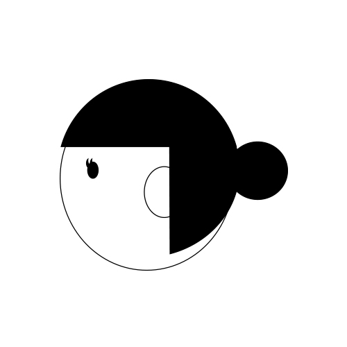

---
categories:
- LIVEのお作法
date: Tue, 08 Nov 2016 23:00:00 +0000
slug: post-9671
tags:
- LIVEのお作法
title: こんな女は嫌だ！LIVEで女の子にやめてもらいたいこと
---

昨日は、<a href="https://www.warawareotoko.com/2016/11/08/post-9660/">男限定LIVEに参戦してみてわかったこと</a>について書きましたが、本日は逆にこんな女性いやだなーって今までのLIVE参戦の経験から思ったやつをまとめたいと思います。これは別に男女関係なく共通で思うことが多いのではないかと思います。<!--more--><h2>ハイヒール履いてる</h2>

これ

まじで危険。リアルに足に穴あくらしいのでマジでやめてほしいです。ちなみに自分は割と固めのブーツ履いてったりすることが多いのですが（レッドウィング）、それも多分あんまよくないかなと思ってます。

ほんとはスニーカーがいいんではないかなぁと思います。

<h2>髪の結び方間違ってる</h2>

これ、地味にヘドバン時とか困る。それなら逆に結んでない方がいいくらい

特に迷惑を考えて気合入れて結んでくれてるんだけど、位置がこういうのとか

こういう感じなのとか。これだと頭後ろに行った時、こっちの顔にもろにぶっささるんですよね。

原因は結んでいる位置です。後頭部の中心で結んでいるため、実は後ろにせり出している構図になっています。

わかってる方だとあらかじめ斜めにしてたりします。

これでお願いします。

<h2>男というだけで攻撃してくる</h2>

これ、もう相当昔の話ですが、まだDIR EN GREYに男が今ほど居なかった時のこと。

別に押したわけでもないのに、男というだけで足を踏みまくる人。今のLIVEはだいぶ平和になったと思います。

<h2>しんぺーはこう思った。</h2>

こんなところでしょうか！でも最近はこういう人見かけたことはないですね。

体臭きになる男の方が出現率は高い

といったところで本日は以上です。
おやすみなさい。