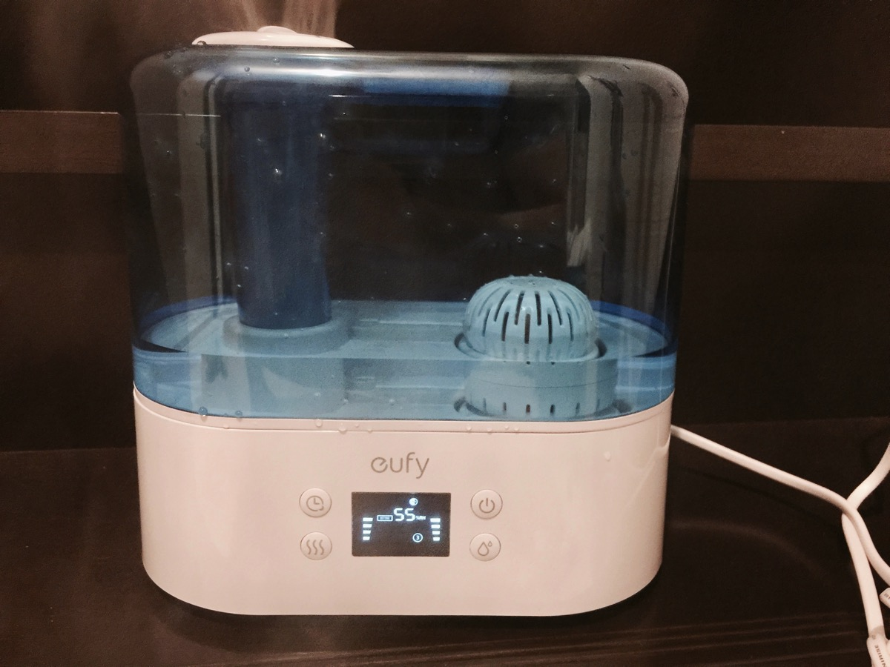
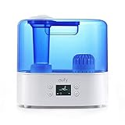

---
categories:
- レビュー
date: Thu, 10 Nov 2016 13:08:00 +0000
slug: post-9676
tags:
- Anker
title: Anker新製品の加湿器「Humos Air」買った！
---

最近めっきり乾燥してきてしまって、濡れタオルを干して寝たりしてるんですが寒すぎて暖房かけるので、すぐに乾いてしまいます。しまいには、LIVEで痛めてる喉がダメージを受けてしまいました。そんな中、9月に発売したAnkerの新製品の加湿器を買ってみましたのでご紹介します。<!--more--><h2>Anker製品は高性能かつ低価格</h2>

個人的なイメージですが、Anker製品は高性能な割に低価格でとても信頼がおけるメーカーだと思っています。わ

数ヶ月前に購入したロボット掃除機のrobovacさん。毎日使ってます！

参考：<a href="https://www.warawareotoko.com/2016/06/14/post-9152/">初めてロボット掃除機を購入！「Anker RoboVac 10 」を使った感想</a>

おかげで掃除機を自分でかけることがなくなりました。夜かけて寝れば朝起きたら綺麗になっているのです。

<h2>そんな中今回発売されたのは加湿器「Humos Air」</h2>

とりあえず、普通に水を入れて起動！通常の加湿器と同じ使い勝手です。
アロマを垂らしてデフューザーとしても使えるみたいです。

こいつの何がいいかって低価格で超音波式ということ。
加湿器はいくつかタイプがあって、スチーム式・超音波式・気化式と大体3つに分けられます。

それぞれ長所短所があります。スチーム式は水を沸騰させるため、倒したりすると火傷の恐れがあります。気化式は、ファンで水を気化させることにより空気を潤します。そのためファンの送風音がしてしまい若干音がきになります。超音波式は、超音波で水を水蒸気に変えるため、音も静かで、水も熱くなりません。

この加湿器は超音波式！そのためとても音が静かなのが特徴です！つまり寝室などにぴったりなのです。

ちなみに超音波式の加湿器のデメリットとして、雑菌が繁殖しやすいというのがあります。繁殖させた雑菌を空気中に拡散してしまっては元も子もありません。しかし、この加湿器は「ゼオライトフィルター」というものを搭載しており、澄んだ水を維持することができるそうです。

<h2>しんぺーはこう思った。</h2>

とりあえず今日つけて寝てみます。いきなり寒くなったので暖房つけて寝ているので、毎朝喉お激痛で目覚めるのでこいつで、そんな苦しみから逃れられるといいです。

と言ったところで本日は以上になります。  おやすみなさい。

<a href="http://www.amazon.co.jp/exec/obidos/ASIN/B01KUUDEES/warawareotoko-22/ref=nosim/" target="_blank" >eufy Humos Air 1.1 超音波加湿器 【自動湿度調整 / 超静音 / 最大26時間連続使用 / 自動停止機能 / アロマデフューザー機能搭載】</a>
posted with <a href="http://kaereba.com" rel="nofollow" target="_blank">カエレバ</a>

 Anker     

<a href="http://www.amazon.co.jp/gp/search?keywords=Humos%20Air&__mk_ja_JP=%E3%82%AB%E3%82%BF%E3%82%AB%E3%83%8A&tag=warawareotoko-22" target="_blank" >Amazon</a>

<a href="http://hb.afl.rakuten.co.jp/hgc/0f6e221b.2eb9748a.0f6e221c.35cc1e84/?pc=http%3A%2F%2Fsearch.rakuten.co.jp%2Fsearch%2Fmall%2FHumos%2520Air%2F-%2Ff.1-p.1-s.1-sf.0-st.A-v.2%3Fx%3D0%26scid%3Daf_ich_link_urltxt%26m%3Dhttp%3A%2F%2Fm.rakuten.co.jp%2F" target="_blank" >楽天市場</a>

<a href="http://ck.jp.ap.valuecommerce.com/servlet/referral?sid=3041033&pid=882528283&vc_url=http%3A%2F%2Fsearch.shopping.yahoo.co.jp%2Fsearch%3Fp%3DHumos%2520Air&vcptn=kaereba" target="_blank" >Yahooショッピング</a>

