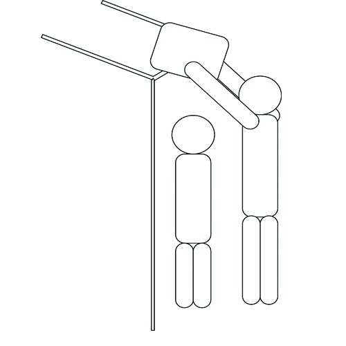

---
categories:
- ブログ
date: Thu, 17 Nov 2016 11:44:00 +0000
slug: post-9712
tags:
- 電車
title: 満員電車でスリーポイントシュート打つおっさんて何考えてるの？三井寿なの？
---

いるよねぇ、満員電車でドア横にポジションどりしてる女の子の頭上の網棚に自分のカバン載っけるおっさん。あれなんなの？バカなの？三井寿なの？<!--more-->具体的にいうとこんなシーンです。

問題は２つあると思う。

制空権への理解

人の頭の上を通って物を載っけるなんてのは制空権の侵犯である。シリア爆撃のためにロシアが隣国の領地上空を通り、撃墜されたの知らんのか？

そしてもう１つ、載っけた荷物の制御である。

今日見たのは、不安定な荷物が落ちかけて近くで立ってた人の頭上に落ちかけてた。しかも、すいませんとか言って荷物下ろす際に、その人の頭に落としてたからな。

いやいや、そんな重いもん頭上に載っけんなよ。

マジでいいたい。無理すんな！無理すんなジジイ！

<h2>しんぺーはこう思った。</h2>

何気にこの電車の中の迷惑行為がシリーズ化してきた•••

よかったら関連記事から過去の記事をどうぞ

ある程度身長があると頭上に荷物置かれることはないんですがね。。。混んでてもそら無理だろっていうのが多い。しかもあれやる時、立ってる人に覆いかぶさるような格好になるでしょ。

あれ、やられた側はキモいんじゃね？とか思う。

といったところで本日は以上です。

おやすみなさい。