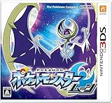

---
categories:
- ポケモン
date: Tue, 22 Nov 2016 13:53:04 +0000
slug: post-9764
tags:
- ポケモン
title: 【ポケモンサンムーン】やり始めたらなんか涙ぐんでしまうくらいジーンきた
---

ポケモンムーンが手元に届いてから、しばらく開封する機会がなく、本日ようやく開封してプレイしてみました！会社で。<!--more--><h2>最新のゲームソフトに対してもうおじいちゃん状態のぼく</h2>

オープニング始まって、主人公がベッドに寝てるシーンから始まるんですが、最初動かし方がわからなかったwww

じーっとしてて、あれ？動かねってなって十字キーの上のスティック？を触ってみると動かせました。PS4のUIに慣れているからか、シンプルな設計に逆に慣れないwおじいちゃんじょうたいで、これどうしたら動くの！？みたいなw

そんなぼくのような人にも最初はチュートリアル的な説明がされます。ただし、あくまでストーリーとして進んでいけるようになっていて、PS4のソフトみたいにがっつりとチュートリアルから始まるわけではないんですねー

あとハートゴールドに比べて音楽がめっちゃいい！

<h2>初代に比べてストーリー重視っぽい！</h2>

んで、そのまま言われるがまま進めていくとパートナーとなるポケモンをもらえるイベントが発生します。

ただ、やっぱりもうぼくおじいちゃんなんですかね〜

なんか一つ一つのストーリー設定とか、キャラの設定とかにもう涙腺が少しジーンときちゃいました。懐かしさもあるのかな〜

襲われているポケモンを助けて、吊り橋から落ちてしまった主人公、それを助ける島の守り神

<strong>そんなありがちな設定！！！ムネアツ！！！</strong>

しかも、めっちゃくちゃストーリー重視なのにも感動

舞台になる島になぜやってきたのか、そこに住む人たちの役割や相関
主人公を取り巻く人間関係！！アローラという地方の文化設定もしっかりしてる！！そしてそれが全て物語になってる！！

初代なんて、もういわゆるRPGでしたよ

近所に住むマッドサイエンティストにいきなり全ポケモン集めろやとかっていう理不尽な命令されて、報酬はレアなポケモン。で、集めきって持っててやったら「君はものを集めるのが好きなのかな〜？」とかほざく始末

でも、サンムーンにはいのちが宿ってる！！

これからの冒険が楽しみ！

<h2>最初のパートナーはニャビー</h2>

ぼくがそもそも今回のポケモンを買いたいと思ったきっかけが、このニャビーという猫ポケモンの最終進化形態ガオガエンがかっこよかったからです。

けっこう振り切ったデザインで、可愛い路線で来てたと思ってたポケモンの中で久しぶりにかっこいい！と思えるものでした。

んで、驚いたのが最初から特殊技を覚えてる点。昔のポケモンは最初覚えてたのは、たいあたりとなきごえくらい。でも、このニャビーは最初から属性技を持っておりました。いやーそうなんだw変なところで驚きました。

<h2>しんぺーはこう思った。</h2>

まだ、ぜんぜん最初なんで、これからの冒険がとにかく楽しみ！！！

早くやりたい！！

と言ったところで本日は以上になります。  おやすみなさい。

<a href="http://www.amazon.co.jp/exec/obidos/ASIN/B01IEMPJAQ/warawareotoko-22/ref=nosim/" target="_blank" >【Kindleキャンペーン対象商品】 ポケットモンスター ムーン - 3DS 【Kindleカタログをダウンロードすると200円OFF(2017/1/9迄)】</a>
posted with <a href="http://kaereba.com" rel="nofollow" target="_blank">カエレバ</a>

 任天堂 2016-11-18    

<a href="http://www.amazon.co.jp/gp/search?keywords=%E3%83%9D%E3%82%B1%E3%83%A2%E3%83%B3&__mk_ja_JP=%E3%82%AB%E3%82%BF%E3%82%AB%E3%83%8A&tag=warawareotoko-22" target="_blank" >Amazon</a>

<a href="http://hb.afl.rakuten.co.jp/hgc/0f6e221b.2eb9748a.0f6e221c.35cc1e84/?pc=http%3A%2F%2Fsearch.rakuten.co.jp%2Fsearch%2Fmall%2F%25E3%2583%259D%25E3%2582%25B1%25E3%2583%25A2%25E3%2583%25B3%2F-%2Ff.1-p.1-s.1-sf.0-st.A-v.2%3Fx%3D0%26scid%3Daf_ich_link_urltxt%26m%3Dhttp%3A%2F%2Fm.rakuten.co.jp%2F" target="_blank" >楽天市場</a>

<a href="http://ck.jp.ap.valuecommerce.com/servlet/referral?sid=3041033&pid=882528283&vc_url=http%3A%2F%2Fsearch.shopping.yahoo.co.jp%2Fsearch%3Fp%3D%25E3%2583%259D%25E3%2582%25B1%25E3%2583%25A2%25E3%2583%25B3&vcptn=kaereba" target="_blank" >Yahooショッピング</a>

<a href="http://www.amazon.co.jp/exec/obidos/ASIN/B01IEMPJMO/warawareotoko-22/ref=nosim/" target="_blank" >【Kindleキャンペーン対象商品】 ポケットモンスター サン - 3DS 【Kindleカタログをダウンロードすると200円OFF(2017/1/9迄)】</a>
posted with <a href="http://kaereba.com" rel="nofollow" target="_blank">カエレバ</a>

 任天堂 2016-11-18    

<a href="http://www.amazon.co.jp/gp/search?keywords=%E3%83%9D%E3%82%B1%E3%83%A2%E3%83%B3&__mk_ja_JP=%E3%82%AB%E3%82%BF%E3%82%AB%E3%83%8A&tag=warawareotoko-22" target="_blank" >Amazon</a>

<a href="http://hb.afl.rakuten.co.jp/hgc/0f6e221b.2eb9748a.0f6e221c.35cc1e84/?pc=http%3A%2F%2Fsearch.rakuten.co.jp%2Fsearch%2Fmall%2F%25E3%2583%259D%25E3%2582%25B1%25E3%2583%25A2%25E3%2583%25B3%2F-%2Ff.1-p.1-s.1-sf.0-st.A-v.2%3Fx%3D0%26scid%3Daf_ich_link_urltxt%26m%3Dhttp%3A%2F%2Fm.rakuten.co.jp%2F" target="_blank" >楽天市場</a>

<a href="http://ck.jp.ap.valuecommerce.com/servlet/referral?sid=3041033&pid=882528283&vc_url=http%3A%2F%2Fsearch.shopping.yahoo.co.jp%2Fsearch%3Fp%3D%25E3%2583%259D%25E3%2582%25B1%25E3%2583%25A2%25E3%2583%25B3&vcptn=kaereba" target="_blank" >Yahooショッピング</a>

<a href="http://www.amazon.co.jp/exec/obidos/ASIN/B00Y9PJX78/warawareotoko-22/ref=nosim/" target="_blank" >Newニンテンドー3DS LL パールホワイト</a>
posted with <a href="http://kaereba.com" rel="nofollow" target="_blank">カエレバ</a>

 任天堂 2015-06-11    

<a href="http://www.amazon.co.jp/gp/search?keywords=%E3%83%8B%E3%83%B3%E3%83%86%E3%83%B3%E3%83%89%E3%83%BCDS&__mk_ja_JP=%E3%82%AB%E3%82%BF%E3%82%AB%E3%83%8A&tag=warawareotoko-22" target="_blank" >Amazon</a>

<a href="http://hb.afl.rakuten.co.jp/hgc/0f6e221b.2eb9748a.0f6e221c.35cc1e84/?pc=http%3A%2F%2Fsearch.rakuten.co.jp%2Fsearch%2Fmall%2F%25E3%2583%258B%25E3%2583%25B3%25E3%2583%2586%25E3%2583%25B3%25E3%2583%2589%25E3%2583%25BCDS%2F-%2Ff.1-p.1-s.1-sf.0-st.A-v.2%3Fx%3D0%26scid%3Daf_ich_link_urltxt%26m%3Dhttp%3A%2F%2Fm.rakuten.co.jp%2F" target="_blank" >楽天市場</a>

<a href="http://ck.jp.ap.valuecommerce.com/servlet/referral?sid=3041033&pid=882528283&vc_url=http%3A%2F%2Fsearch.shopping.yahoo.co.jp%2Fsearch%3Fp%3D%25E3%2583%258B%25E3%2583%25B3%25E3%2583%2586%25E3%2583%25B3%25E3%2583%2589%25E3%2583%25BCDS&vcptn=kaereba" target="_blank" >Yahooショッピング</a>

