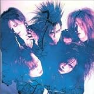
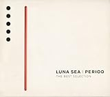
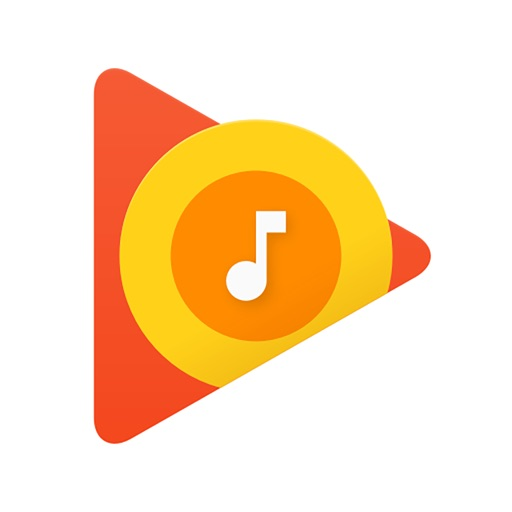

---
categories:
- music
date: Sat, 26 Nov 2016 13:41:19 +0000
slug: post-9786
tags:
- おすすめ
title: 最近見つけたかっこいいバンド「ルナシー」
---

VJS以降いろんな動画を漁ってたんですけど、あの曲が耳から離れない！そうルナフェスの時にラスト皆んなで歌ってたLUNA SEAの「PRECIOUS」

んで、そこからLUNA SEAのいろんなアルバムを主にgoogle play musicで聴き漁ってたんですけどいやー驚きました。昔の「PRECIOUS」って全く別の曲やんけ！ってことで本日は、人生で始めてちゃんときいてみたルナシーというバンドいついての個人的な感想です。

<!--more-->
<h2>「LUNA SEA」と「LUNACY」の違い</h2>
wikipediaによるとメジャーを意識した時にJの発案で狂気の沙汰という意味の「LUNACY」から「LUNA SEA」に表記変更しようとなったそうです。

ちなみに1989年に現体制となり、翌1990年に「LUNA SEA」となったようです。

ということで実は「LUNACY」での活動期間はかなり短かったんですね。
このことはまだ動員が200人とかそんくらいだったみたいで、なんだか色々驚きです。
<h2>「PRECIOUS」が昔と今で違いすぎててカバーかと思った。</h2>
で、ルナフェスの時DIR EN GREYのToshiyaとDieも参加してましたが、あのメロディーがずーっと頭から離れませんでした。

んで、google play musicで曲名順で聞いてるといろんなアルバムに収録されている同じ曲が続けて再生されるわけなんですが、いやーこれがほんとうに驚きました。

PERIODというアルバムに収録されている「PRECIOUS」と2011年バージョンのとLUNA SEAというアルバムに収録されているのとで、それぞれ全く別物でした。

なんていうか、DIR EN GREYの残というレベルではないのです。あれは編曲とかが変わってるので、再収録という認識ができると思うのですが、LUNA SEAの場合は、もう別バンドになっちゃってます。

でも、それぞれがめちゃくちゃかっこいいと思います。ルナフェスで聞いたのはなんとなく2011年バージョンぽい感じがしました。

LUNA SEAに収録されているのは、疾走感と儚さって感じでした。PERIOD収録は、すっごい丁寧な印象です。間とって2011年バージョンが自分には一番しっくりきました。

他にもバージョンあるのかもしれませんが、自分が聞いたのはこの3つでした。
<h2>しんぺーはこう思った。</h2>
前にも書きましたが、ぼくがLUNA SEA食わず嫌いになったのは同級生のイイズカくんのせいです。

でも、ちゃんと聴いてみると「なるほどな」という感じがします。初期のPIERROTがLUNA SEAの影響ありそうな気もしてきたし、割とシンプルな構成の曲は確かに90年代後半と2000年代前半に溢れてた、それがLUNA SEAの影響だったのかなとか思いました。

割と活動休止後期よりも〜中期の方がぼく的にはかっこいいなと感じました。
LIVEにも行ってみたくなっております！でもこのクラスはチケットがたかそうだ！！

と言ったところで本日は以上になります。

おやすみなさい。

<a href="http://www.amazon.co.jp/exec/obidos/ASIN/B0000549QK/warawareotoko-22/ref=nosim/" target="_blank" rel="noopener">LUNA SEA</a>

posted with <a href="http://kaereba.com" target="_blank" rel="nofollow noopener">カエレバ</a>

LUNA SEA エクスタシー 2000-09-13

<a href="http://www.amazon.co.jp/gp/search?keywords=LUNA%20SEA&amp;__mk_ja_JP=%E3%82%AB%E3%82%BF%E3%82%AB%E3%83%8A&amp;tag=warawareotoko-22" target="_blank" rel="noopener">Amazon</a>

<a href="http://hb.afl.rakuten.co.jp/hgc/0f6e221b.2eb9748a.0f6e221c.35cc1e84/?pc=http%3A%2F%2Fsearch.rakuten.co.jp%2Fsearch%2Fmall%2FLUNA%2520SEA%2F-%2Ff.1-p.1-s.1-sf.0-st.A-v.2%3Fx%3D0%26scid%3Daf_ich_link_urltxt%26m%3Dhttp%3A%2F%2Fm.rakuten.co.jp%2F" target="_blank" rel="noopener">楽天市場</a>

<a href="http://ck.jp.ap.valuecommerce.com/servlet/referral?sid=3041033&amp;pid=882528283&amp;vc_url=http%3A%2F%2Fsearch.shopping.yahoo.co.jp%2Fsearch%3Fp%3DLUNA%2520SEA&amp;vcptn=kaereba" target="_blank" rel="noopener">Yahooショッピング</a>

<a href="http://www.amazon.co.jp/exec/obidos/ASIN/B00BH2XX6S/warawareotoko-22/ref=nosim/" target="_blank" rel="noopener">PERIOD～THE BEST SELECTION～</a>

posted with <a href="http://kaereba.com" target="_blank" rel="nofollow noopener">カエレバ</a>

ＬＵＮＡ　ＳＥＡ Universal Music LLC 2006-10-25

<a href="http://www.amazon.co.jp/gp/search?keywords=LUNA%20SEA&amp;__mk_ja_JP=%E3%82%AB%E3%82%BF%E3%82%AB%E3%83%8A&amp;tag=warawareotoko-22" target="_blank" rel="noopener">Amazon</a>

<a href="http://hb.afl.rakuten.co.jp/hgc/0f6e221b.2eb9748a.0f6e221c.35cc1e84/?pc=http%3A%2F%2Fsearch.rakuten.co.jp%2Fsearch%2Fmall%2FLUNA%2520SEA%2F-%2Ff.1-p.1-s.1-sf.0-st.A-v.2%3Fx%3D0%26scid%3Daf_ich_link_urltxt%26m%3Dhttp%3A%2F%2Fm.rakuten.co.jp%2F" target="_blank" rel="noopener">楽天市場</a>

<a href="http://ck.jp.ap.valuecommerce.com/servlet/referral?sid=3041033&amp;pid=882528283&amp;vc_url=http%3A%2F%2Fsearch.shopping.yahoo.co.jp%2Fsearch%3Fp%3DLUNA%2520SEA&amp;vcptn=kaereba" target="_blank" rel="noopener">Yahooショッピング</a>

<a href="https://itunes.apple.com/jp/app/google-play-music/id691797987?mt=8&amp;uo=4&amp;at=11ld5P" target="_blank" rel="noopener">Google Play Music</a> (無料)

<a href="https://itunes.apple.com/jp/developer/google-inc./id281956209?uo=4&amp;at=11ld5P" target="_blank" rel="noopener">Google, Inc.</a> <a style="width: 100px; color: #ffffff; background: -webkit-gradient(linear, 100% 0%, 100% 100%, from(rgba(85,182,237,0.5)), to(rgba(41,140,218,1))); font-size: 10px; font-weight: bold; text-align: center; display: inline; text-decoration: none; border: 0px; padding: 5px; border-radius: 10px; white-space: nowrap;" href="https://itunes.apple.com/jp/app/google-play-music/id691797987?mt=8&amp;uo=4&amp;at=11ld5P" target="_blank" rel="noopener">iTunes で見る</a>

(2016.11.26時点)

posted with <a href="http://pochireba.com" target="_blank" rel="nofollow noopener">ポチレバ</a>

