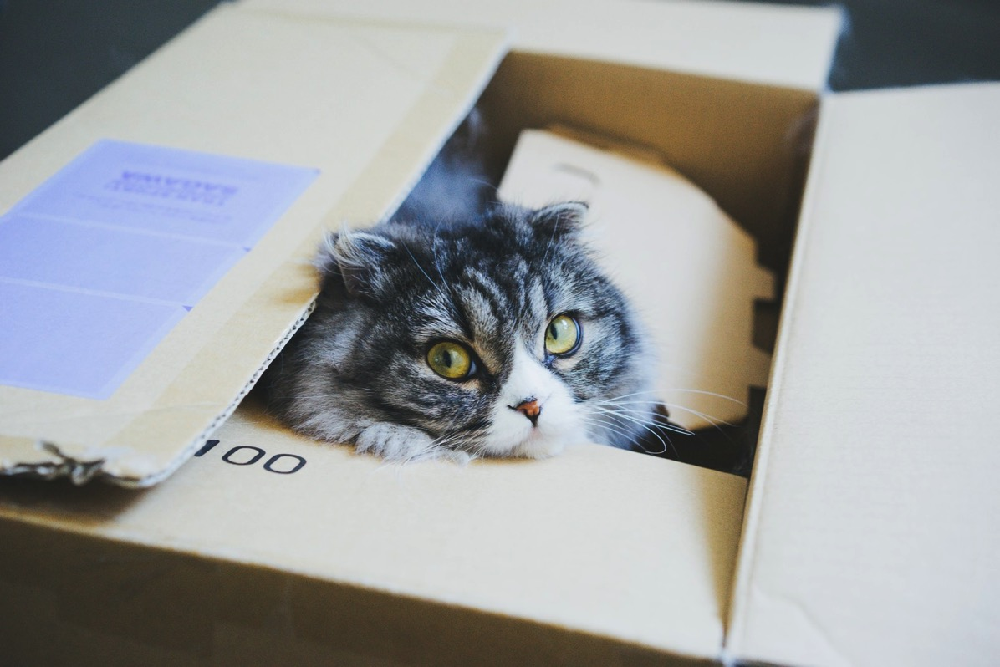

---
categories:
- レビュー
date: Mon, 28 Nov 2016 11:18:00 +0000
slug: post-9792
tags:
- Amazonプライム
title: Amazonプライムマークがついてるのに当日配送されない！「マケプレお急ぎ便」とは
---

先日Amazonでとある電化製品を購入したんですが、「プライム」マークがついているにも関わらず当日届きませんでした。必要に迫られていて、いつもなら確実に当日届く時間帯にポチりました。にも関わらず到着が数日後•••なんだよこれ！と思って調べてみたら、どうやら「プライム」マークがついているからと言って、かならず当日届くわけではないことがわかりました。本日はそれについて書きます。<!--more--><h2>Amazonの配送形態の違いについて</h2>

Amazonにはいくつか発送形態があります。その形態により到着までの日程がかわってきますので、自分のニーズに合わせて選択することをおすすめします。

配送形態は次の通りです。

<ul>
	<li>通常</li>
	<li>お急ぎ便</li>
	<li>当日お急ぎ便</li>
	<li>お届け日指定便</li>
</ul>

だいたいこの4つに分類されます。

<strong>通常便の場合は2,000円以上の買い物で無料</strong>となりますが、それに<strong>満たないと350円がかかります。</strong>

<strong>お急ぎ便の場合は360円</strong>
<strong>当日お急ぎ便は514円</strong>
<strong>お届け日時指定便は360円（当日の場合は514円）</strong>

しかし、上記の金額は<strong>プライム会員なら全て無料です。</strong>

参考：<a href="https://www.amazon.co.jp/gp/help/customer/display.html?nodeId=642982">配送料について</a>

<h2>「マケプレお急ぎ便」という存在</h2>

今回始めて存在を知りましたが、マケプレお急ぎ便というものが存在します。この配送対象の商品にもプライムマークがつきます。

では、マケプレお急ぎ便とはどういったものでしょうか？

通常Amazonには2種類の発送元が存在します。それはAmazonの倉庫からの発送か、販売業者からの発送なのかです。

マーケットプレイスの商品は、後者のパターンで業者からの発送となります。そのため、お急ぎ便のように当日配送などができない場合が多いです。（Amazon倉庫のように半自動もしくは全自動ではなく、人間が梱包したり発送準備したり、諸々するので）

しかし、マケプレお急ぎ便とはマーケットプレイス商品であるにもかかわらずお急ぎ便のように最短で発送することができるというもののです。

当日便もあります。

ただ、ぼくの場合プライム会員なので大抵のものは当日、タイミングによっては翌日に届きます。「プライム」マークを目印にしていました。

しかし、今回のようにマケプレお急ぎ便であるということを知らずに、プライム＝Amazon倉庫からの発送という認識でいると思っていたタイミングで到着しない場合があるので注意が必要です。到着日は必ず確認しましょう。

参考：<a href="https://www.amazon.co.jp/gp/help/customer/display.html?nodeId=202003230">マケプレお急ぎ便について</a>

<h2>プライム会員ならそれが何度でも無料な上にその他にも利点がある</h2>

さて、何度も書きました通り、プライム会員であればあんまり到着日を気にする必要はありません。

それよりも台風とか雪の時に「今日は急がなくてもだいじょうぶです。」くらいに思う時があるくらいです。

また、プライム会員の魅力は当日お急ぎ便だけではありません。

プライムナウという最短1時間で注文した商品が届くサービスを使えることもメリットです。<strong>最近23区全域にサービスが拡大しました</strong>ので、会社で外に買いにいく暇ないけどどうしても必要なものがある！とか会社の同僚に何かプレゼントを送りたいけど、買いにいく暇がない！なんて時に使うとめちゃくちゃ便利です。

参考：<a href="https://www.amazon.co.jp/b?node=3907674051">https://www.amazon.co.jp/b?node=3907674051</a>

<h2>しんぺーはこう思った。</h2>

現在Amazonプライム会員の会費は年間3,900円です。

正直まったく高く感じません。それにAmazonがないと生活に支障をきたす自身があるので、この金額が倍になったとしてもおそらく退会しないでしょう。事実アメリカでは99ドルという日本の倍以上の会費であるにもかかわらず6人に1人がプライム会員らしいです。

ということでプライム会員かなりおすすめです。

と言ったところで本日は以上になります。  おやすみなさい。

<iframe src="//rcm-fe.amazon-adsystem.com/e/cm?t=warawareotoko-22&o=9&p=12&l=ur1&category=prime&banner=1JDEH56FFMMBANKKEJR2&f=ifr" width="300" height="250" scrolling="no" border="0" marginwidth="0" style="border:none;max-width:800px;max-height:600px;" frameborder="0"></iframe>