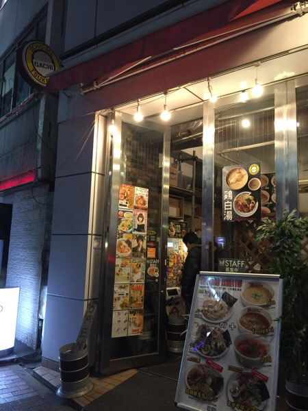
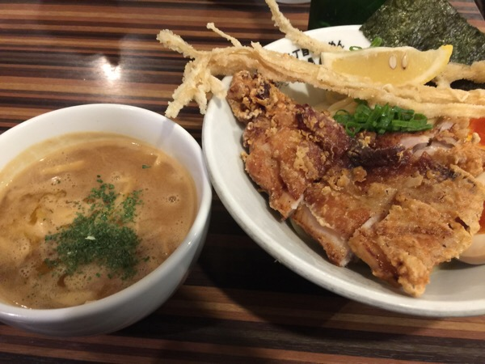

---
categories:
- グルメ
date: Fri, 02 Dec 2016 13:49:00 +0000
slug: post-9819
tags:
- つけ麺
title: 新宿二丁目のつけ麺「GACHI」は飲みの後でも割と食べられるくらいに美味しかった！
---

本日チームの忘年会でございました。凄いいいお店だったのですが、時間と量が若干物足りなくて、いつもは締めのラーメンとか絶対食べない派なんですが、今日は同僚のおじさんに連れられてつけ麺を食べにいってきました。そのお店がわりと美味しかったのでご紹介。<!--more--><h2>新宿二丁目にあるつけ麺「GACHI」</h2>

なんとなく1人では来づらい立地にありました。そしてこの地に足を踏み入れたのが初めてで、一緒に来た人とは終始「なるほど」という言葉をかけあっておりました。

そんな街並みの中にポツンと存在するつけ麺屋「GACHI」

なんとなく店名に変な連想をしつつ、食券を買って店外の列に並びます。行き交う男性2人組が多いことを確認しつつ結構待ちました。酔っ払っているので正確な時間はわかりませんが、15分くらいは並んだ気がします。その間に店内から出て来た人が少ないところを見ると回転率は割とよくないです。

そしてぼくが注文したのがこちら

テリヤキデラックスです。
竜田揚げみたいなのと卵1個、メンマを揚げたものなどが入っていました。

飲み会のあとだったのもありますが食べ切れるけど、あともう少し食べたらキツいくらいの量でした。

味は麺がしっかりと歯ごたえがあって、量はおそらくそこまで多くないと思いますが満足感が得られるくらいでした。

つけ汁も味がしっかりしてて美味しかったです。

<strong><a href="https://tabelog.com/tokyo/A1304/A130401/13131683/" target="_blank">二丁目つけめん ガチ</a></strong>

<strong>関連ランキング：</strong><a href="https://tabelog.com/rstLst/MC11/">つけ麺</a> | <a href="https://tabelog.com/tokyo/A1304/A130402/R5181/rstLst/">新宿御苑前駅</a>、<a href="https://tabelog.com/tokyo/A1304/A130401/R5182/rstLst/">新宿三丁目駅</a>、<a href="https://tabelog.com/tokyo/A1304/A130401/R8219/rstLst/">東新宿駅</a>

<h2>しんぺーはこう思った。</h2>

今日は周りの人たちとの飲み会だったので行きましたが、再来週にある部の飲み会はもちろん欠席！行きたい飲み会だけいけばいいんだ！時間とお金と心の無駄遣いになっちゃうからね！

と言ったところで本日は以上になります。  おやすみなさい。

そしてまた明日。