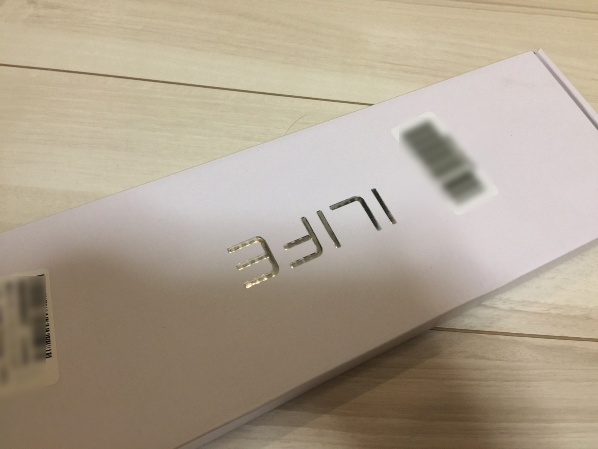
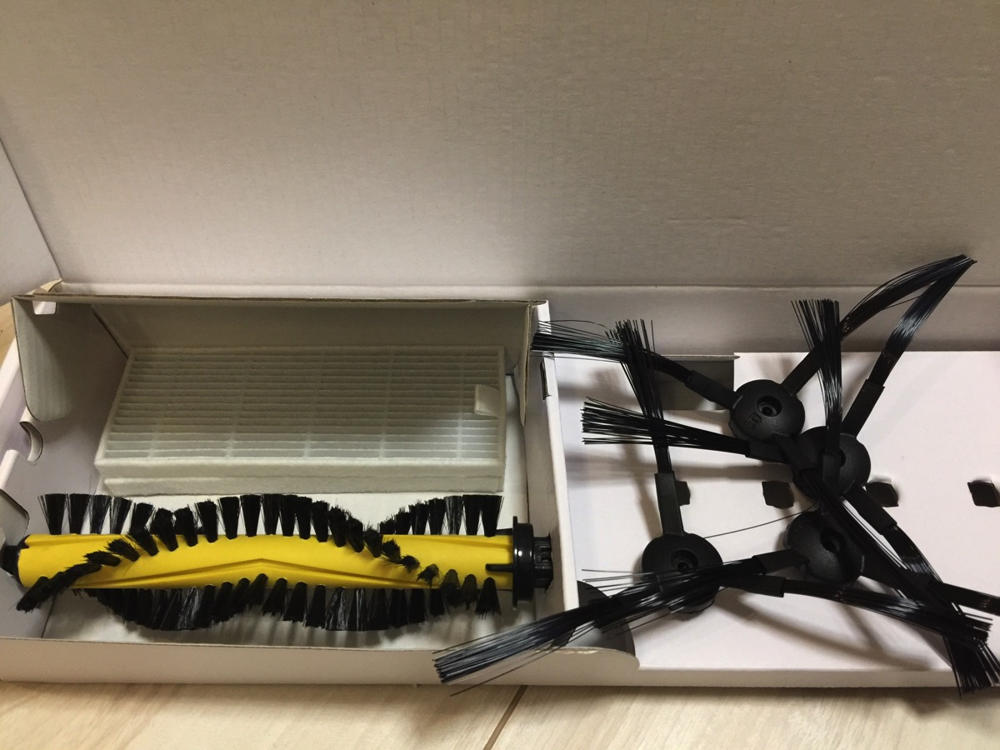
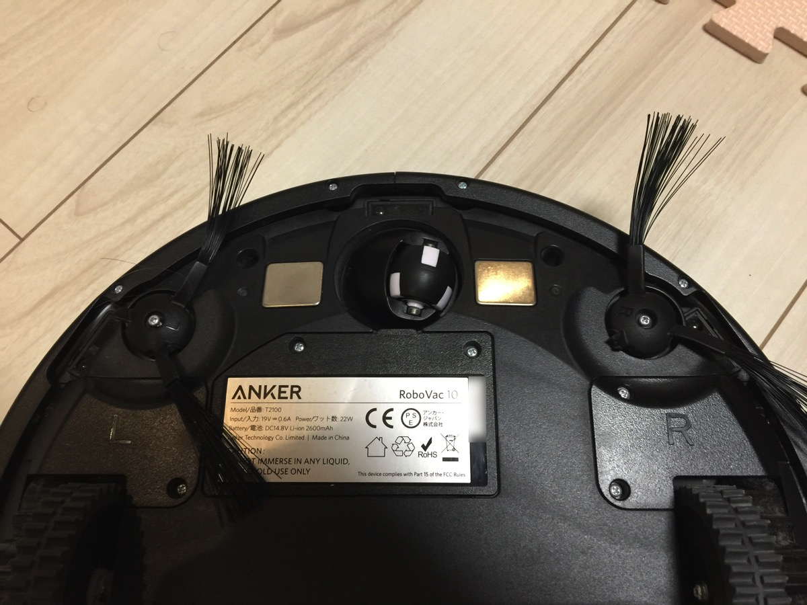
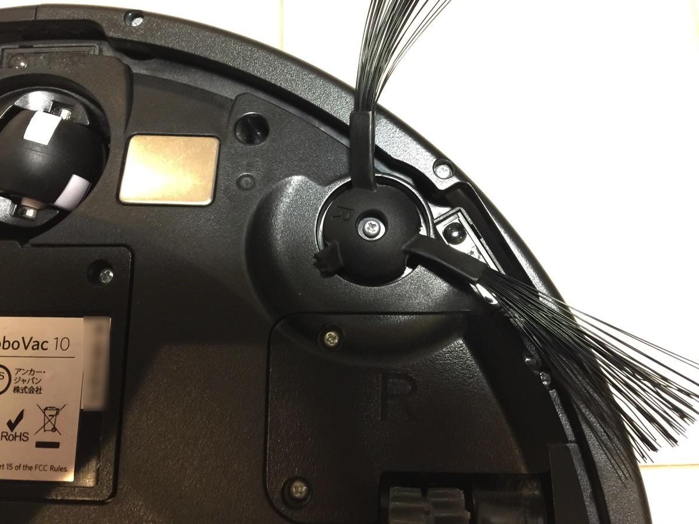
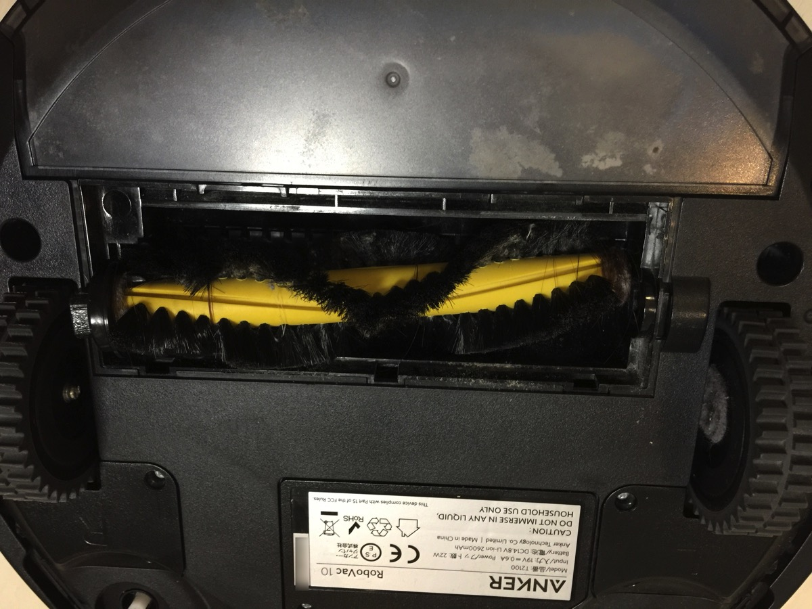
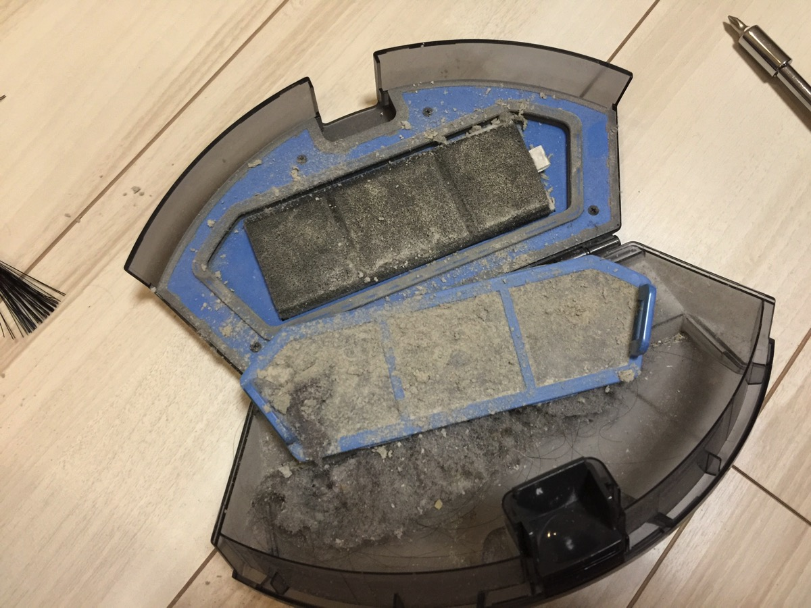
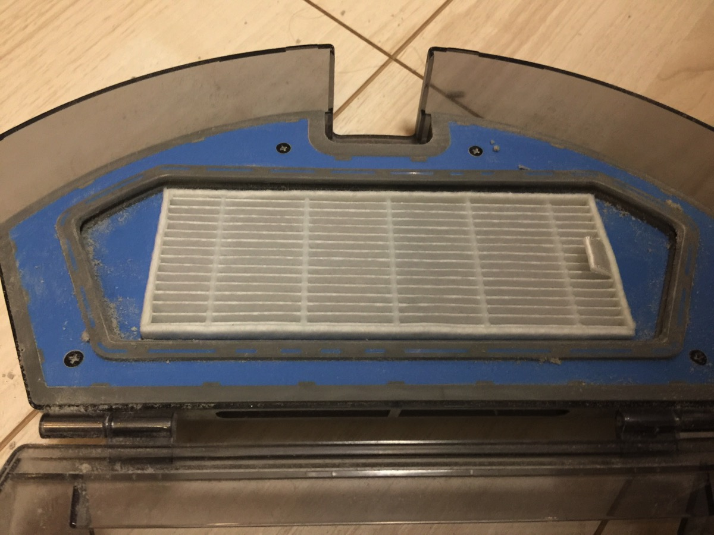
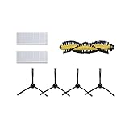

---
categories:
- レビュー
date: Sun, 04 Dec 2016 14:27:58 +0000
slug: post-9831
tags:
- Anker
title: Ankerの「RoboVac」のブラシ部分のパーツ交換方法
---

数ヶ月前に購入したAnkerのロボット掃除機「RoboVac」のおかげで掃除機をほとんどかけなくなりました。しかしながら、床に置きっ放しにしたものを巻き込んでしまったりして、ブラシパーツ部分がもげてしまいまい、能力がかなり下がってしまいました。そこで本日は壊れたパーツ部分の交換方法をご紹介。<!--more--><h2>RoboVacの交換パーツはAmazonでも売ってる</h2>

ちなみに最初から交換パーツ用が1個入ってます。今回はそれも壊れたので、2回目の交換になります。結構な頻度で壊れるので消耗品として定期交換をした方がいいかもしれません。もちろん、床に絡まるようなものを置いておかなければ、壊れる頻度も低くなるとは思いますが。

こちらが交換パーツです。

ブラシが2対と大きなブラシが1つ、フィルターが2つ入っていました。

<h2>交換方法はかんたん</h2>

交換といっても基本ネジでとまっているのを外して付け替えるだけです。

ネジ一本でとまっているので、小さなネジを無くさないように取り外します。

ちなみにブラシはこんな風に折れます。

大きなブラシはカバー外してすぐにとれます。ネジなどはいりません。

それとせっかくフィルターがついていたので交換してみようと思ってびっくり。閲覧注意の汚さでした。

いろんな目に見えない塵芥を吸い込んでくれていたようです。完全に粉状態のものがさらさらと落ちてきました。

新品に交換するとこんなにキレイ

さてこれでOK

今日からまたキレイにしてくれることでしょう！

<h2>しんぺーはこう思った。</h2>

日々使うからこそメンテをちゃんとしないと性能がどんどん落ちていきます。最近ゴミが拾えてないなーと思っていたんですが、まさかフィルターがこんなに汚かったとは、、、でも掃除が非常に楽チンになったので、メンテをしっかりとしつつ今後も大事に使っていきたいと思います。

とはいえ、実は数ヶ月前に発売したばっかなのに、あらたにAnkerの新ブランド「eufy」から<a href="http://amzn.to/2gUWa9m">RoboVac 20</a>が発売しております。ひとまわり大きくなり高性能機になったみたいです。

今買うなら間違いなくそちらでしょう！寝てる間に綺麗にしてくれるのでロボット掃除機持ってない方は安価で性能も悪くないeufyがオススメです！

と言ったところで本日は以上になります。  おやすみなさい。

そして、また明日。

<a href="http://www.amazon.co.jp/exec/obidos/ASIN/B01M5EJ4TV/warawareotoko-22/ref=nosim/" target="_blank" >真空ロボットクリーナーILIFE A4、Anker RoboVac 10用交換パーツパッケージ</a>
posted with <a href="http://kaereba.com" rel="nofollow" target="_blank">カエレバ</a>

 ILIFE Innovation limited     

<a href="http://www.amazon.co.jp/gp/search?keywords=%E7%9C%9F%E7%A9%BA%E3%83%AD%E3%83%9C%E3%83%83%E3%83%88%E3%82%AF%E3%83%AA%E3%83%BC%E3%83%8A%E3%83%BCILIFE%20A4%E3%80%81Anker%20RoboVac%2010%E7%94%A8%E4%BA%A4%E6%8F%9B%E3%83%91%E3%83%BC%E3%83%84%E3%83%91%E3%83%83%E3%82%B1%E3%83%BC%E3%82%B8&__mk_ja_JP=%E3%82%AB%E3%82%BF%E3%82%AB%E3%83%8A&tag=warawareotoko-22" target="_blank" >Amazon</a>

<a href="http://hb.afl.rakuten.co.jp/hgc/0f6e221b.2eb9748a.0f6e221c.35cc1e84/?pc=http%3A%2F%2Fsearch.rakuten.co.jp%2Fsearch%2Fmall%2F%25E7%259C%259F%25E7%25A9%25BA%25E3%2583%25AD%25E3%2583%259C%25E3%2583%2583%25E3%2583%2588%25E3%2582%25AF%25E3%2583%25AA%25E3%2583%25BC%25E3%2583%258A%25E3%2583%25BCILIFE%2520A4%25E3%2580%2581Anker%2520RoboVac%252010%25E7%2594%25A8%25E4%25BA%25A4%25E6%258F%259B%25E3%2583%2591%25E3%2583%25BC%25E3%2583%2584%25E3%2583%2591%25E3%2583%2583%25E3%2582%25B1%25E3%2583%25BC%25E3%2582%25B8%2F-%2Ff.1-p.1-s.1-sf.0-st.A-v.2%3Fx%3D0%26scid%3Daf_ich_link_urltxt%26m%3Dhttp%3A%2F%2Fm.rakuten.co.jp%2F" target="_blank" >楽天市場</a>

<a href="http://ck.jp.ap.valuecommerce.com/servlet/referral?sid=3041033&pid=882528283&vc_url=http%3A%2F%2Fsearch.shopping.yahoo.co.jp%2Fsearch%3Fp%3D%25E7%259C%259F%25E7%25A9%25BA%25E3%2583%25AD%25E3%2583%259C%25E3%2583%2583%25E3%2583%2588%25E3%2582%25AF%25E3%2583%25AA%25E3%2583%25BC%25E3%2583%258A%25E3%2583%25BCILIFE%2520A4%25E3%2580%2581Anker%2520RoboVac%252010%25E7%2594%25A8%25E4%25BA%25A4%25E6%258F%259B%25E3%2583%2591%25E3%2583%25BC%25E3%2583%2584%25E3%2583%2591%25E3%2583%2583%25E3%2582%25B1%25E3%2583%25BC%25E3%2582%25B8&vcptn=kaereba" target="_blank" >Yahooショッピング</a>

