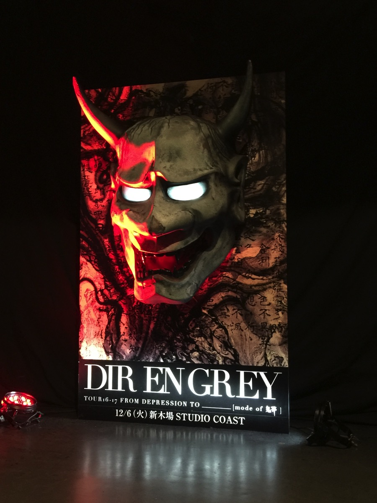
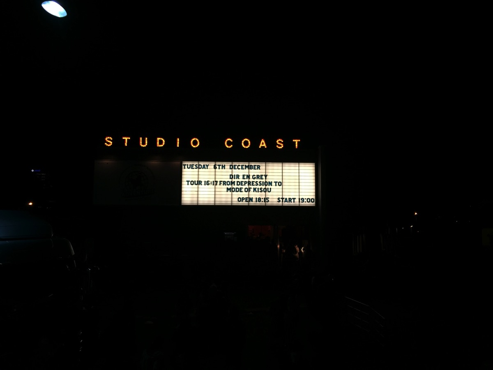
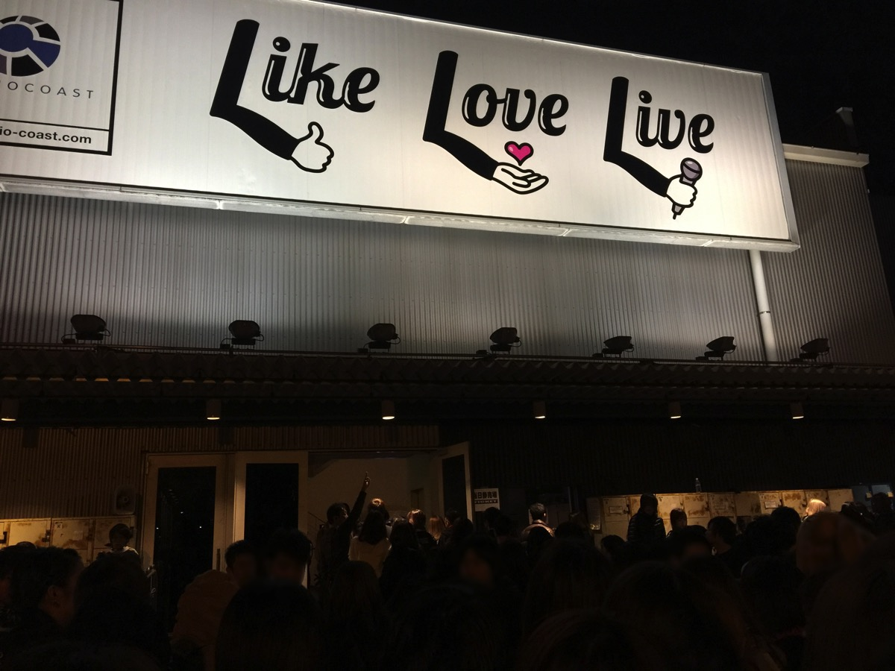

---
categories:
- DIR EN GREYのLIVEレポ
- TOUR16-17 [mode of 鬼葬]
date: Tue, 06 Dec 2016 13:14:00 +0000
slug: post-9857
tags:
- DIR EN GREY
- LIVEレポ
title: 【ライブレポ】DIR EN GREY TOUR16-17 FROM DEPRESSION TO ________ [mode of 鬼葬]2016_12_6＠新木場スタジオコースト
---

ついにこの日が来ました。1ヶ月程の短いツアーでしたが、DIR EN GREY TOUR16-17 FROM DEPRESSION TO ________ [mode of 鬼葬]が、本日ツアーファイナルをむかえました。本日はそのLIVEレポです。<!--more-->

<h2>セトリ</h2>

逆上堪能ケロイドミルク
FILTH
ZOMBOID
24個シリンダー
輪郭
Cause of fickleness
embryo
蟲
新曲
undecided
鬼眼
Domestic fucker family
Un deux
Sustain the Untruth

EN.
G.D.S
NEWSMAN
ピンクキラー
詩踏み
umbrella
JESSICA

なんとなく輪郭からのながれがめちゃくちゃ張り詰めてて、意識が何回も飛んだ。このあいだの記憶がほとんどない。まるでDUM SPIRO SPEROツアーのようだった。

<h2>メンバーの衣装とアンコの様子</h2>

京は黒髪でガチガチに固めて前髪ぱっつんの側頭部剃り上げという奇抜なスタイルでした。一般人は再現不能と思われます。黒いオーバーオール的なのを着ていた気がします。その上にエナメルっぽいドレスみたいなジャケットを着ていました。楠田えりこぽい印象です。

アンコールでは網のセーター？を着ていて志茂田景樹さながらの格好でした。DieはアンコールではToshiyaのグレムリンTシャツを着用

Toshiyaはアンコでシャツのボタンを破り捨て。あんなに細いのにめっちゃマッチョなのはなんでなの。

Shinyaと薫はいつも通り。Shinyaはサンタクロースのように袋からツアーグッズを取り出して投げてた。薫は投げるように作られたであろうデカピックを口にくわえつつ、狙いを定めてた。

<h2>しんぺーはこう思った。</h2>

さて、これで年内のDIR EN GREYワンマンライブは終了です。次は年明けのuroborosツアーです。

ぼくは国際フォーラムのチケットを取っておりますので、2月まではDIR EN GREYのLIVEはありません。次のツアーも楽しみですね！

といったところで本日は以上です。おやすみなさい。

そしてまた明日。