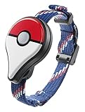
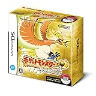

---
categories:
- ポケモン
date: Wed, 07 Dec 2016 13:57:15 +0000
slug: post-9864
tags:
- ポケモンGO
title: ポケモンGOと歩いた4ヶ月間！見知らぬ中学生にバカにされても続けるよ！
---

ポケモンGOが日本でリリースされて4ヶ月とちょっとたちました。もうまもなく金銀のポケモンが追加されるという噂です。ぼくは国内で捕獲できる143種のうちラッキーを除く142種を捕獲しております。おそらくアップデートによる追加には間に合わないでしょう。くやしい。<!--more--><h2>見知らぬ中学生にバカにされた</h2>

そんな中、今日も帰宅途中にやってたわけなんですよ。そうしましたら信号待ち中に後ろにいた中学生に言われました。「まだやってんのかよ。まだやってんのかよ。まだやってるやつバカしかいないからな。」

そうです。そうなんです。バカなんです。じゃなかったらやってないでしょう。会社で未だにやってるの同期の男とぼくくらいだもんな

まぁでも、調査によるとポケモンGOをプレイしているのは圧倒的に大人らしいですよ。課金前提の作りになっているので、中学生が簡単にできて、しかも面白いと思える領域まで達するには若干無理があると思います。

さらに、今国内で集められるポケモンは第１世代と呼ばれる赤緑のポケモンです。最初にポケモンが発売されたのが20年前、今の10代は発生すらしてなかったわけです。そら、あんた飽きますわ。

<h2>ポケモンと歩いた道程</h2>

トレーナーレベル27
集めたポケモン142
捕まえたポケモン2,856
進化させたポケモン407
回したポケストップ3,625
歩いた距離はでませんでしたので、多分1000km未満

ポケモンGOをやり始めてから行ったことがないところに行きました。毎日毎日ポケモンGOをやるために、時間を調整して作って、効率的なルートを考えて行動しました。

今までスマホでのゲームで課金をほとんどしたことが無かったぼくが、おそらく10000円前後は課金していると思います。

それでも別にいい。それでも楽しいから。

単純なゲームです。ゲーム性も正直ありません。あるのは、自己管理という大人の嗜みだけです。動かすことができない時間や自由にならない時間が山のようにある中で、絞り出したわずかな時間をさらにポケモンのためにどう使うか。

それを考えることがすごい楽しかった。

そして、これからもそれは続けます。

好きなものが好きで何が悪い。

正直流行りでダウンロードしたわけではないし、懐かしさでやってるわけではないんで。「まだプレイしてる」っていう感覚はない。

ということで、まだやってるやつがバカというかもう少し正確にいうと、まだやってるおっさんはバカです！宜しくお願いします！

<h2>しんぺーはこう思った。</h2>

ポケモンは本当に大人のゲームです。ゲームシステムが運動が中心となっており、本質的にはヘルスケアアプリだからです。

子どもをターゲットとするなら、出現するポケモンは現在のサンムーンもしくはその前の第６世代のものから出現させるべき。でもそうしなかったのは、子どもむけではないから。

しかも、バカじゃないから何キロも歩かないよね、ゲームでw

でも、ぼく歩いちゃうんだよな〜バカだからw
明日からも歩いてきますぜ！

と言ったところで本日は以上になります。  おやすみなさい。

そしてまた明日。

<a href="http://www.amazon.co.jp/exec/obidos/ASIN/B01IO57DAM/warawareotoko-22/ref=nosim/" target="_blank" rel="noopener">Pokémon GO Plus (ポケモン GO Plus) & 【Amazon.co.jp限定】オリジナルスマートフォン壁紙&ポケットモンスター サン・ムーンに利用できる300円割引クーポン 配信</a>
posted with <a href="http://kaereba.com" rel="nofollow noopener" target="_blank">カエレバ</a>

 任天堂 2016-09-16    

<a href="http://www.amazon.co.jp/gp/search?keywords=%E3%83%9D%E3%82%B1%E3%83%A2%E3%83%B3go%20%E3%83%97%E3%83%A9%E3%82%B9&__mk_ja_JP=%E3%82%AB%E3%82%BF%E3%82%AB%E3%83%8A&tag=warawareotoko-22" target="_blank" rel="noopener">Amazon</a>

<a href="http://hb.afl.rakuten.co.jp/hgc/0f6e221b.2eb9748a.0f6e221c.35cc1e84/?pc=http%3A%2F%2Fsearch.rakuten.co.jp%2Fsearch%2Fmall%2F%25E3%2583%259D%25E3%2582%25B1%25E3%2583%25A2%25E3%2583%25B3go%2520%25E3%2583%2597%25E3%2583%25A9%25E3%2582%25B9%2F-%2Ff.1-p.1-s.1-sf.0-st.A-v.2%3Fx%3D0%26scid%3Daf_ich_link_urltxt%26m%3Dhttp%3A%2F%2Fm.rakuten.co.jp%2F" target="_blank" rel="noopener">楽天市場</a>

<a href="http://ck.jp.ap.valuecommerce.com/servlet/referral?sid=3041033&pid=882528283&vc_url=http%3A%2F%2Fsearch.shopping.yahoo.co.jp%2Fsearch%3Fp%3D%25E3%2583%259D%25E3%2582%25B1%25E3%2583%25A2%25E3%2583%25B3go%2520%25E3%2583%2597%25E3%2583%25A9%25E3%2582%25B9&vcptn=kaereba" target="_blank" rel="noopener">Yahooショッピング</a>

<a href="http://www.amazon.co.jp/exec/obidos/ASIN/B002HWR0SO/warawareotoko-22/ref=nosim/" target="_blank" rel="noopener">ポケットモンスター ハートゴールド(特典無し)</a>
posted with <a href="http://kaereba.com" rel="nofollow noopener" target="_blank">カエレバ</a>

 任天堂 2009-09-12    

<a href="http://www.amazon.co.jp/gp/search?keywords=%E3%83%8F%E3%83%BC%E3%83%88%E3%82%B4%E3%83%BC%E3%83%AB%E3%83%89&__mk_ja_JP=%E3%82%AB%E3%82%BF%E3%82%AB%E3%83%8A&tag=warawareotoko-22" target="_blank" rel="noopener">Amazon</a>

<a href="http://hb.afl.rakuten.co.jp/hgc/0f6e221b.2eb9748a.0f6e221c.35cc1e84/?pc=http%3A%2F%2Fsearch.rakuten.co.jp%2Fsearch%2Fmall%2F%25E3%2583%258F%25E3%2583%25BC%25E3%2583%2588%25E3%2582%25B4%25E3%2583%25BC%25E3%2583%25AB%25E3%2583%2589%2F-%2Ff.1-p.1-s.1-sf.0-st.A-v.2%3Fx%3D0%26scid%3Daf_ich_link_urltxt%26m%3Dhttp%3A%2F%2Fm.rakuten.co.jp%2F" target="_blank" rel="noopener">楽天市場</a>

<a href="http://ck.jp.ap.valuecommerce.com/servlet/referral?sid=3041033&pid=882528283&vc_url=http%3A%2F%2Fsearch.shopping.yahoo.co.jp%2Fsearch%3Fp%3D%25E3%2583%258F%25E3%2583%25BC%25E3%2583%2588%25E3%2582%25B4%25E3%2583%25BC%25E3%2583%25AB%25E3%2583%2589&vcptn=kaereba" target="_blank" rel="noopener">Yahooショッピング</a>

