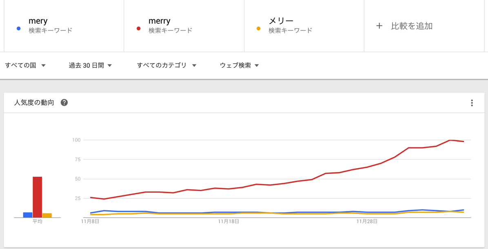
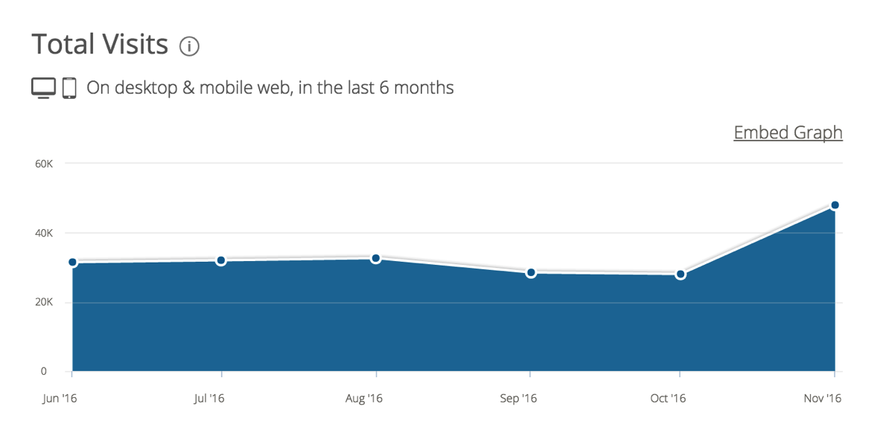

---
categories:
- music
date: Thu, 08 Dec 2016 12:13:00 +0000
slug: post-9869
tags:
- merry
title: MERY封鎖でMERRYのサイトへの検索流入が凄いことになってた
---

連日ネットを騒がせているDeNAショックですが、DeNA内でおそらく1番大きなキュレーションサイトであるMERYの封鎖により、思わぬところに影響がありそうでなさそうなので調べてみました。<!--more--><h2>fwd所属「MERRY」のオフィシャルサイトへの流入が増加</h2>

MERY封鎖(記事非公開)との報道に検索する人が増えたのでしょう。Googleトレンドによると、報道と同時に検索数が増加しています。

しかしここで注目したいのは、検索した人が正しくキュレーションサイトのMERYに到達したのかということです。

それではメリー、<a href="http://merryweb.jp/">merry</a>と言った近しい言葉のトレンドを見てみましょう。

３つの中でなんとmerryがもっとも検索されたようです。

で、確かmerryは検索結果1位でしたので、みんなそのまま<a href="http://merryweb.jp/">merry</a>のオフィシャルサイトにアクセスしたものと思われます。

similarwebによるとオフィシャルサイトのPVがいつもよりも増加しているのがわかります。きっと事務所は驚いたかもしれません。どこのサーバーを使っているかわかりませんが、アクセスが一時的に遅くなったりしたかもしれないですな。

参考：<a href="https://www.similarweb.com/">https://www.similarweb.com/</a>

あと、MERYっていう通販サイトもあるのでそれも、検索上位でMERRYと1位争ってたのでそっちにもアクセスいってるんだろうなー

<h2>しんぺーはこう思った。</h2>

ふと、気になって調べたしだいです。
とくにだからと言ってなんもないです。

といったところで本日は以上です。おやすみなさい。

そして、また明日、