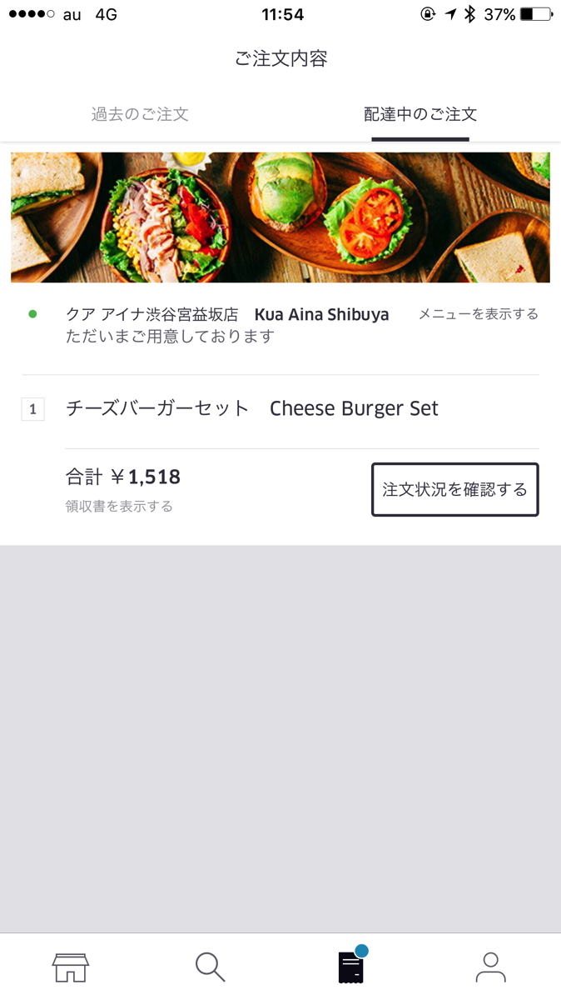
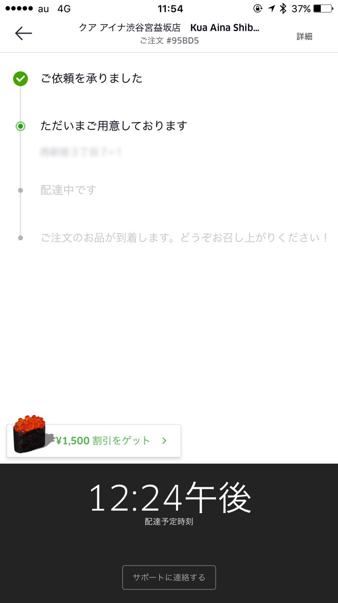
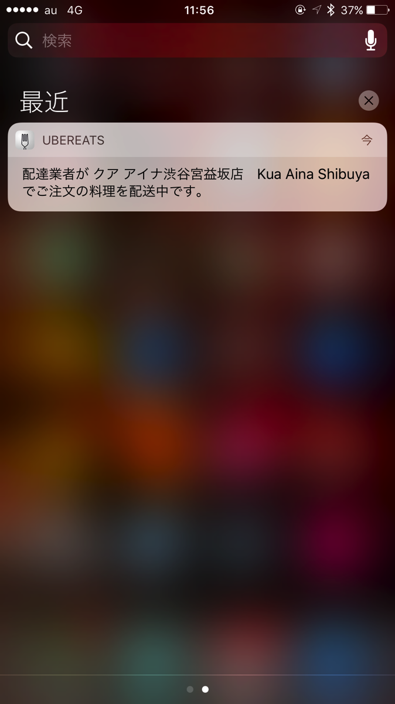
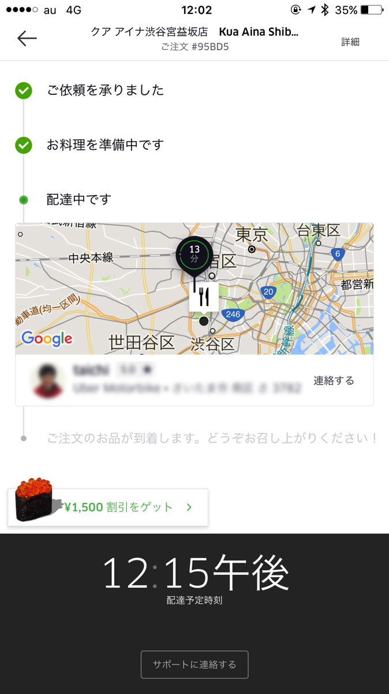
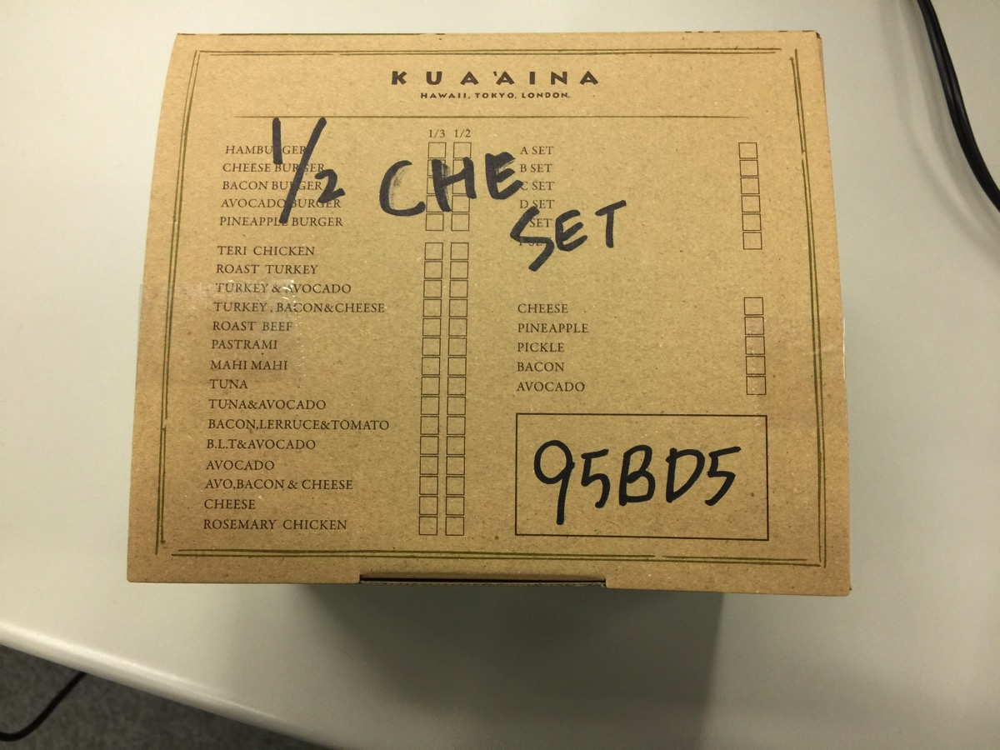
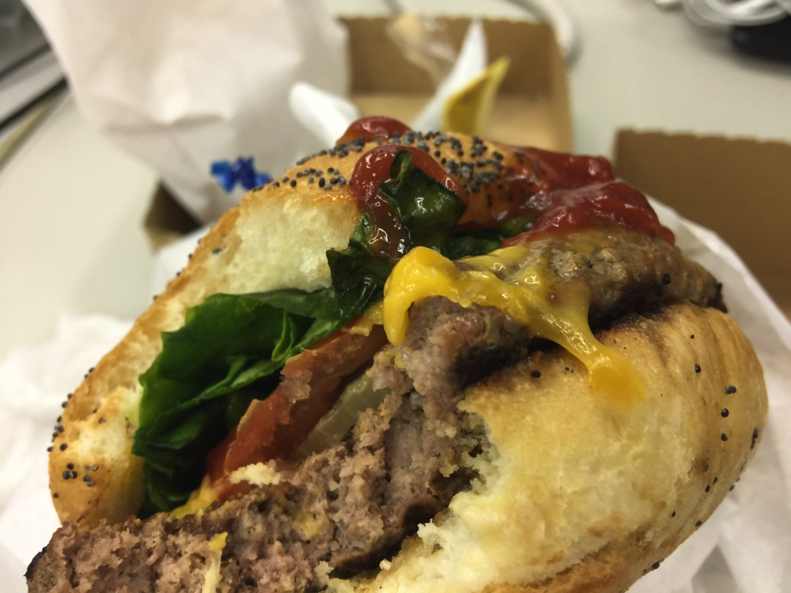
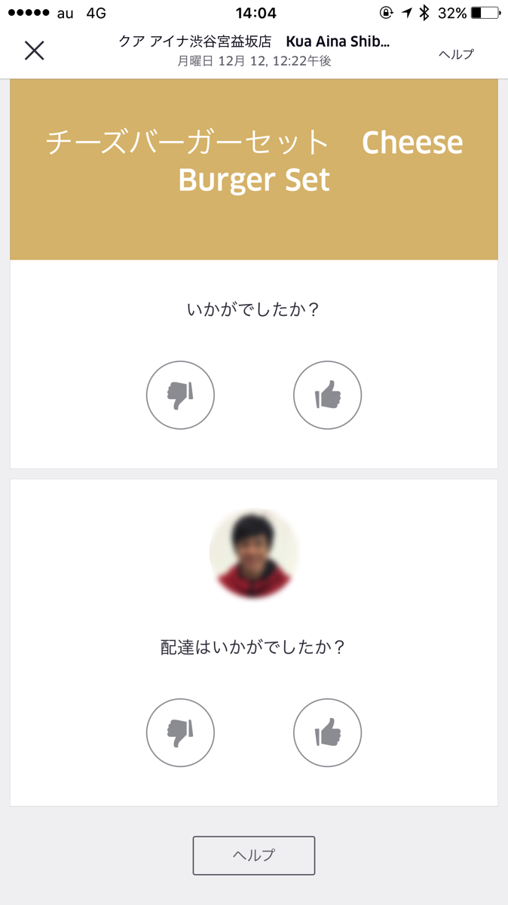

---
categories:
- Uber Eats
date: Mon, 12 Dec 2016 10:53:00 +0000
slug: post-9890
tags:
- Uber Eats
title: Uber Eatsエリア拡大したので早速使って見た。
---

本日よりUber Eatsのエリアが拡大したとのこことで、早速ちゅうもんしてみました！昨年まで愛用していたLINE WOWとの比較含めて感想をご紹介いたします！<!--more--><h2>Uber Eatsとは？</h2>

廃車サービスのUberが始めた弁当宅配サービスです。日本では9月に上陸しましたが、ぼくはサービスエリアが渋谷区を中心としていたためリリース日に注文することができず非常に悔しい思いをしました。

そのため、わざわざUberに乗ってUber Eats対象エリアまで行って注文を試みたこともありました。

参考:<a href="https://www.warawareotoko.com/2016/09/29/post-9335/">Uber Eatsの対象エリア外なので対象エリアまでUnerで行って注文してみようとした話</a>

<h3>注文の仕方</h3>

注文がスムーズすぎてスクショをとるの忘れてました。店舗を選んでメニューを注文すればOK

あとは、待つのみ。注文を確認するをタップすると配送状況が確認できます。

30分前後まってると会社のビル付近まで持ってきてくれました！何階までくればいいかわからなかったみたいで電話がかかってきました。そのまま、上がってきてOKのむねをつたえるとエレベーターであがってきて、受け取り。支払いはカード払いなので、現金の受け渡しは発生しません。超手軽です。

クアアイナのチーズバーガーです。1500円くらい。

食べていると、配達員の評価を求める通知がきました。

<!--<h2>Uber EatsとLINE WOW比較</h2>-->

<!--<h3>Uber Eatsのここがイマイチ</h3>-->

<h2>しんぺーはこう思った。</h2>

全てがスムーズで、気軽で手軽！！しかもスピーディ！！

これからもっと店舗のラインナップが増えるといいなー！またLINE WOWの時みたいに使いたおすぞ！

と言ったところで本日は以上になります。  おやすみなさい。

そして、また明日。

<a href="https://itunes.apple.com/jp/app/ubereats-fudoderibariwosupidini/id1058959277?mt=8&uo=4&at=11ld5P" target="_blank" >UberEATS：フードデリバリーをスピーディーに</a>&nbsp;(無料)

<a href="https://itunes.apple.com/jp/developer/uber-technologies-inc./id368677371?uo=4&at=11ld5P" target="_blank" >Uber Technologies, Inc.</a>&nbsp;<a href="https://itunes.apple.com/jp/app/ubereats-fudoderibariwosupidini/id1058959277?mt=8&uo=4&at=11ld5P" target="_blank" style="width:100px;color:#ffffff;background:#298CDA;font-size:10px;font-weight:bold;text-align:center;display:inline;text-decoration:none;border:0px;padding:5px;border-radius:10px;background:-moz-linear-gradient(rgba(85,182,237,0.5), rgba(41,140,218,1));background:-webkit-gradient(linear, 100% 0%, 100% 100%, from(rgba(85,182,237,0.5)), to(rgba(41,140,218,1)));white-space: nowrap;">iTunes で見る</a>

(2016.12.12時点)

posted with <a href="http://pochireba.com" rel="nofollow" target="_blank">ポチレバ</a>

