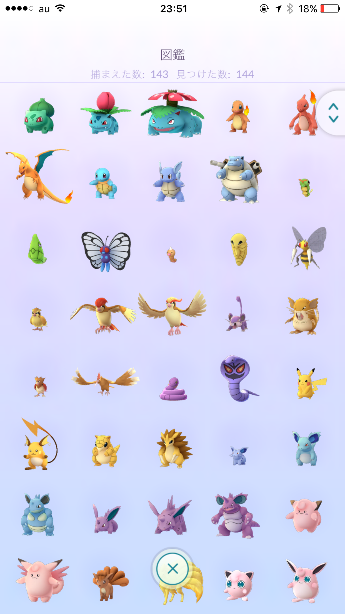
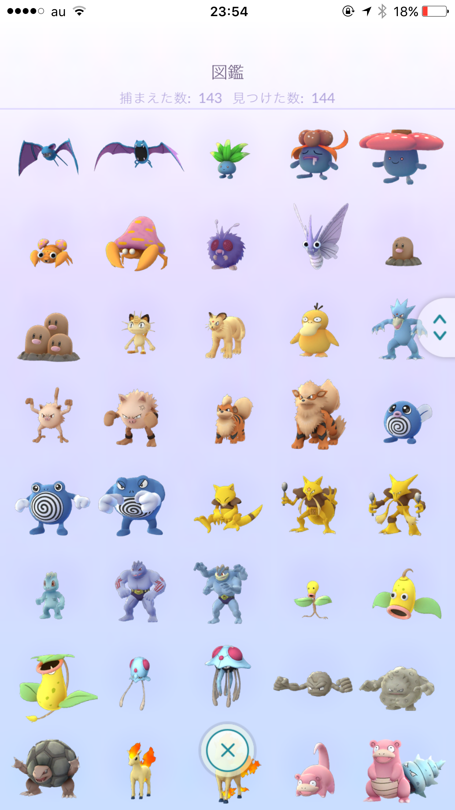
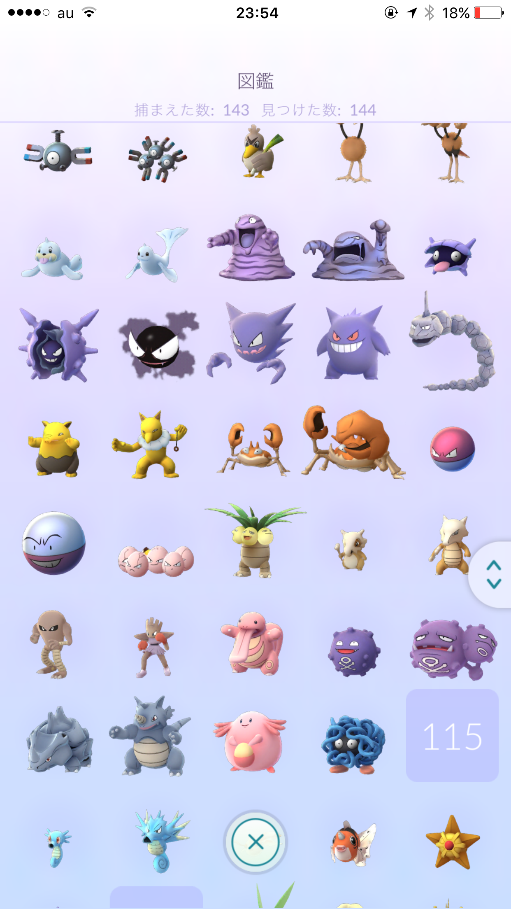
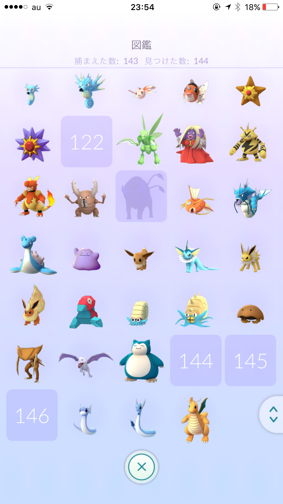
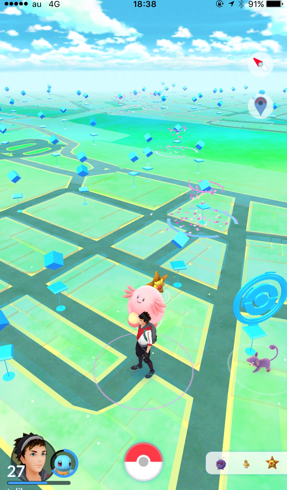
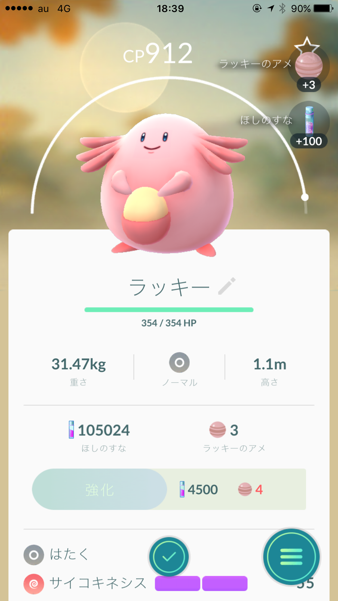
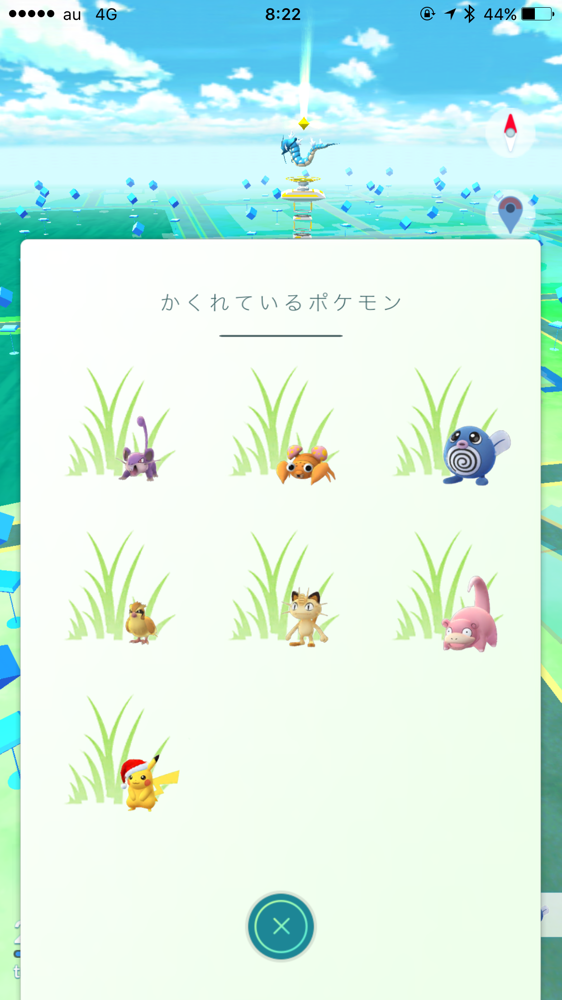
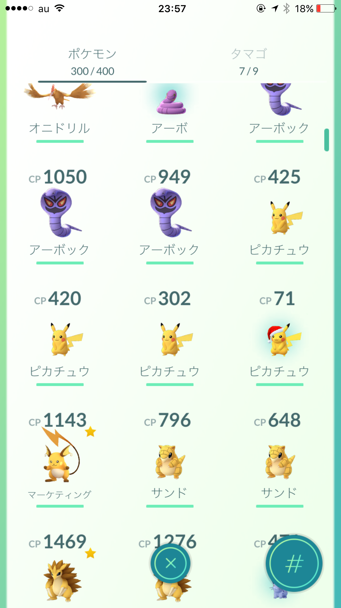

---
categories:
- ポケモン
date: Tue, 13 Dec 2016 14:04:00 +0000
slug: post-9906
tags:
- ポケモンGO
title: 【ポケモンGO】1日遅れの国内コンプ！そして今日から新しい冒険の始まりぃぃい！おじさんはまだまだポケモンやるよ！
---

ポケモンGOを初めておよそ5ヶ月。ようやく、ようやく！本日国内で集められる143種のポケモンを集め、図鑑コンプいたしました！本日から金銀の新種追加され、事実上はコンプではないのですが、まぁそこはご愛嬌。1日遅れではありますがコンプを記念して書きたいと思います。<!--more--><h2>コンプした図鑑がこちら</h2>

おそらく、すでに多くの方がコンプしており、見飽きたかもしれませんが、こちらがコンプした図鑑です。

ブランクになっているのは、日本国内では出現しないバリヤード(ヨーロッパ限定)、ガルーラ(オーストラリア限定)、ケンタロス(アメリカ限定)とミュー、ミューツー、サンダー、ファイヤー、フリーザーなどの伝説ポケモンです。

ケンタロスだけジムにいるのを見かけたので、シルエットが登録されています。

なお、ラッキー捕獲時の様子がこれ

コンプに対しての感慨は以前書きましたので、そちらを参照ください。

ただ、一部抜粋するならポケモンGOは時間管理ゲームだと思います。完全に大人向けのゲームで限られたリソースをどう効率よく配分するかが問われます。

若者なら体力に任せて歩き回ったり、巣に何時間も張り付いたらいいでしょう。しかし、今や中心プレイヤーは大人ばかり。そうなると仕事帰りや通勤中にどれだけ効率よく集めるかがキーになります。

さらにどうやったら、ポケモンGOに時間を費やせるか。そのためにはリアルで抱えている仕事をどういうペースでこなし、どれだけ早く退社するのかなどなど。

この大人の嗜みに今ぼくは１つ区切りをつけ、次のステージに進もうとしています。新たな冒険にワクワクしています。いや、結構マジで。

<h2>追加された金銀ポケモン</h2>

本日追加されたのは噂通りの金銀のポケモンたち。ただし、全種類ではなく、金銀ゲーム内の設定で卵から出るベビィポケモンのみ。

追加されたのは公式発表によるとトゲピーとピチュー

ただし、それ以外にも複数が追加された模様です。具体的にはこちら

【2kmタマゴ】
・ピィ
・ププリン
【5km】
・トゲピー
・ピチュー
【10km】
・ムチュール
・エレキッド
・ブビィ

今までの卵から出るポケモンに追加されたのであれば、出現率はそれぞれ相当低そうです。出るまで孵化装置への課金は必須でしょう。せめて無限孵化装置をもう１つくらいほしいところ。

ちなみに本日9個卵を孵しましたが、1匹も新種は出ませんでした。

<h2>サンタピカチュウがあざとい</h2>

なお、本日よりクリスマスシーズンのキャンペーンもスタートしました。ハロウィンの時の様にゴースト系が出やすくなるようなものではなく、斜め上のキャンペーンの様です。

なんとサンタ帽子をかぶったピカチュウの出やすくなっている様です。ちなみにライチュウもサンタ帽子を被ってるらしいです。進化させるとそうなるのか不明ですが。

朝から近くにはいる様なのですが一向に現れませんでした。が、ポケモンGOプラスをガチャガチャやってたらいつのまにか捕まえていました。感動もなんもなし！

まぁピカチュウなんてのは、初代赤緑プレイヤーにとってトキワの森にでてくるただのレアポケモンに過ぎません。最初は見た目も可愛くなかったし。

それがアニメで主人公のパートナーに抜擢され世界的マーケティングの急先鋒となり、日本といえばピカチュウくらいにいつのまにか祭り上げられていました。

知ってましたか？ポケモンの名称て国によって違うんですよ。日本だとヒトカゲだけどアメリカだとサラマンダーだったりすんですよ。でもピカチュウは日本だろうがアメリカだろうが中国だろうが全世界でピカチュウという名称なんです。

さらにはアニメの声優もピカチュウだけは日本のオリジナルの声優を使用しているのです。それとポケモンGOのゲーム内でもピカチュウのみアニメ版の声で鳴き声が表現されます。

そんなマーケティングピカチュウなんかぼくは別に好きでもなんでもないんだ！！！

<h2>しんぺーはこう思った。</h2>

おそらく年内にはこれ以上の追加はないのではないでしょうか。

そうなるとどんだけ課金して、どんだけ歩くかが鍵になりそうです。

ゆるゆると頑張りたいと思います。それとサンムーン初めてからハートゴールドが止まっちゃってるのでこっちも進めなくちゃ！

これからも頑張りたいと思います。
といったところで、本日は以上です。おやすみなさい。

そして、また明日。