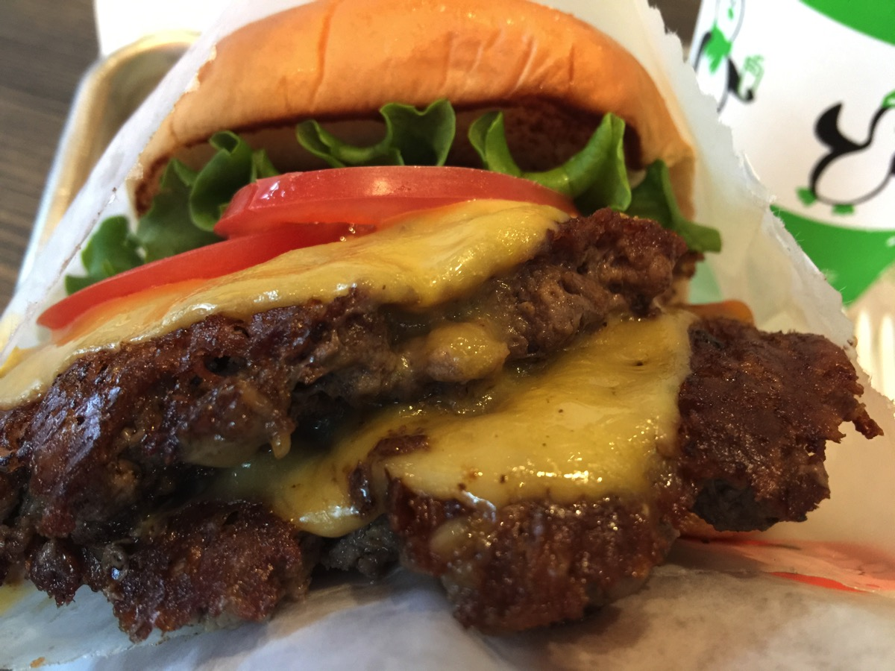

---
categories:
- グルメ
date: Wed, 28 Dec 2016 14:18:46 +0000
slug: post-9998
tags:
- おすすめ
- グルメ
title: 2016年版「今年一番美味しかった店」
---

今年もあと数日です。会社周辺にいいお店もないし、ラーメン屋もないしで今年はそんなに外食をしなかった！そんな中、今年行ったお店で美味しかったお店をいくつかご紹介いたします。<!--more--><h2>渋谷宮益坂にある鳥料理の店「鬼亭」</h2>

はい、いきなりダントツでめちゃくちゃおすすめのお店をご紹介します。知り合いの知り合いに連れていってもらったんですが、いやーまじですごかった。とくに写真はありませんが。

牛や豚の焼肉ではなく、新鮮な鳥を焼いて喰う店です。鳥なんで変に胃もたれしたりもしません。脂っこくないのです。しかも柔らかい！！！

見た目は古めの小さな居酒屋なんですが、これが本当においしい！店内も満席！！多分予約していかないと入れない。以前は紹介制だったらしい。

<strong><a href="https://tabelog.com/tokyo/A1303/A130301/13003491/" target="_blank">鬼亭</a></strong>

<strong>関連ランキング：</strong><a href="https://tabelog.com/rstLst/yakitori/">焼き鳥</a> | <a href="https://tabelog.com/tokyo/A1303/A130301/R4698/rstLst/">渋谷駅</a>、<a href="https://tabelog.com/tokyo/A1306/A130602/R2153/rstLst/">表参道駅</a>、<a href="https://tabelog.com/tokyo/A1306/A130601/R9951/rstLst/">明治神宮前駅</a>

<h2>新宿歌舞伎町「叙々苑」</h2>

これも上の店に連れて行ってくれた方に連れられて行きました。

高級店だけはあります。食べたそばから笑いながら「うまい」という言葉がもれ出します。本当にうまい。こんな肉をパクパク食べるなんて滅多にない。ちなみに奢りでしたよ。

本当にうまかった〜

こちらも写真なし

<strong><a href="https://tabelog.com/tokyo/A1304/A130401/13010854/" target="_blank">叙々苑 新宿歌舞伎町店</a></strong>

<strong>関連ランキング：</strong><a href="https://tabelog.com/rstLst/yakiniku/">焼肉</a> | <a href="https://tabelog.com/tokyo/A1304/A130401/R5480/rstLst/">西武新宿駅</a>、<a href="https://tabelog.com/tokyo/A1304/A130401/R5184/rstLst/">新宿西口駅</a>、<a href="https://tabelog.com/tokyo/A1304/A130401/R5182/rstLst/">新宿三丁目駅</a>

<h2>割と気軽に贅沢できるハンバーガーショップ「シェイクシャック」</h2>

ニューヨークから2015年に日本に上陸したハンバーガーショップです。今や東京に数店舗あります。

割と高めで、ハンバーガーとドリンクとポテトで2000円以下くらいになります。それでも十分美味しいので、気軽に贅沢をという時にはおすすめです。

これは写真あります。

あとドリンクは必ずシェイクを頼みましょう。シェイクシャック行ってるのにシェイク頼まないのはちょっと損した気分になります。国際フォーラムと恵比寿にも店舗あるのでLIVE前とかにどうぞ。

<strong><a href="https://tabelog.com/tokyo/A1301/A130102/13200310/" target="_blank">シェイクシャック 東京国際フォーラム店</a></strong>

<strong>関連ランキング：</strong><a href="https://tabelog.com/rstLst/hamburger/">ハンバーガー</a> | <a href="https://tabelog.com/tokyo/A1301/A130102/R10345/rstLst/">有楽町駅</a>、<a href="https://tabelog.com/tokyo/A1301/A130102/R8513/rstLst/">日比谷駅</a>、<a href="https://tabelog.com/tokyo/A1302/A130201/R7588/rstLst/">二重橋前駅</a>

<h2>しんぺーはこう思った。</h2>

今日で仕事納め！休み中にできれば大好きなラーメン屋いきてー！！今年美味しいラーメンほとんどくってねーぞ！！！

と言ったところで本日は以上になります。  おやすみなさい。

そして、また明日。